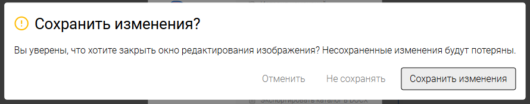

Требуется доработка некоторых элементов:

1. В меню выбранного объекта направление указывается не в тултипе, а по переключению кнопки по направлению часовой стрелки.

2. Кнопку “Сохранить“ заменить на “Сохранить и выйти“, которая, по названию понятно, сохраняет изменения и закрывает редактор изображения.

3. Задний фон. Задний фон уже имеет темный цвет, но при включении кроппер имеет белый цвет. Можно заменить его на темный, но убрать совсем не получится -- не будет отображаться обрезаемая зона.

   Ограничить его тоже нельзя, поскольку работает через box-shadow, который не поддается ограничению выхода за элемент. (overflow: hidden)

4. Переделать окно подтверждения закрытия редактора, если есть изменения.

   

Критерии:

1. \[x\]Направление указывается по нажатию на кнопку по часовой стрелке.

2. \[x\]Кнопка “Сохранить“ заменена на “Сохранить и выйти“.

3. \[x\]Задний фон сменен на темный.

4. \[x\]Изменено окно подтверждения закрытия при наличии изменений.