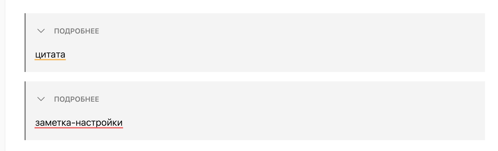
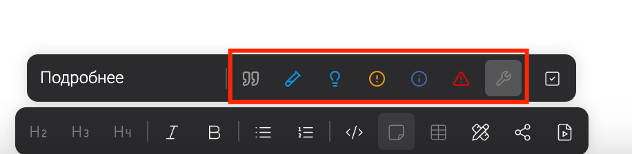
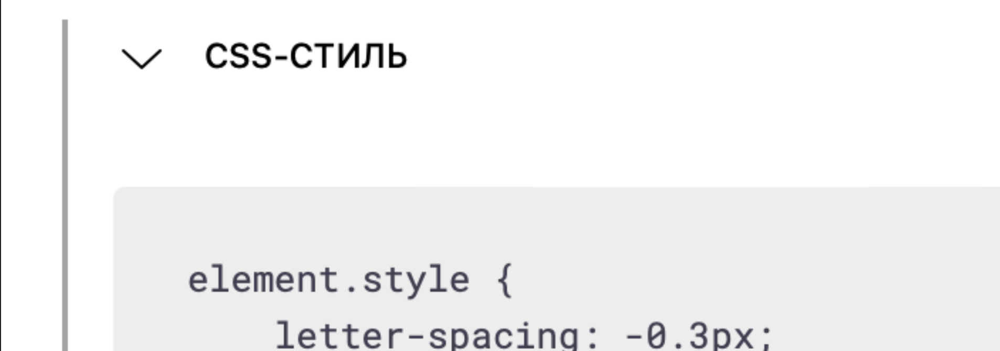
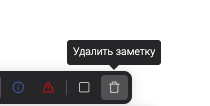
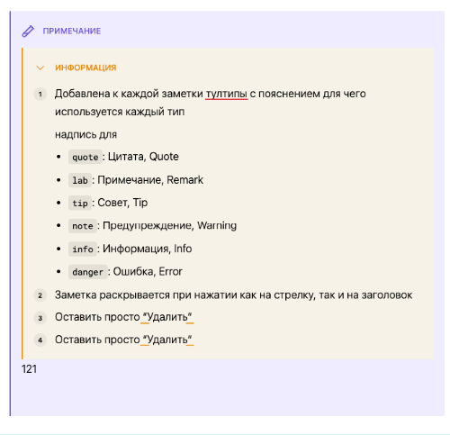

-  Добавить корзину для удаления заметки;

-  Заметки quote и hotfixes в развернутом виде ничем не отличаются:

   

-  Предлагаю к каждой заметке добавить тултип с кратким пояснением. Не понятно, для чего используется каждый тип и чем отличаются:

   

-  Заметка раскрывается и скрывается только при нажатии на стрелку, при нажатии на заголовок не работает:

   

-  ~~В блоке лишнее пустое место между заголовком и кодовым блоком~~

   

   исправлено в [**@SY @AL \[done\] Логирование ошибок в logic**](./../../../jun-2024/prilozhenie-2/oshibki-2/oshibki)

## Критерии

-  Добавлена корзина в интерфейсе заметки для её удаления

-  Заметки имют следующие вид:

   -  `hotfixes` убран из интерфейса

   -  `lab` фиолетового цвета:

      в светлой теме: линии -- #8270db, фон -- #f3f0ff, линии в темной -- #8f7ee7

      

-  Добавлена к каждой заметки тултипы с пояснением для чего используется каждый тип

   надпись для

   -  `quote`: Цитата, Quote

   -  `lab`: Примечание, Remark

   -  `tip`: Совет, Tip

   -  `note`: Предупреждение, Warning

   -  `info`: Информация, Info

   -  `danger`: Ошибка, Error

-  Заметка раскрывается при нажатии как на стрелку, так и на заголовок

## Замечания

-  \[x\]Кнопку удаления заметок назвать просто “Удалить“

   

   Исправлено

-  В заметку вставляются скопированные заметки, а после перезагрузки страницы ломаются

   

   проблема с обратным парсингом [Заметка в заметка через md : GXS-1798 (](https://support.ics-it.ru/issue/GXS-1798)[ics-it.ru](http://ics-it.ru)[)](https://support.ics-it.ru/issue/GXS-1798)