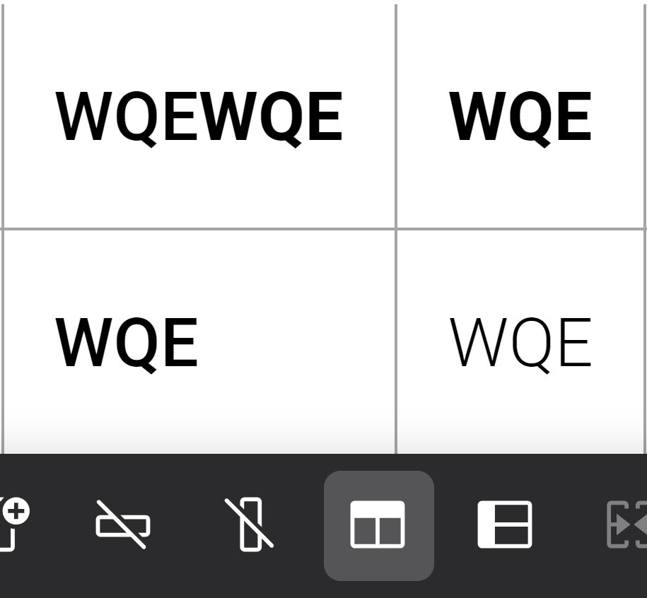
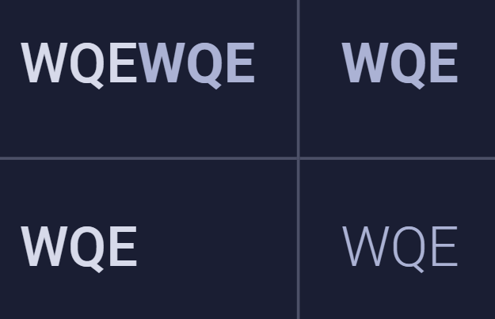

Сейчас при работе с таблицами есть проблемы:

-  Когда таблица очень широкая, не видно, где заканчивается таблица из-за отсутствия границы у отображаемой части

-  Когда панели скрыты, при изменении ширины таблицы, наведение на панель приведет к её открытию.

-  В светлой теме текст в заголовках столбцов/строк выглядит толще, чем тот же текст с применением стиля `жирный`

   первая строка -- заголовок, левый столбец -- со стилем `жирный`

   

   

## Критерии приемки

-  Если таблица выходит за пределы видимой области влево или вправо, на соответствующих краях видимой части таблицы должен появляться градиент, создающий эффект размытия.

   

-  Когда панели скрыты, при изменении ширины таблицы, наведение на панель не будет вызывать её открытие.

-  Текст заголовка без стилей и тот же текст, но со стилем `жирный` теперь выглядят одинаково

-  Изменение ширины столбца не влияет на остальные столбцы

-  Максимальная ширина для столбца, у которого не задана ширина -- `240px`

## Оценка

анализ -- 8 ч

реализация -- 40 ч