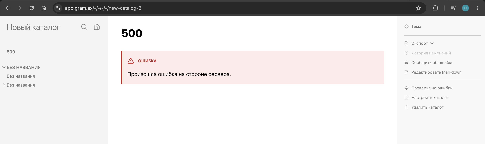

Сейчас при ошибке парсинга статьи выводится такая статья с ошибкой. Хотя это в приложении, т.е. никакого сервера нет.

## Критерии

-  Если случилась ошибка при парсинге статьи, ошибка будет выглядеть так в приложениях для редактирования:

   **Заголовок:** Не удалось отобразить статью

   **Текст статьи:** Gramax не смог прочитать Markdown-конструкцию в файле статьи. Кликните [cmd:Редактировать Markdown:file-pen], а затем исправьте ошибку или удалите конструкцию.

-  Если случилась ошибка при парсинге статьи, ошибка будет выглядеть так в докпортале

   **Заголовок:** Не удалось отобразить статью

-  Если случилась ошибка при каких то других обстоятельствах, ошибка будет выглядеть так

   **Заголовок:** Не удалось отобразить статью