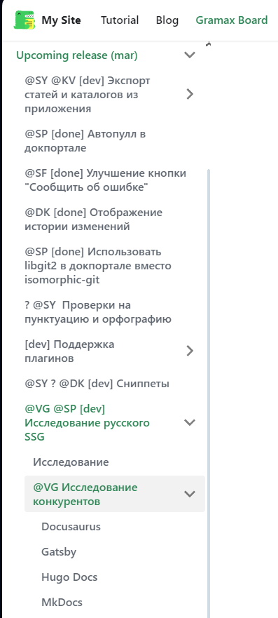
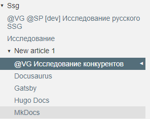
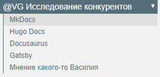

### [MkDocs](./../../../../upcoming-release/ssg/new_article_1/mkdocs.md)

Написан на **Python**

Очень прост в развертывании, так как проект на MkDocs состоит из папки с **Markdown**\-файлами и файла конфигурации `mkdocs.yml`

### [Hugo Docs](./../../../../upcoming-release/ssg/new_article_1/hugo.md)

Написан на **Go**

Минимальная работа для развертывания чуть больше, чем у **MkDocs**, так как надо дополнительно установить тему сайта.

Можно сказать, что **Hugo** предлагает функциональность, аналогичную **MkDocs**, но с добавлением расширенных возможностей и большей гибкостью в управлении контентом и внешним видом сайта.

### [Docusaurus](./../../../../upcoming-release/ssg/new_article_1/docusaurus.md)

Фреймворк или инструмент для создания статических сайтов на основе React

Предназначен в первую очередь для создания проектной документации.

Начало работы:

-  Чтобы измененить шаблонный раздел документации `docs` -- нужно подставить свои **Markdown**\-файлы в папку `docs`

-  Изменить шаблонную главную страницу -- `src/pages/index.js` и `docusaurus.config.js`

### [Gatsby](./../../../../upcoming-release/ssg/new_article_1/gatsby.md)

Так же как и **Docusaurus** фреймворк или инструмент для создания статических сайтов на основе React

Использует GraphQL для управления данными.

Чтобы вывести страницы с контентом из **Markdown**\-файлов, надо понять как работает GraphQL, что представляет сложность для начала работы с ним, но предлагает кучу возможностей

Начало работы:

-  Главная страница -- создается шаблоннная, но это так как это jsx, надо полностью переписывать самому

-  Страницы с содержанием из **Markdown**\-файлов, также надо написать самому

## Мнение какого-то Василия

Мне кажется, что ssg от Gramax-а должно передавать структуру расположения файлов в нем + обертка сайта (Главная страница, меню, подвал сайта и т.д.). **Docusaurus** хорошо передает структуру расположения файлов:

в **Hugo** нельзя скрывать подразделы как в Garmax:

(возможно есть тема, в которой это нормально реализовано, я не нашел)

В **MkDocs** главная страница подраздела находится внутри раздела:

Стрелка справа -- перемещение по странице (в **Gramax** и **Docuaurus** это расположено справа сверху):

А в **Gatsby** страницы сайта надо  писать самому