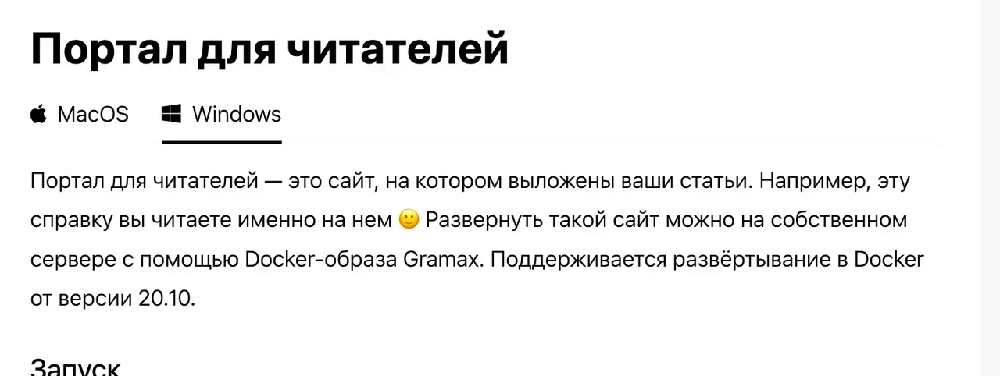
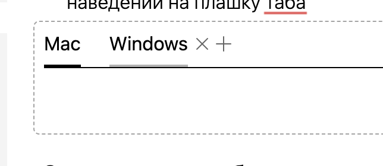
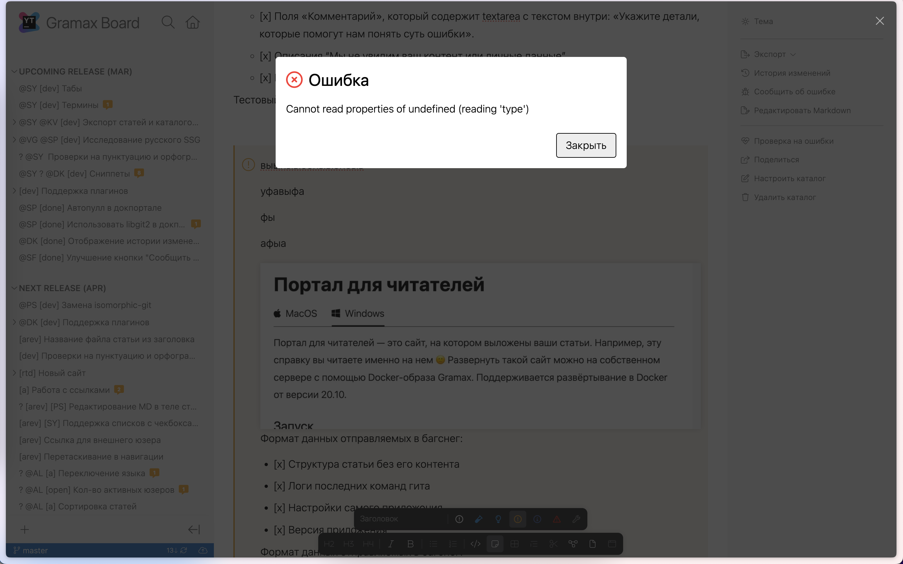

Общий вид:



При активной вкладке Mac и при наведении на таб Windows должно выглядеть так:



### Механика и внешний вид

Вкладки:

-  Ширина табов ограничена шириной блока. Пусть вводят столько сколько нужно

-  При добавлении таба нажатием на плюсик называть таб “Вкладка” и выделять весь текст, курсор должен быть сфокусирован там. Можно начать писать и задавать название вкладки.

-  Заголовок вкладки font-weight: 400

-  Минимальная ширина вкладки 1px

-  Расстояние между табами и крестиком 0.25rem, а между крестиком и другим табом 0.5rem

-  Нижняя граница вкладок должна быть `var(--color-line)`

-  При наведении на неактивный таб снизу должна рисоваться граница с цветом `var(--color-text-secondary)`

-  При редактировании названия вкладок при нажатии на Enter курсор должен переходить в содержимое вкладки

Плюсик:

-  Появляется при наведении на шапку таба. При наведении на плюсик “Добавить новую вкладку”.

-  При нажатии создается новая вкладка в конце списка вкладок с названием “Вкладка”.

-  крестик отображается при наведении мышкой на таб.

-  Курсор при наведении на таб должен быть обычный текстовый (т.к. туда встанет курсор)

Крестик:

-  При наведении на вкладку справа от нее появляется крестик. При наведении на него показывается тултип “Удалить вкладку”.

-  При попытке удалить последнюю вкладку у пользователя спросить “Вы удаляете последнюю вкладку. Удалить весь элемент?”. При подтверждении - удалить полностью весь элемент табов.

Внешний вид рамки:

-  margin/padding боковые -8px/8px, вертикальные -4px/4px

-  Радиус границы должен быть размером large (5px). Заодно радиус тулбара должен быть normal (4px), а радиус элемента в тулбаре small (3px)

Markdown:

```md
[tabs]

[tab:name:icon]

[/tab]


[tab:name:icon]

[/tab]

[/tabs]
```

### Замечания

1. Находясь в заметке, которая расположена прямо над табом, я могу нажать fn+backspace и загнать таб в заметку. После чего вся страница ломается.

   

### Дальнейшие шаги

-  Перемещение табов можно сделать через стрелки у каждого таба, появляются при наведении на плашку таба

-  При добавлении таба нажатием на плюсик называть таб “Вкладка” и выделять весь текст, курсор должен быть сфокусирован там. Можно начать писать и задавать название вкладки.