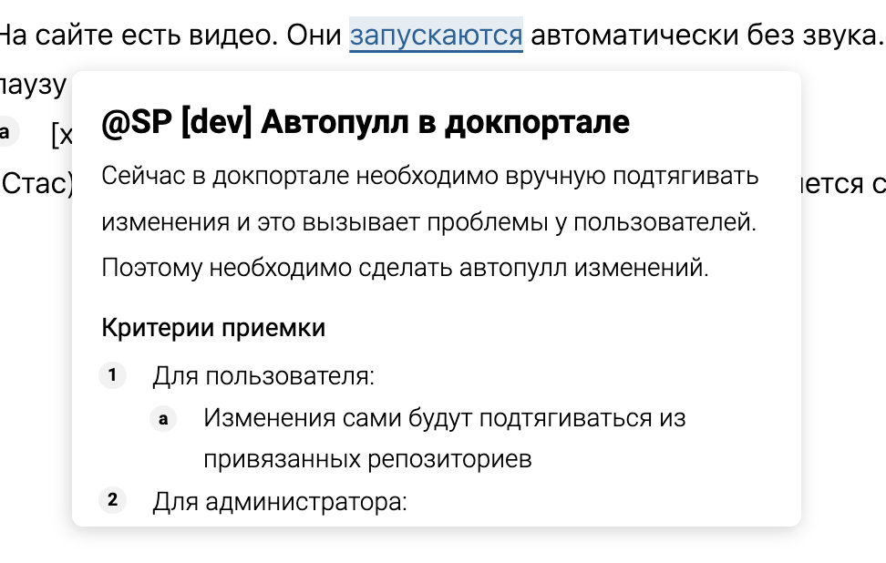

:::danger Есть замечания ниже

В блоке “Замечания”

:::

Референсы:

-  <https://help.obsidian.md/Home>

-  <https://en.wikipedia.org/wiki/Cucumber>

Как таковые термины предлагаю не делать, ограничиться ссылками на статьи и превью контента статьи, как в Википедии.

В дальнейшем, если мы сделаем [типизацию](./../../upcoming-release/search-as-plugin.md) блоков и возможность делать на них ссылки, то можно будет делать отдельную статью с глоссарием и делать ссылки на блоки в этой статье с превью текста блока.

1. Когда навожусь на ссылку, которая ведёт на статью в каталоге, то над окном редактирования ссылки появляется превью статьи.

2. Превью показывает:

   1. Первый блок в статье, который является текстом.

   2. Если после текста идёт список, то его также показываем в превью.

   3. Превью не должно превышать 290 символов. После 285 символа предлагаю осветлять текст, чтобы юзер понял, что можно прочитать продолжение по ссылке.

3. Текст в превью сохраняет форматирование из статьи. В т.ч., если там есть ссылка или файл, то из превью можно их считать/перейти, но нельзя редактировать.

4. Текст в превью можно выделить и скопировать.

### Требования к внешнему виду

Общий вид, который нужно сопоставить по pixel perfect в статье *Новый сайт* [comment:2](@SY[/comment] как добавить ссылку без  выделения текста?)

На что стоит обратить внимание:

-  Все размеры должны быть даны в em без пикселей (в списках чтобы ровно было придется немного повозиться, там хитрая верстка у нас).

-  Базовый размер шрифта `14px`, `line-height: 1.4`.

-  Размеры заголовков уменьшенные: font-size: h1 = 1.3, h2 = 1.2, h3 = 1.1, h4 и ниже = 1.

-  Вертикальные отступы у всего уменьшены в полтора раза. Т.е. margin вместо 1 и 0.5 стал 0.6 и 0.3.

-  [comment:5]Радиус у поповера увеличен до 8px[/comment] (если что можно не делать, за следующий месяц запланировано).

-  [comment:6]Ссылка по которой открыт поповер[/comment] подчеркивается (на скрине еще заливка есть и бордер underline-offset 0.2, предлагаю его не делать).

-  [comment:7]У поповера желательно сделать уголок [/comment](как у тултипов), который привязан к тому месту, где находился курсор мыши, когда он показался.