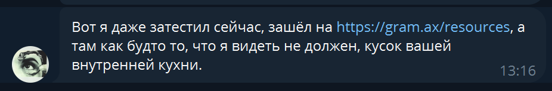

Сейчас у нас есть [gram.ax/resources](http://gram.ax/resources), и там используется специальный захардкоженный образ из ветки `blog`. Хотелось бы сделать его более универсальным, чтобы можно было развернуть блог для ICS, используя тот же самый образ и настраивая его только через переменные среды.

Еще надо бы добавить перенаправление пользователей с главной страницы, если они не авторизованы (было когда-то в планах, но не было случая добавить).

## Критерии приемки

-  Нажатие на название каталога должно вести на корень каталога, а нажатие на лого вести на сайт.

-  Добавлено перенаправление неавторизованных пользователей с главной страницы на сайт.

-  Добавлена возможность изменять на какой сайт будет вести нажатие на логотип и перенаправление неавторизованных пользователей с главной страницы (для [gram.ax/resources/blog](https://gram.ax/resources/blog) это будет [gram.ax](https://gramax), а для [ics-it.ru/resources/blog ](https://ics-it.ru/resources/blog)это будет [ics-it.ru](https://ics-it.ru/)).

## Трудозатраты

-  Анализ - 2 часа.

-  Разработка - 4 часа.