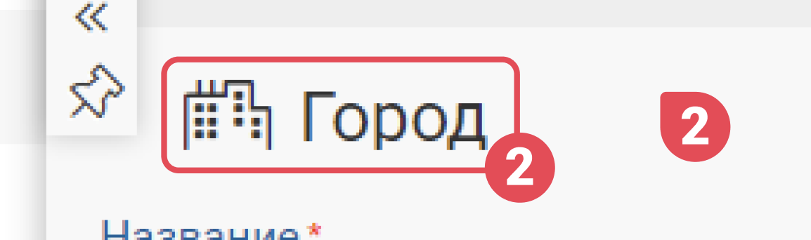
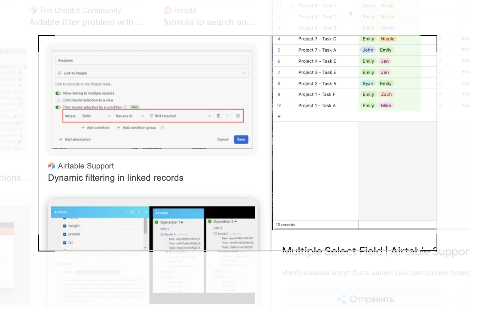
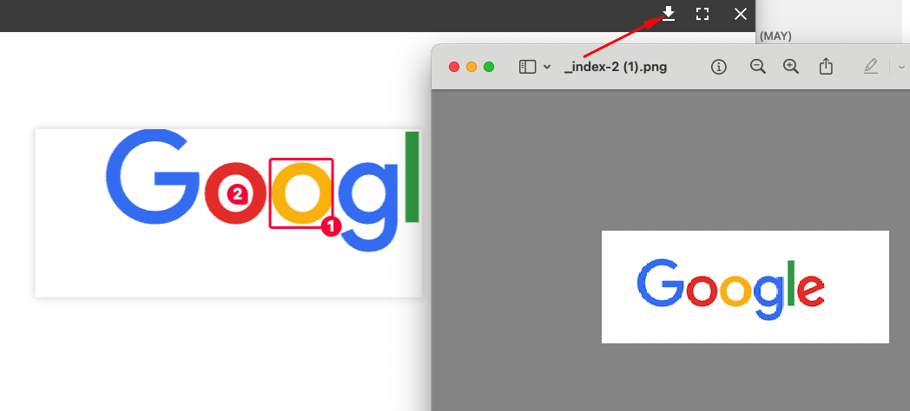
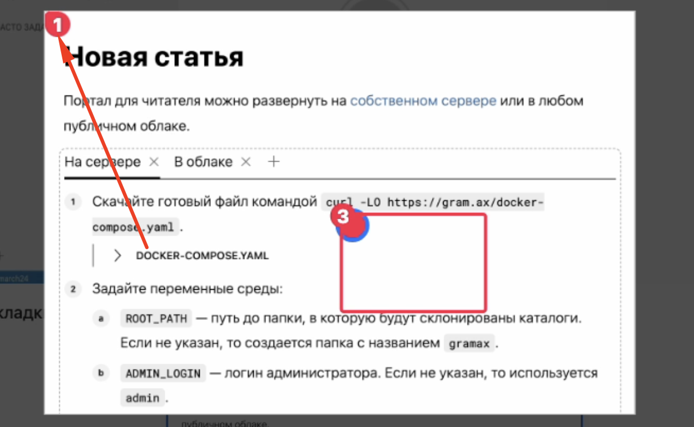
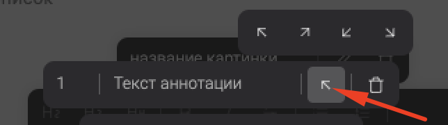

Сейчас нет никакой возможности хоть как-то отредактировать изображения через визуальный редактор. Хотелось бы иметь такую возможность.

## **Критерии**

-  **Режим редактирования**. Редактирование изображение вызывается из тулбара.

   -  Внешний вид окна редактирования:

      -  Картинка имеет настоящий размер.

      -  Задний фон имеет цвет #fff с прозрачностью в 10%.

      -  Под изображением появляется тулбар со следующими элементами: 1) добавить указатель 2) добавить рамку | вертикальный разделитель | 3) обрезка 4) Сохранить

   -  **Пометки на изображении**:

      -  Типы пометок (annotations):

         -  Рамка. Добавляется автоматически при зажатом ЛКМ на изображении и отпускании в другой позиции. При нажатии на кнопку в тулбаре -- добавляется по центру изображения.

         -  Указатель. Добавляется автоматически клику на изображение. При нажатии на кнопку в тулбаре -- добавляется по центру изображения.

      -  Внешний вид:

         -  Диаметр аннотаций - 24px.

         -  Радиус указателя - 4px.

         -  Числа жирные и с размером 18px.

         -  Закругление рамки по углам 4px.

         -  Цвет не изменяется пользователем.

            

      -  При выборе объекта он выделяется синей обводкой (outline).

      -  Направление:

         -  Указывается через выпадающий список в дополнительном меню (меню изменения объекта) или при создании новой аннотации. Выбор сохраняется, и все последующие создаются с таким же номером.

         -  В рамке аннотация устанавливается в соответствующем угле.

         -  Аннотация не принадлежащая к рамке имеет измененный угол со соответствующим направлением.

      -  Порядковый номер:

         -  При создании первой аннотации она не имеет номера. При создании второй в первый элемент добавляется 1, а во второй 2. При последующем добавлении номер увеличивается на 1.

         -  При удалении элемента  с числом, все следующие сдвигаются на 1. При изменении числа на существующий номер -- то, вместо которого вставили, и все следующие увеличиваются на 1.

         -  Порядковый номер не может быть двузначным. При достижении 9 все следующие аннотации создаются без номера.

      -  Описание: Необязательное текстовое поле. Значение отображается тултипом сразу же при наведении на рамку/указатель.4

   -  **Режим обрезки**. Режим включается при нажатии на кнопку обрезки. При переходе в режим обрезки:

      

      -  Появляется тулбар обрезки с кнопками:

         -  Удалить обрезку -- убирает всю обрезку и выходит из режима.

         -  Сохранить на диске -- появляется когда есть обрезанная область. После нажатия выходит из режима обрезки и белесая область пропадает. Действие можно отменить.

      -  Дополнительно:

         -  Уголки имеют стандартный синий цвет (цвет выделения узлов).

         -  Размер обрезчика не ограничивается.

         -  Вырезанная область плавно центрируется (транзишон на пол секунды).

-  **Отображение в Markdown**:

   -  При редактировании изображения само изображение не изменяется. А все дополнительные изменения сохраняются в md

      `[./image.png:alt:title:x,y,w,h:annotation,x,y,text,top-left,&square,x,y,w,h,text,top-left,]`

      Примеры:

      `[./edit-image.png:::0,0,100,100:]` - без элементов

      `[./edit-image.png:::0,0,100,100:annotation,35,45,privet,bottom-right]` - с элементом

      `[./edit-image.png:::10,35,90,65:]` - с обрезкой

   -  Когда нет дополнительных свойств, то картинка отображается в старом сокращенном виде, как это принято в Markdown

-  **Отмена изменений.** После выхода из редактирования история изменений очищается.

## Замечания

1. Если применена обрезка, то значок в тулбаре был синим. [icon:check]

2. Странная анимация при включении режима обрезки [icon:check]

3. Синий цвет на углы у обрезки и аутлайн на квадратной аннотации [icon:check]

4. Появление углов для растяжения у квадратной аннотации при hover  [icon:x]

   Не реализовано, так как за синим аутлайном не видно, поэтому и толку нет.

5. Без отступов у уголков растяжения [icon:check]

6. У квадратной аннотации тултип у кругляшка [icon:check]

7. Закрытие редактора с подтвердждением [icon:check]

8. Сохранение в тулбаре через вертикальный разделитель [icon:check]

9. Задний фон окна редактирования с альфой 80% [icon:check]

10. Дефолтный текст не должен быть установлен [icon:check]

11. При выходе за рамки контейнера при создании аннотации её удалять  [icon:check]

12. Контейнеру предупреждения очень плохо  [icon:check]

13. Пустое место в модальном окне [icon:check]

14. Поставить в компоненте кнопки иконку и текст на одном уровне [icon:check]

15. Disabled на инпут индекс при единственной аннотации [icon:check]

16. Удаление создания аннотации при mouseUP [icon:check]

17. \[-\]Если обрезать картинку, добавить несколько пометок и запушить статью, то скачивается старая версия картинки.

    

18. \[-\]В режиме редактирования картинки при двойном клике по картинке появляется аннотация.

19. \[-\]При добавлении нескольких аннотации очень быстро в верхнем левом углу промелькивает пометка “1“.

    

20. \[-\]У главной кнопки указания направлений нет тултипа.

    

21. Если несколько элементов накладываются друг на друга, то появляется проблема при удалении этих лишних пометок. [4444\.mov](./4444.mov)

22. У кнопок “Сохранить“ разные иконки