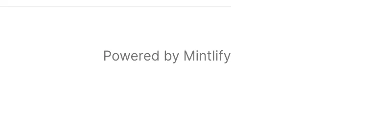
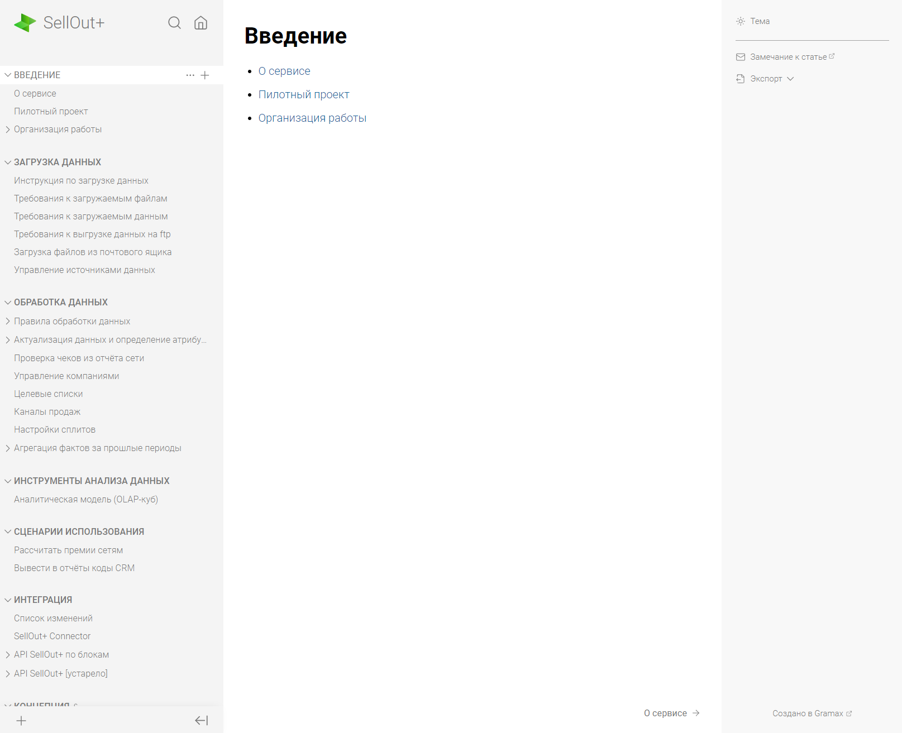
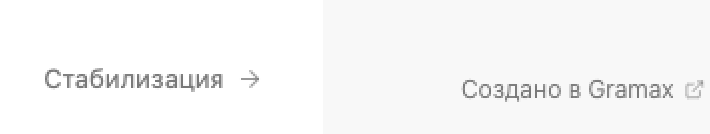
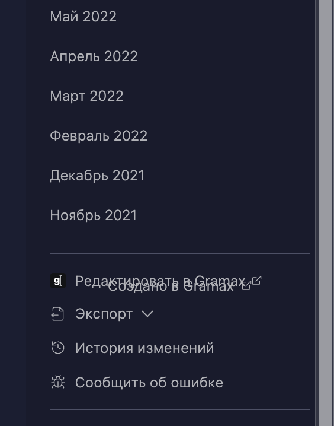

Сейчас любой может развернуть портал на Gramax и никакого упоминания о нас там не будет.

Нужно добавить упоминание.

:::hotfixes:true Пример

:::

## Критерии приемки:

-  В правом нижнем углу есть пометка “Создано в Gramax”.

   -  Шрифт, размер, толщина текста -- как у кнопок переключения между статьями.

   -  Выравнивание по центру правой панели.

   -  Отступ снизу -- как у кнопок переключения между статьями.

-  Пометка появляется на портале для чтения и не видна в приложении.

-  На надпись можно кликнуть, перейдет на сайт <https://gram.ax/>.

-  Справа от надписи, иконка внешней ссылки.

## Замечания

-  Кнопка переключения между статьями немного жирнее и находится чуть выше пометки “Создано в Gramax”.

-  Кнопка сломалась в <https://alfa-ics-it.gram.ax/doc-reader>

