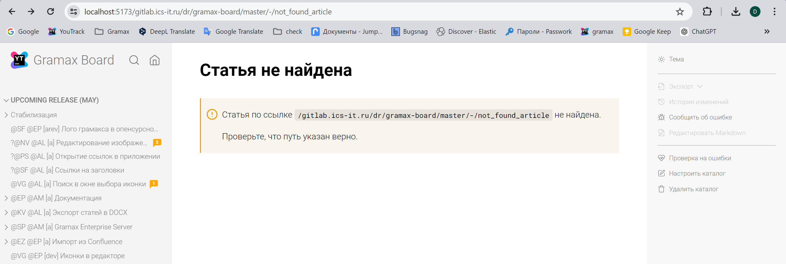
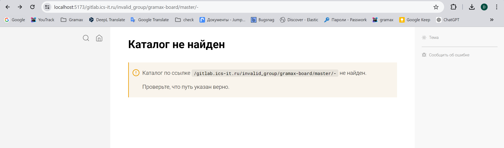
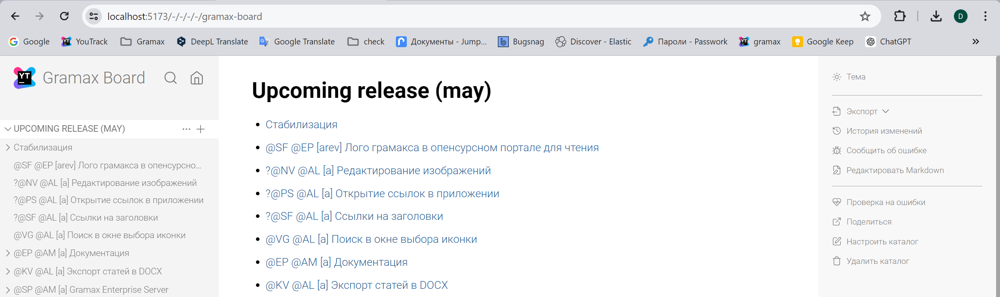
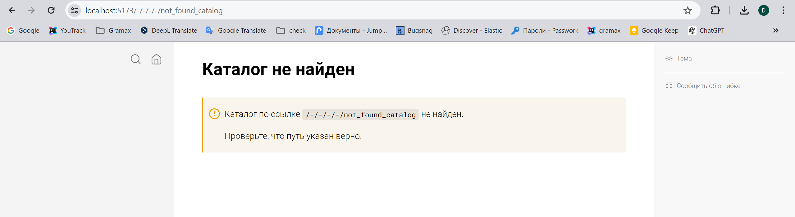
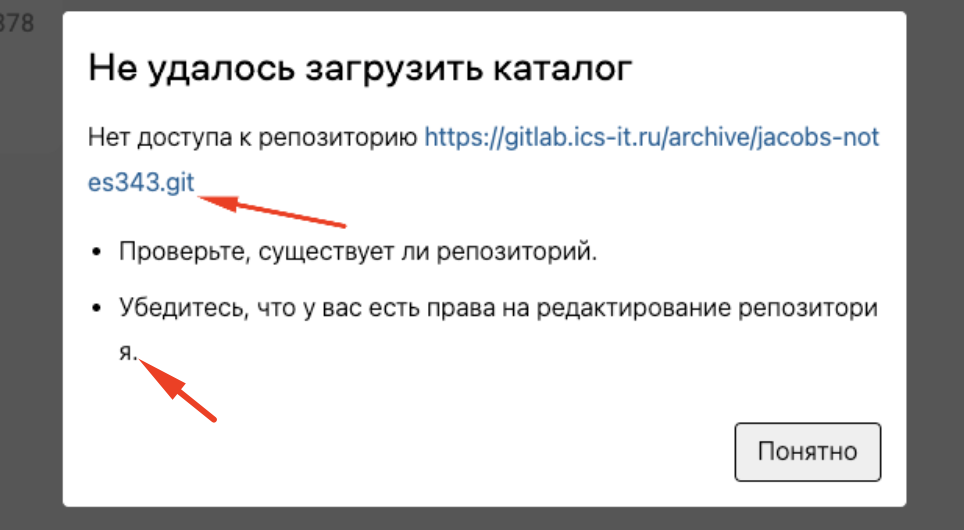

Есть проблема, что при открытии грамакс с некорректной ссылкой на удалённый репозиторий, приложение выдает окно клонирования каталога. Но после того как пользователь нажимает на клонировать у него выходит либо 404 либо, что-то непонятное для обычного пользователя. Хотелось бы чтобы пользователи не сталкивались с непонятными ошибками.

Исходная заявка -- <https://support.ics-it.ru/issue/GXS-1435>

## Критерии

-  **Репозиторий еще не склонирован.** Появляется модальное окно:

   -  Заголовок: Загрузить каталог?

   -  Текст: Ссылка ведет на каталог, который еще не загружен.

      Для просмотра и изменения  нужно загрузить его из хранилища.

   -  Кнопки: Загрузить и Отменить

   -  При загрузке мы проверяем:

      -  **Нет хранилища.** При попытке клона репозитория из хранилища, которое не добавлено:

         -  Заголовок: Не удалось загрузить каталог

         -  Текст: Нет доступа к хранилищу {name}. Добавьте его, чтобы продолжить загрузку.

         -  Кнопки:

            -  Отменить

            -  Добавить хранилище

      -  **Нет репозитория в хранилище или нет доступа к нему**. При попытке клонирования кривой ссылки (404) открывается модалка:

         -  Заголовок: Не удалось загрузить каталог

         -  Текст: Нет доступа к репозиторию {rep-url}.

            -  Проверьте, существует ли репозиторий.

            -  Убедитесь, что у вас есть права на редактирование репозитория.

         -  Кнопка: Понятно

-  **Ссылка на репозиторий неполная НЕКОРРЕКТНАЯ?**. При открытии ссылки, в которой не содержится вся информация про удалённый репозиторий (домен, группа, название репозитория),  Gramax считает это локальным каталогом, и попытается открыть как обычный локальный каталог и возникают ошибки понятные пользователям:

   -  **Нет локального каталога.** Отображается статья:

      -  *Заголовок*: Каталог не найден

      -  *Текст*:

         :::note 

         Каталог по ссылке `путь` не найден.

         Проверьте, что путь указан верно.

         :::

      -  Также убираются все кнопки в правой панели, кроме кнопки *Сообщить об ошибке,* также она  перенесена через сплиттер в самый низ.

   -  **Есть локальный каталог, но нет статьи**. Отображается статья:

      -  *Заголовок*: Статья не найдена

      -  *Текст*:

         :::note 

         Статья по ссылке `путь` не найдена.

         Проверьте, что путь указан верно.

         :::

      -  Кнопки в правой панели

         :::hotfixes:true Выглядят вот так

         

         :::

-  **Каталог склонирован, но устарел.** Появляется модальное окно:

   -  *Заголовок*: Синхронизировать каталог?

   -  *Текст*: Версия каталога устарела. Чтобы получить изменения, синхронизируйте каталог.

   -  *Кнопки*:

      -  Синхронизировать

      -  Отменить

-  **Каталог склонирован, ссылка ведет на другую ветку.** Появляется модальное окно:

   -  *Заголовок*: Сменить ветку?

   -  *Текст*: Вы переходите по ссылке, которая ведет на другую ветку.

      Если у вас есть неопубликованные изменения и они не конфликтуют с изменениями в другой ветке -- они перенесутся.

      Сменить ветку ИМЯ на ветку ИМЯ и синхронизировать каталог?

   -  *Кнопки*:

      -  Сменить и синхронизировать

      -  Отменить

**Анализ:** 1 день

**Реализация**: \~2-3 дня

**Design details:**

**Если что-то не так, но мы не знаем что**. Например, плохой интернет, архивирован реп, любая другая причина.

-  Заголовок: Не удалось загрузить каталог

-  Текст: Попробуйте обновить страницу и загрузить каталог заново.

-  Кнопка: Понятно

-  Каталог найден, статья не найдена:

   `https://app.gram.ax/gitlab.ics-it.ru/dr/gramax-board/master/-/not_found_article`

   

-  Каталог с таким названием существует, но неправильно указана информация про удалённый репозиторий (домен, группа или название репозитория):

   `https://app.gram.ax/gitlab.ics-it.ru/invalid_group/gramax-board/master/-`

   

-  Ссылка указана на локальный каталог:

   -  Каталог с таким именем есть:

      `https://app.gram.ax/-/-/-/-/gramax-board`

      

   -  Каталога с таким именем нет:

      `https://app.gram.ax/-/-/-/-/not_found_catalog`

      

**Ограничения**:

-  Сам libgit2 возвращает при любом неправильном запросе ошибку `bad packet length`. Пока решили, что при этой ошибке считать, что репозитория не существует или к нему нет доступа.

-  Если пользователь начнёт клонировать репозиторий, а потом у него отключится интернет, то у него просто будет бесконечная загрузка. Пока не знаем как это лучше решить.

### Замечания

-  \[x\]В url на репозиторий присутствует лишнее значение “.git”.

-  \[x\]2-й пункт поместить в одну строку, только одна буква переносится на следующую строку.

