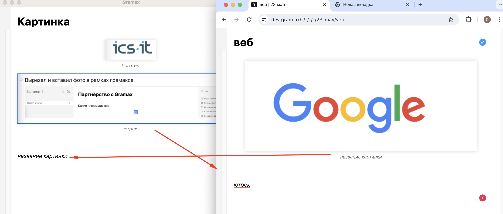
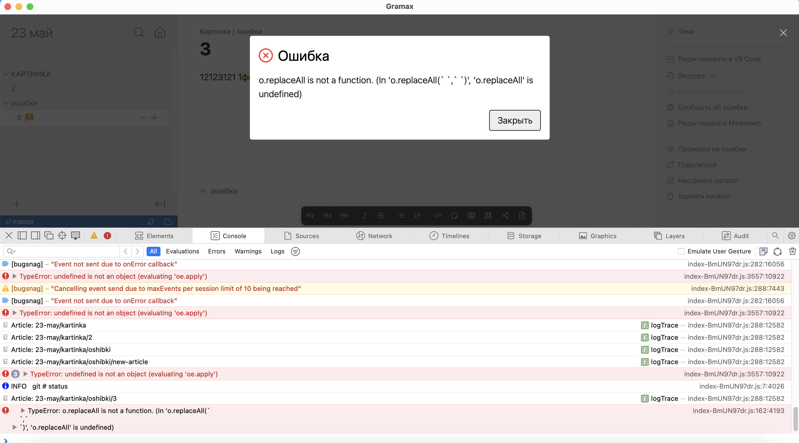

При вырезании и вставки фрагмента, имеющего ресурс, например картинку, она пропадает. Хотелось бы, чтобы ресурсы можно было копировать и вставлять, как текст.

## Критерии

-  Вырезание -- это копирование в буфер и удаление выделенного фрагмента

-  Если вставляем из буфера фрагмент в котором содержался комментарий то комментарий не вставляется если в этой статье такой комментарий уже есть.

-  Отмена работает с ресурсами точно также как с обычным текстом

-  При копировании имя ресурса сохраняется в буфере при вставке если такой ресурс уже существовал то имя файла корректируется по той же логике по которой статьи

## Ограничения

-  Браузеры запрещающие кастомные MIME типы не могут принимать буфер с десктоп приложения или других браузеров (Firefox, Safari и прочие).

## Оценка

-  Реализация -- 7 дней

-  Реальность -- \~20 дней

## Исходная заявка

-  <https://support.ics-it.ru/issue/GXS-1332>

## Замечания

-  \[x\]В десктопе вырезанная картинка после вставки появляется обратно. В веб-версии проблемы нет.

[video:https://drive.google.com/file/d/1W8_Q58zjrZx3V98R0kzVaf9HLMYo93Hp/view?usp=sharing:]

-  Скопированная картинки из десктопа в веб и наобород не вставляется, только подпись картинки появляется.

-  \[x\]Не работает отмена вырезанного файла (последнего действия) по CTRL+Z.

-  \[-\]При вставке скопированного текста, в котором содержался комментарий, в новый узел - появилась ошибка. Больше не смогла воспроизвести.

   
