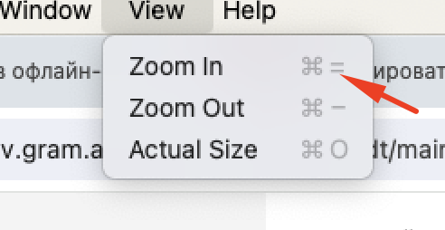
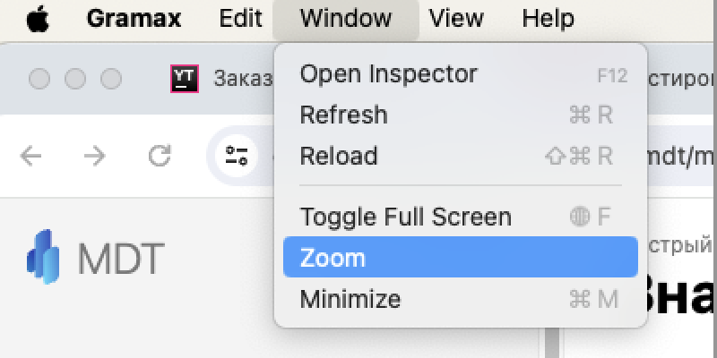

Сейчас нехватает возможность изменять масштаб контента в десктопном приложении.

Нужно, чтобы пользователь имел возможность изменять масштаб привычными ему способами -- при помощи `cmd/ctrl +/-` и жестами.

## Критерии

1. В верхнем меню есть вкладка `View`, которая содержит в себе:

   1. `Zoom In` [icon:command]\+ для увеличения масштаба

   2. `Zoom Out` [icon:command]\- для уменьшения масштаба

   3. `Actual Size` [icon:command]0 для сброса масштаба до изначального

   4. При увеличении и уменьшении масштаб переключается между: 25, 33, 50, 67, 75, 80, 90, 100, 110, 125, 150, 175, 200, 250, 300, 400, 500 процентами

2. В Windows и Linux можно изменять масштаб при помощи жеста `pinch zoom`.

## Технические ограничения

1. `macOS`: `WkWebView` [должен уметь](https://developer.apple.com/documentation/webkit/wkwebview/1414983-allowsmagnification?language=objc) увеличиваться при помощи жестов, но `tauri` не имеет никаких способов настроить так `WkWebView`.

   Как вариант -- написать Issue в их репозиторий. Возможно добавят, но вряд ли в ближайшее время.

2. `macOS`: Во вкладке `View` хоткей `Zoom In` отображается как [icon:command]= -- в таури нельзя задать именно `+`. На работу приложения это не влияет

3. `windows`: Нет вкладки `View`, поскольку хоткеи из неё пытаются переопределить стандартную логику webview и ломают её

## Зависит от

1. [Обновление Tauri](./../../jun-2024/prilozhenie-2/obnovlenie-tauri-do-200.md)

## Замечания

-  \[-\]В сочетании клавиш для увеличения масштаба = вместо +.

(Всё ок, это ограничение.)

-  \[-\]Кнопка `Zoom` есть и во вкладке Window.

(Всё ок, Window > Zoom управляет размером окна)

## Замечания из демо

-  Подумать как выдавать текущий масштаб

-  Сделать на cmd+0