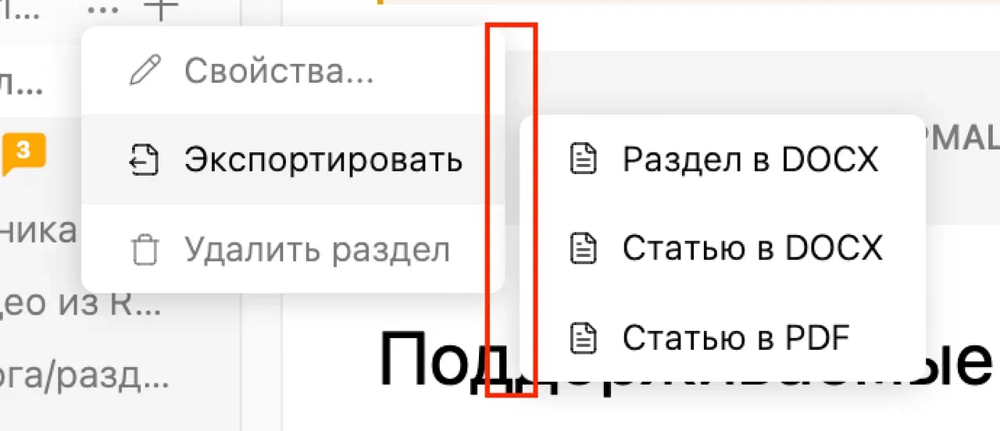
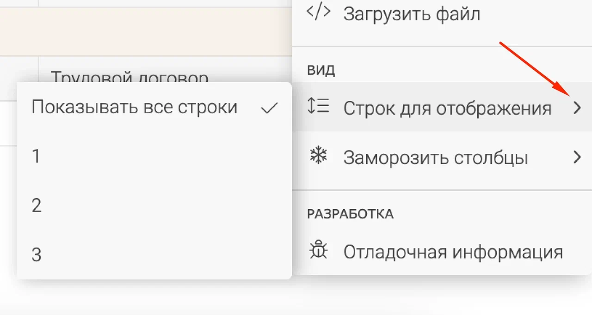
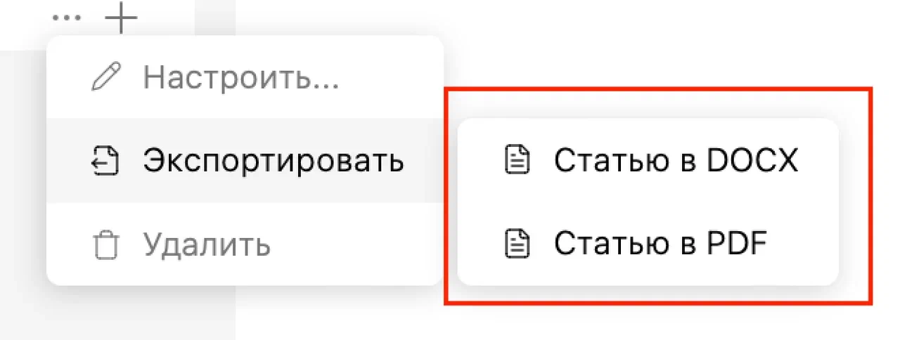

На данный момент нельзя экспортироавть DOCX в докпортале. Нужно это исправить.

## Критерии

-  Работает экспорт в докпортале

-  Кнопка троеточия есть в докпортале

   [image:./_index-3.png:::0,0,100,100:70:]

## Оценка

-  Анализ: 10ч

-  Реализация: 48ч

## Тестовые сценарии

-  Экспорт каталога

-  Экспорт статьи

-  Неудачная попытка экспорта раздела самой дочерней статьи

-  Экспорт какого-то разделаэ

## Известные ограничения

-  Редактированные картинки на сервере экспортируются как обычные

-  Шрифты у диаграмм игнорирются, вместо них -- стандартный из библиотеки sharp

-  Mermaid диаграммы будут экспортироваться как блок кода.

-  ER-диаграммы без стрелок

## В рамках следующих юс

-  Убрать растояние между вападающими списками и добавить стрелки

-  Сделать цвет текста серым и только при наведении - черный

## Замечания

-  На [докпортале](https://alfa-ics-it.gram.ax/) нет кнопки “Экспортировать каталог в DOCX“.