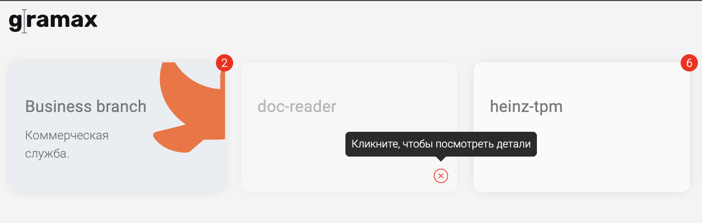
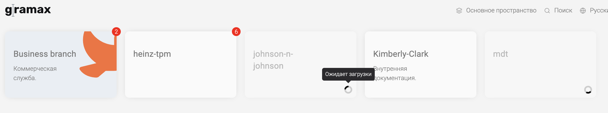

Сейчас при процессе клонирование у нас модальное окно из которого ничего не понятно, коме того что идет какой-то процесс клонирования. Хотолсь бы чтобы при клонированиии пользователь мог заниматься чем-нибдуь другим и был виден прогресс.

## Критерии

-  При запуске на главной страницу появляется плашка c названией папки и крутилкой

   

   -  На эту плашку невозможно нажать

-  Во время клона можно нажать на другие плашки и работать в них

-  Если при клонированиии сулчиться ошибка то она выведиться примерно вот таким образом

   

   -  При клике на иконку появялется стандартное модальное окно с ошибкой клонирования и каталог удаляется из главной

-  При клонировании через ссылку, такая же ситуация

-  Когда клонируется один каталог и пользователь через интерфес клонирует другой, то 2 каталог добавялется в очередь и также отображается на главной

   

   -  При обновлении страницы вся очеред очищается

## Тесты

-  Переписаны тесты е2е

## Оценка

-  Анализ: 2ч

-  Реализация: 16ч.

## Замечания

-  При загрузке двух и более каталогов, 2й каталог не добавляется в очередь. На главной странице на этих каталогах появляется красный восклицательный знак и нет крутилки. А в каталогах бесконечная загрузка с ошибкой “Не удалось определить текущую ветку”. [123\.mov](./123.mov)