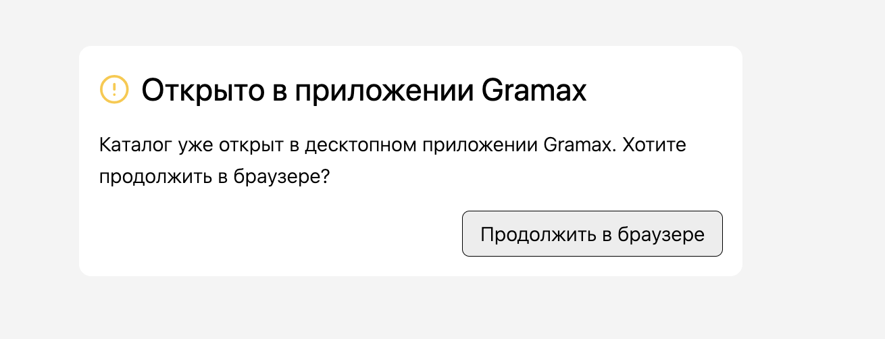
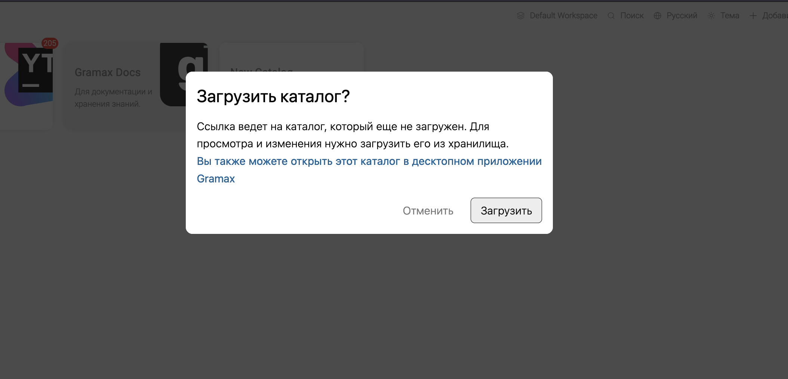
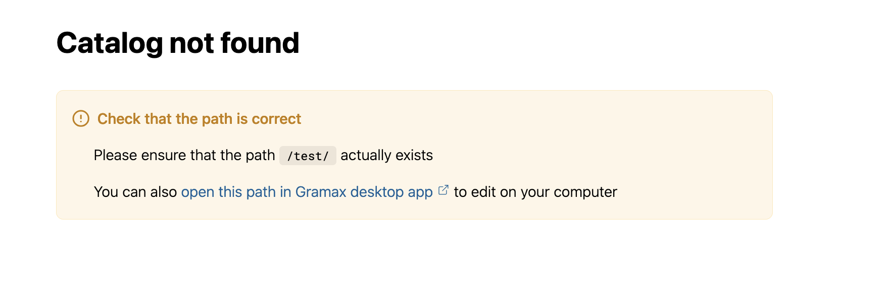

Основной кейс: Когда открываю ссылку она должна сразу открыться в декстопном приложении (если оно установлено).

До этого мы уже начинали делать эту задачу. Частично проблема была решена, но полностью основной кейс не решили. Что есть сейчас: при открытии ссылки, она открывается в веб-приложении и если такого каталога в веб-приложении не существовало -- предлагает сначала склонировать, если старые изменения синхронизировать, если ветка другая -- переключить. Без этого не появляется кнопка открытия в десктопном приложении.

Сейчас есть возможность открыть статью в приложении, но для этого нужно в неё сначала зайти. Это создаёт неудобства, если каталог не склонирован или не синхронизирован.

Нужно, чтобы при открытии ссылок `https://app.gram.ax/<path>`, приложение пыталось перенаправить пользователя в десктопное приложение и не загружать каталог в браузере.

Верхнеуровневые требования:

-  Нужно открывать ссылку в десктопном приложении независимо от состояния веб-приложения

-  Открытие ссылки в десткопном приложении должно быть максимально быстрым и не отъедать каждый раз батарею для инициализации веб-приложения

## Критерии

1. Если пользователь переходит по ссылке в браузере, то перед загрузкой самого веб-приложения, оно пытается открыться в десктопе и открывается там, если десктопное приложение запущено

   1. Окно в браузере закрывается, если его возможно закрыть программно. Его возможно закрыть программно, если оно дочернее, т. е., например, было открыто по ссылке из Яндекс Мессенджера или других страниц.

      В противном случае пользователь видит сплеш-скрин

      

   2. Приложение загружается как обычно, если десктопное приложение не открыто

2. В правой навигации присутствует кнопка “Открыть в приложении”, если каталог не был найден

3. В предупреждениях о не найденном каталоге и статье есть ссылка на открытие десктопного приложения. При нажатии:

   1. [comment:J0fKz]Ссылки на открытие приложения перенаправ[/comment]ляют дают возможность открыть текущую страницу в десктопном приложении.

      После перехода, веб-приложение проверяет, действительно ли удалось открыть приложение и выдаёт предупреждение в противном случае -- эта логика уже была.

      Эта проверка срабатывает во всех случаях, кроме не найденной статьи/каталога -- техническое ограничение, поскольку это кастомные статьи и их содержимое задаётся маркдауном.

   2. Такая ссылка также присутствует в окне предложения клонирования, если репозиторий не был склонирован

