

---

*  

   В ворде

*  

   В грамаксе

*  

   Объяснение

---

*  

   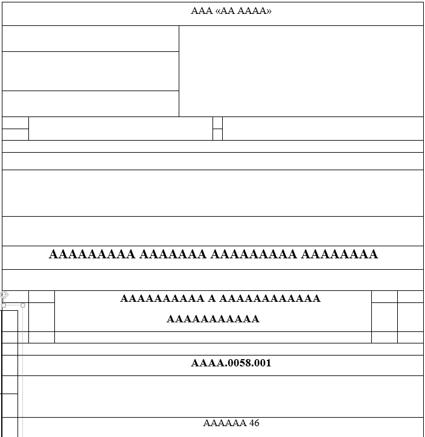

*  

   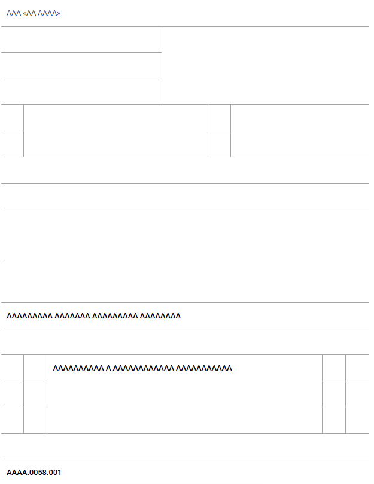

*  

   Поскольку у нас нет возможности выравнивания текста, то он всегда будет отображаться прижатым слева.

   В целом таблица вставилась как есть.

   Нет возможности скрытия границ

---

*  

   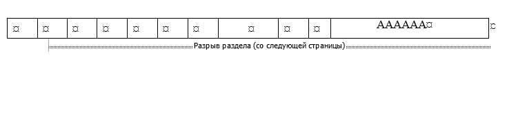

*  

   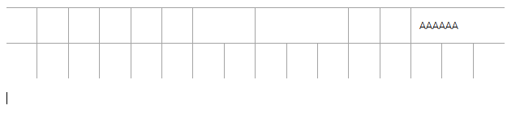

*  

   У нас нет разрыва страницы

---

*  

   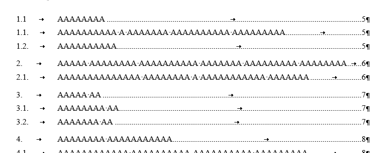

*  

   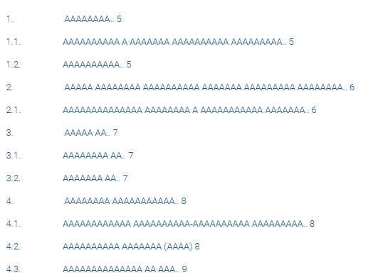

*  

   Нет выравнивая на всю ширину из-за отсутствия возможности “табать“ любые элементы.

   Ссылки вставились, но не ссылаются на что-то внутри документа.

   

   Вставляется сразу и содержимое, на что указывается ссылка

---

*  

   

*  

   \-

*  

   Они даже не выделяются вместе со всем документом.

   Если бы и выделялись, то просто встали на свое место, как обычный параграф

---

*  

   \-

*  

   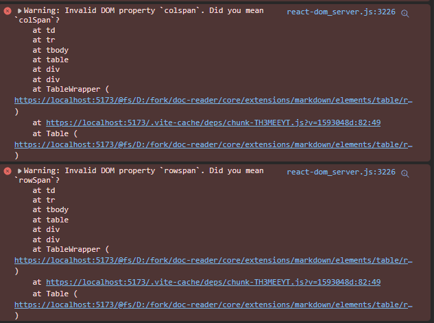

*  

   При вставке таблиц.

   У них rowspan, у нас rowSpan

   У них colspan,  у нас colSpan

---

*  

   Изображения

*  

   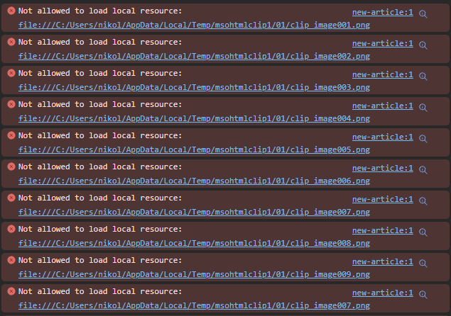

*  

   У нас нет доступа к месту, где хранятся изображения, из-за этого и невозможно их вставить.

---

*  

   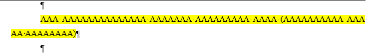

*  

   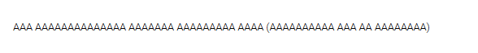

*  

   Не можем изменить задний фон текста.

   notion такое тоже не могет

---

*  

   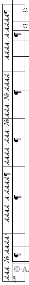

*  

   \-

*  

   Вертикальная таблица вообще не вставилась.

---

*  

   

*  

   

*  

   Списки


