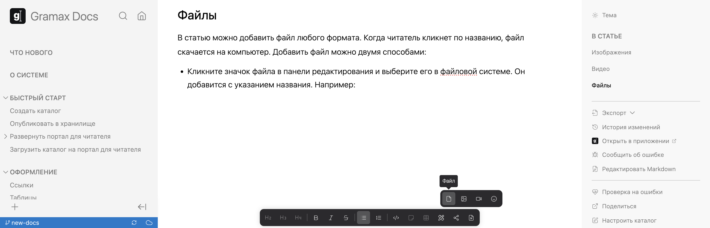

В статью можно добавить файл любого формата. Когда читатель кликнет по названию, файл скачается на компьютер. Добавить файл можно двумя способами:

-  Кликните значок файла в панели редактирования и выберите его в файловой системе. Он добавится с указанием названия. Например: [О системе \_ Gramax Docs.pdf.](<./О системе _ Gramax Docs.pdf>)

   

-  Выделите текст, на который хотите добавить файл. Затем кликните значок файла в дополнительной панели и выберите его в файловой системе. Файл добавится, но название будет скрыто. Например: [текст с файлом](<./О системе _ Gramax Docs-2.pdf>).