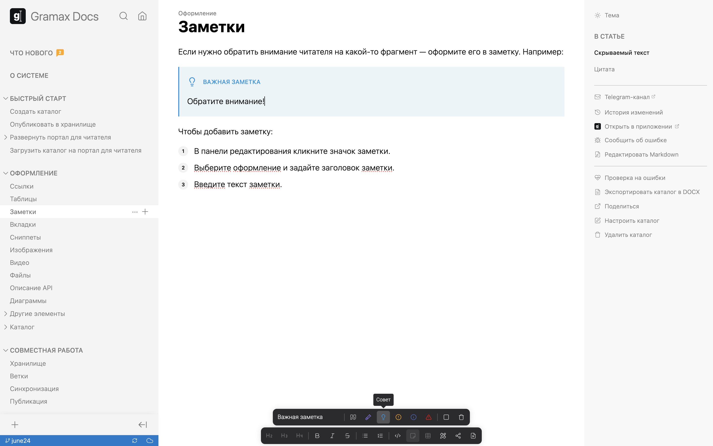

Если нужно обратить внимание читателя на какой-то фрагмент -- оформите его в заметку. Например:

:::tip Важная заметка

Обратите внимание!

:::

Чтобы добавить заметку: в панели редактирования кликните значок заметки. Затем выберите оформление, задайте заголовок и введите текст.

## Скрываемый текст

Вы можете скрыть текст заметки под спойлер -- на портале читателю ее нужно будет развернуть. Это удобно в случаях, если справочный текст длинный, но не обязательный. Например:

:::hotfixes:true Не очень важная заметка

Можете и не читать.

:::

Чтобы добавить заметку со скрываемым текстом, отметьте пункт *Сворачивать*.

## Цитата

Для оформления прямой речи в статье можно использовать стиль цитаты. Например:

:::quote 

Не злоупотребляйте заметками!

:::