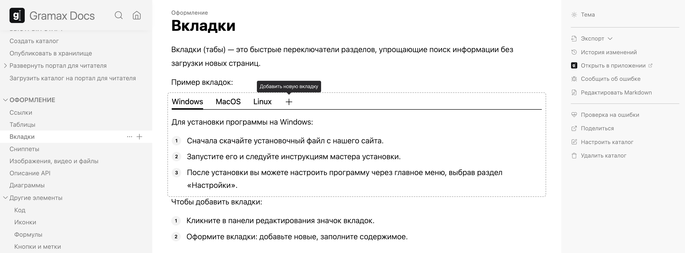

Вкладки (табы) -- это быстрые переключатели разделов, упрощающие поиск информации без загрузки новых страниц.

Пример вкладок:

[tabs]

[tab:Windows::]

Для установки программы на Windows:

1. Сначала скачайте установочный файл с нашего сайта.

2. Запустите его и следуйте инструкциям мастера установки.

3. После установки вы можете настроить программу через главное меню, выбрав раздел «Настройки».

[/tab]

[tab:MacOS::]

Для установки программы на MacOS:

1. Перетащите загруженный файл приложения в папку «Приложения».

2. Откройте его через Finder, при первом запуске может потребоваться подтверждение в связи с политиками безопасности macOS.

3. Для настройки используйте меню настроек в верхней части экрана, выбрав «Настройки приложения».

[/tab]

[tab:Linux::]

Для установки программы на Linux:

1. В терминале предоставьте права на исполнение загруженного файла `chmod +x <файл>`.

2. Выполните команду `./<файл>`.

3. Запустите сам файл.

[/tab]

[/tabs]

Чтобы добавить вкладки: кликните в панели редактирования значок вкладок. Затем оформите их: добавьте новые, заполните содержимое.

