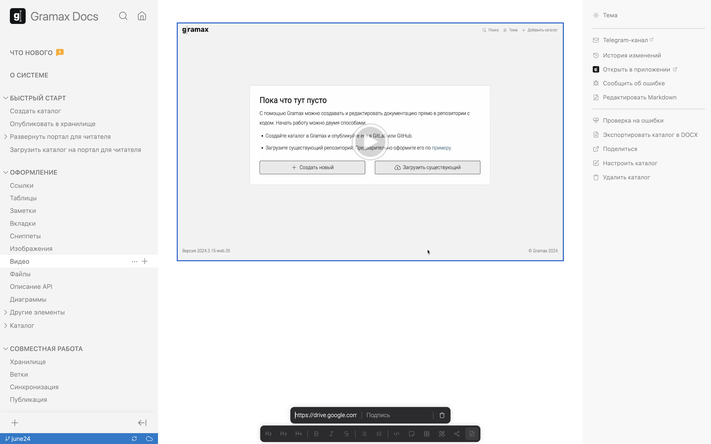

В статью можно добавить видео из следующих источников:

-  По прямой ссылке.

-  YouTube -- скопируйте URL страницы с видео или нажмите *Поделиться* и скопируйте короткую ссылку.

-  Rutube -- скопируйте URL страницы с видео или нажмите *Поделиться* и скопируйте короткую ссылку.

-  Google Drive -- нажмите на файле *Открыть доступ*, затем выберите в общем доступе *Все, у кого есть ссылка*. Кликните *Копировать ссылку*.

-  Dropbox -- нажмите на файле *Поделиться через Dropbox* и скопируйте ссылку.

-  Mega -- нажмите на файле *Получить ссылку* и скопируйте ее.

Чтобы отобразить видео из источника, кликните значок видео в панели редактирования и вставьте ссылку на него.

