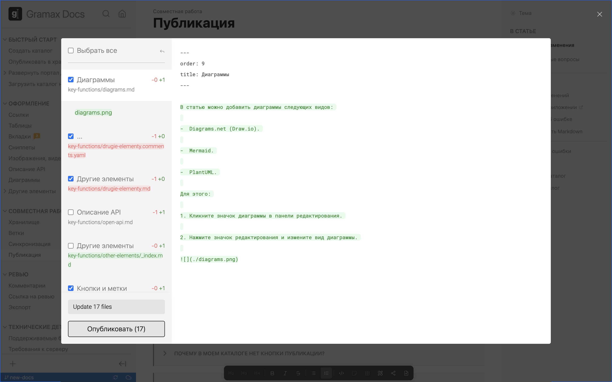
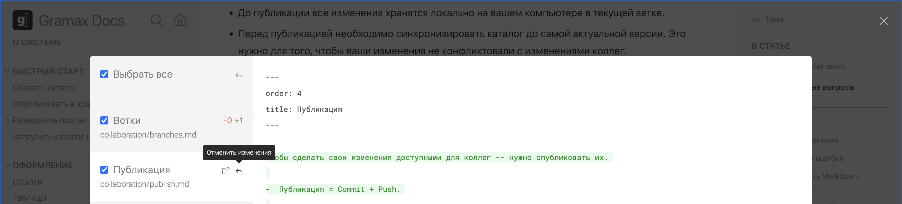

Чтобы сделать свои изменения доступными для коллег -- нужно опубликовать их.

-  До публикации (commit + push) все изменения хранятся локально на вашем компьютере в текущей ветке.

-  Перед публикацией необходимо синхронизировать каталог до самой актуальной версии. Это нужно для того, чтобы ваши изменения не конфликтовали с изменениями коллег.

-  Опубликовать можно как выбранные статьи, так и все.

-  К каждой публикации автоматически генерируется комментарий -- он также сохранится в Git-хранилище, как комментарий к коммиту. Этот комментарий можно изменить.

-  До публикации локальные изменения можно откатить. После публикации это сделать в Gramax невозможно.

## Опубликовать изменения

1. Кликните значок облачка в строке состояния репозитория.

2. Просмотрите изменения в статьях.

3. Отметьте статьи, которые нужно опубликовать. По умолчанию выбраны все.

4. Нажмите *Опубликовать*.

## Часто задаваемые вопросы

:::hotfixes:true Почему другие не видят мои изменения?

Чтобы ваши изменения стали доступны другим, нужно их опубликовать.

:::

:::hotfixes:true Почему в моем каталоге нет кнопки публикации?

Любые изменения публикуются в хранилище. Потому каталог должен быть подключен к любому из них.

-  Каталог загружен из хранилища, но связь не определилась -- кликните иконку хранилища и заполните данные о хранилище.

-  Каталог существует только локально -- кликните иконку хранилища, добавьте его и опубликуйте каталог.

:::

:::hotfixes:true Как откатить изменения в статье?

**До публикации:** если нужно откатить локальные изменения, которые еще не опубликованы.

Откройте окно публикации изменений и нажмите *Отменить изменения* рядом со статьей.

**После публикации:** если нужно откатить изменения, когда статья уже опубликована.

Функция возвращения к предыдущей версии не предусмотрена в Gramax. Но можно перепубликовать статью. Для этого:

1. Откройте статью и кликните *История изменений* в правой панели.

2. Выберите одну из версий, скопируйте содержимое статьи и закройте историю изменений.

3. В правой панели кликните *Редактировать Markdown* и вставьте содержимое из буфера обмена.

4. Опубликуйте изменения.

:::

:::quote:true Каталог загружен из хранилища, но в строке отображается зачеркнутое облачко.

У вас сгорел токен доступа к хранилищу. Добавьте хранилище заново и каталог автоматически свяжется с репозиторием.

:::