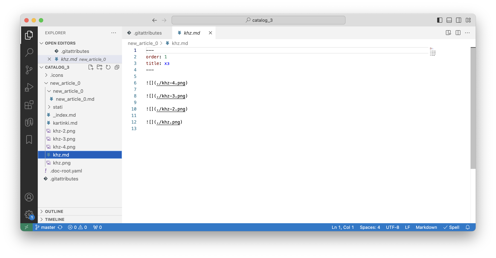
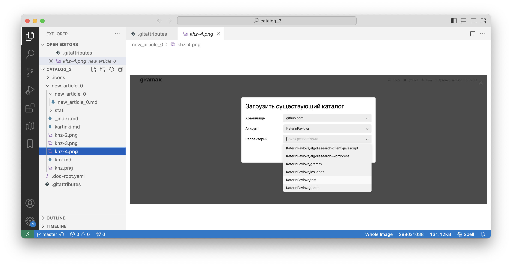
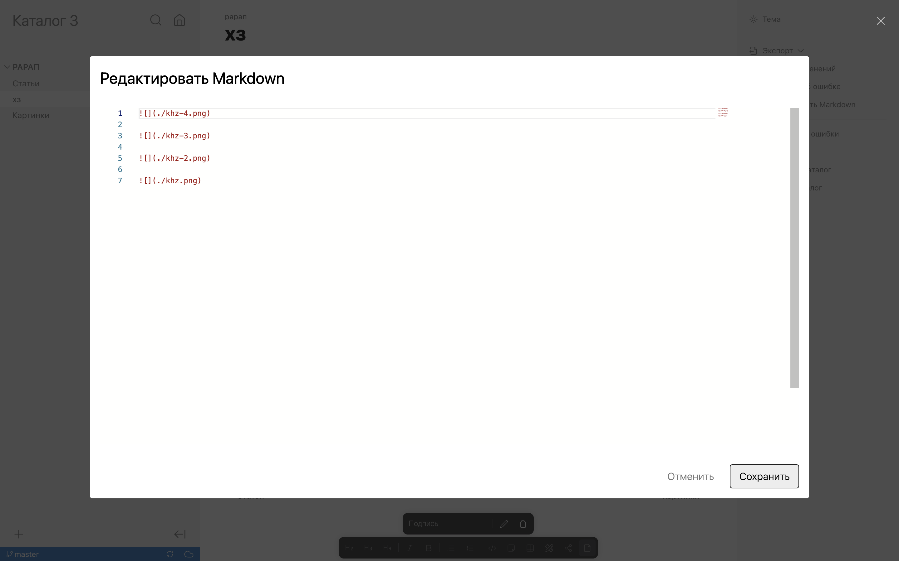
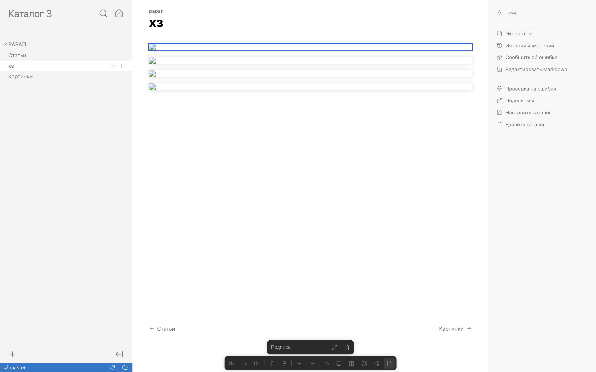
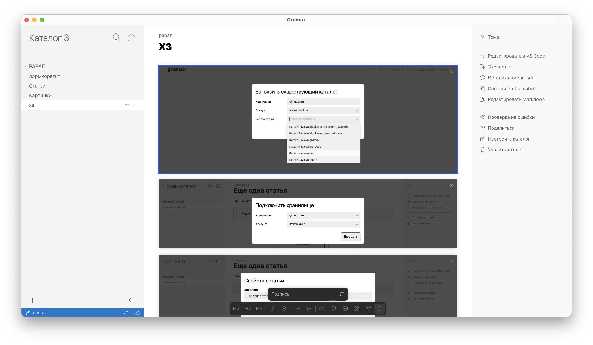

Git LFS (Git Large File Storage) -- это расширение для Git, позволяющее эффективно управлять и версионировать большие файлы, такие как изображения, видео и архивы. Вместо хранения этих файлов непосредственно в репозитории Git LFS сохраняет их в отдельном хранилище, заменяя их в репозитории ссылками на файлы. Это оптимизирует использование дискового пространства и ускоряет работу с репозиториями, особенно при работе с большими мультимедийными данными.

## Зачем это в Gramax

1. **Экономия места в репозитории:**\
   Git LFS хранит большие файлы отдельно от основного хранилища Git, заменяя их на текстовые метаданные в репозитории. Это позволяет экономить место, и основная история коммитов остается более компактной.

2. **Ускорение работы с репозиторием:**\
   При клонировании или переключении веток большие файлы не скачиваются сразу, а только при необходимости. Это позволяет быстро загружать репозиторий и работать с ним, так как скачивается только актуальный контент.

3. **Ускорение загрузки гифок:**

   Сейчас Gramax долго грузит гифки. Если их версии не будут клонироваться, воспроизведение должно быть пошустрее.

4. **Возможность хранения видео в репозитории:**

   Сейчас мы не позволяем хранить видео в репозитории. Позже можно будет добавить опциональную кнопку -- если Git LFS используется, видео можно добавить напрямую в реп.

## Как работать

1. Клонирую репозиторий. Git автоматически загрузит и разархивирует все необходимые изображения, управляемые через Git LFS. Просматриваю изображения в Markdown-файлах так же, как если бы они хранились непосредственно в репозитории.

2. Добавляю изображение в репозиторий, как обычно.

3. Пушу изображение в удаленный репозиторий -- Git LFS автоматически отправит изображение в своё хранилище, а в самом репозитории останется файл-заместитель с метаданными.

   :::hotfixes:true Файл-заместитель

   Файл-заместитель с метаданными в Git LFS представляет собой небольшой текстовый файл, содержащий информацию о том, где находится настоящий файл, управляемый через Git LFS. Этот файл сохраняется в том же формате и с тем же расширением, что и оригинальный файл, но вместо оригинального содержимого содержит метаданные.

   Типичный пример файла-заместителя для изображения в Git LFS выглядит примерно так:

   ```
   version https://git-lfs.github.com/spec/v1
   oid sha256:1234567890abcdef1234567890abcdef1234567890abcdef1234567890abcdef
   size 123456
   ```

   :::

4. Добавляю картинку в статью -- прописываю обычный путь ``. Даже если изображения управляются через Git LFS, их пути в документации остаются неизменными.

## Как настроить

1. Включить Git LFS в GitLab/GitHub.

2. Установить локальный Git LFS командой `git lfs install`.

3. Определить, какие файлы будут храниться в хранилище. Для этого в репе создать файл  `.gitattributes` и добавить туда типы файлов (.png, .gif и тд).

4. Настроить хранилище для файлов. Можно использовать:

   1. Встроенное хранилище Git LFS в GitLab/GitHub. Но оно ограничено и платное.

   2. Собственный сервер. Настроить его не очень просто, вот что говорит чат гпт.

   :::hotfixes:true Настроить на собственном сервере

   Если вы предпочитаете полную настройку, вы можете написать собственный сервер с поддержкой протокола Git LFS или использовать серверное ПО с аналогичным функционалом. Для этого нужно детально изучить спецификацию протокола Git LFS.

   После развертывания сервера вам потребуется обновить конфигурацию Git, чтобы репозиторий знал, где искать ваши большие файлы. Для этого можно использовать команду:

   ```
   git lfs endpoint <url_to_your_lfs_server>
   ```

   Также стоит убедиться, что у вашего сервера достаточно ресурсов для хранения и обработки больших файлов, и настроить политику безопасности для доступа к этим данным.

   :::

## Как должно работать в Gramax

Для Gramax не должно быть отличий в использовании картинок: лежат они в репозитории или Git LFS.

1. Настройка выполняется за пределами Gramax и визуально для редактора ни на что не влияет.

2. Файлы из Git LFS клонируются вместе с репозиторием.

3. Файлы отображаются в статье, истории изменений, публикации изменений, проверке на ошибки.

## Практика

### Предварительная настройка

1. Открыла терминал и настроила локальный гит.

   1. Сделала SSH-ключ для подключения к акк гитхаба.

   2. Обновила Homebrew.

### Установка и настройка Git LFS

1. Скачала  LFS с сайта <https://git-lfs.com/>

2. Установила LFS командой `brew install git-lfs`.

3. Открыла терминал в репозитории, где буду использовать Git LFS и настроила его.

   1. Добавила в отслеживание png, gif, svg командами:  `git lfs track «*.png»`   `git lfs track «*.gif»`  `git lfs track «*.svg»`   -- создался файл `.gitattributes`

   2. Проверила, какие файлы отслеживаются командой `git lfs track`

   3. Открыла реп в вс коде и закоммитила файл `.gitattributes`

### Настройка хранилища

1. Подключила в гитхабе пакет Git LFS за 5 долларов.

### Использование Git LFS

1. В вс коде добавила в настроенный реп картинки, гифку, иконку. И закоммитила их.

2. Удалила локальный реп.

3. Заново склонировала реп.

   1. В вс коде картинки, гифки, свг отображаются норм.

      

      

   2. В браузерном грамаксе -- не отображаются.

      

      

   3. В десктопном -- отображаются.

      
