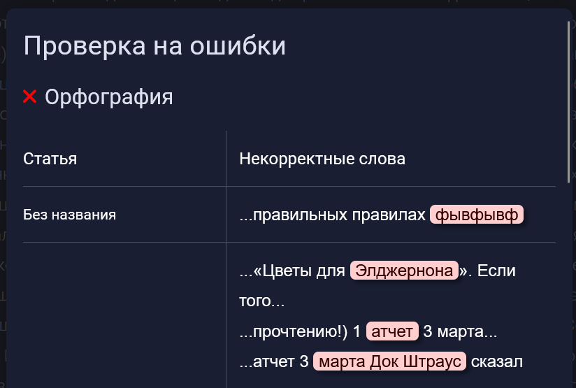
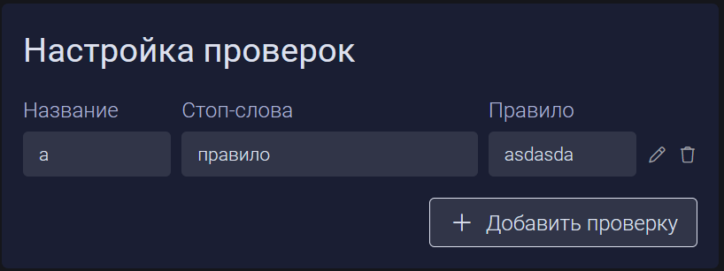
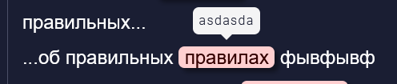

Добавлен в меню “Проверка на ошибки“ пункт с орфографическими ошибками в статьях.



Какие правила реализованы:

-  Стоп слова:

   -  Для редактирования этих стоп-слов есть прототип формы ввода правил, в которую можно вписать начальные формы слов и сообщение к каждому правилу.

      

   -  При сохранении правил перезапускается сервер **LanguageTool** для включения новых праил. При следующей проверке слова и их формы будут помечены как ошибки с соответствующими сообщенииями

   

-  Числительные - все прописи чисел попадают под правило

   -  Все числительные написанные словами, определяются как ошибка, с сообщением

      `Используйте числительные в виде цифр для повышения читаемости текста`

-  Вы/Ваш при использовании не в начале предложения

   -  Все слоова, у которых начальная форма `вы` или `ваш`, определяются как ошибка, с сообщением

      `Вы/Ваш не в начале предложения должно быть с маленькой буквы`

-  Ошибка при использовании буквы “ё”

   -  Все слова с буквой “ё“ определяются как ошибка, с сообщением

      `Используется буква "ё"`

-  Страдательный залог

   -  краткие формы глагола (завершен, написано) и интранзитивные глаголы несовершенного вида со словом в творительном падеже (*заводится водителем*) помечаются как ошибка с сообщением

      `Возможно страдательный залог`

   :::hotfixes:true Интранзитивный глагол несовершенного вида

   Интранзитивным глаголом -- глагол, который не требует объекта для передачи своего действия. Обычно он образует действие, которое происходит внутри субъекта, то есть без воздействия на другие предметы или лиц.

   -  Глагол несовершенного вида -- это глагол, который обозначают незаконченное, длительное, без ограничения во времени действие или процесс

   :::

   -  Ограничения

      -  `Машина заводится` -- не можем определить, потому что глагол такого же вида, как и в словосочетании `Я иду`, где он не является страдательный

      -  `Машина заводится человеком` -- можем определить

-  Цепочки существительных - 3 включительно подряд

   -  Все цепочки из 3 существительных подряд определяются как ошибка, с сообщением

      `В тексте обнаружена цепочка из трех и более существительных подряд`

-  Кавычки - должны быть только елочки.

   -  Символы `“ ” " ' ‘ ’` определяются как ошибка, с сообщением

      `Используйте кавычки-елочки`

Правило `WHITESPACE_RULE`, помечающее повтор пробела как ошибку, отключено.

Потому что вложенные списки выглядят так:

```
 * 1-ый уровень
   * 2-ой уровень
     * ...
```