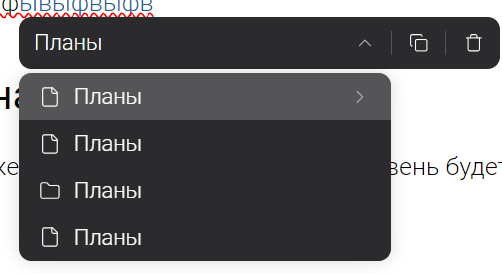
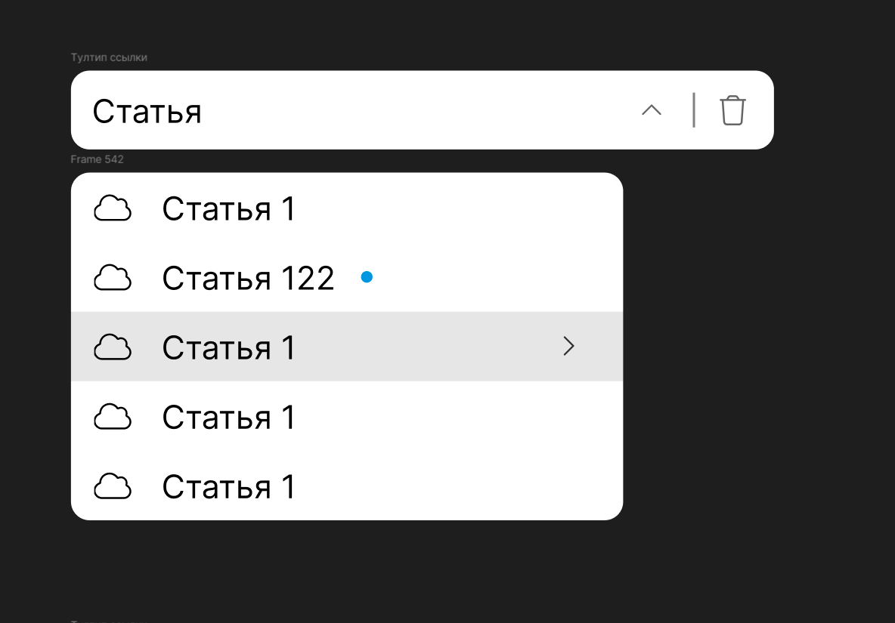
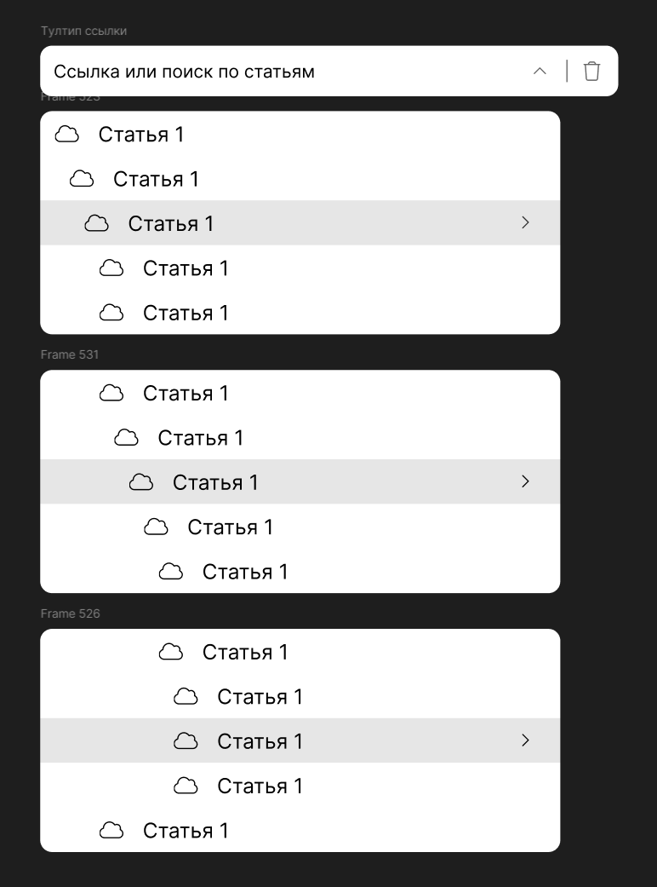
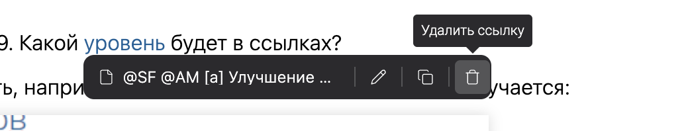

## Вопросы на анализ

-  Уровень вложенности составляет 9. Какой уровень будет в ссылках?

-  В ссылках нужно что то отображать, например имя самой верхней статьи. Или получается:

   

-  Так же не понятно, какая ссылка выбрана, думаю отображать маркер в текущей ссылке;

:::quote:true Пример маркера в ссылке23

:::

:::note:true Пример возможной иерархии

:::

## Критерии

-  Ширина выпадающего меню ссылок [comment:TG79t]составляет[/comment] 350px ( при добавлении иерархии, нужно иметь чуть большую ширину);

-  Добавить иерархию статьей:

   -  при поиске иерархия [comment:V1N3K]выключается[/comment] ( проще в реализации ).

-  При открытии выпадающего меню ссылок, происходит скролл до текущей статьи;

-  Переход по ссылке на текущую статью, должен закрывать тултип (сейчас остается).

   

## Тесты

-  ?[comment:9dMSf]Добавление[/comment] ссылки на статью:

   -  должна быть создана статья, с именем, на которую будет ссылка

   -  выбор статьи поиском и хоткеем Enter.

-  ?Переход по ссылке на статью;

-  ?Удаление ссылки;

-  ?Добавление ссылки на заголовок текущей статьи:

   -  до этого степа нужно написать статью с заголовками;

-  ?Переход по ссылке на заголовок:

   -  только проверка url ( на счет позиции не уверен ).

## Оценка

-  анализ: 3ч;

-  реализация: 32ч;

-  тесты: ?8ч.