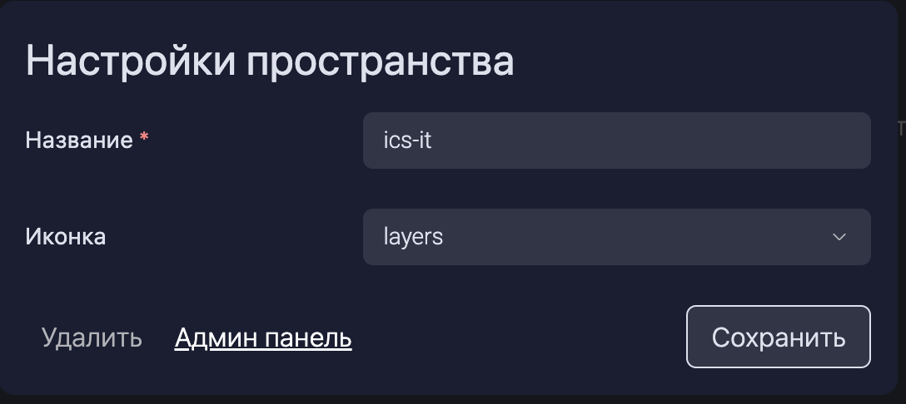

### Docker compose

Для разворачивания GES при помощи docker compose на своем сервере необходимо иметь:

-  **Docker** (а также Docker Compose 2.0 и выше)

-  **Учетные данные для** `registry.gram.ax`

-  **Лицензионный ключ**

Также необходимо скачать docker-compose файл для запуска при помощи команды `curl -o docker-compose.yaml https://gram.ax/enterprise-docker-compose.yaml -o .env https://gram.ax/enterprise.env`. Перед запуском необходимо выставить следующие переменные при помощи переменных сред, либо при помощи `.env` файла:

-  `CLIENT_NAME`  -- имя клиента в `lowercase`, пример: `gramax`, **обязателен**

-  `ALLOWED_GRAMAX_URLS` -- урлы, на которых расположены дополнительные инстансы грамакса, пример: `ALLOWED_GRAMAX_URLS=https://some-instance.gram.ax,https://another-instance.gram.ax`, если инстанс грамакса один, то запятая в конце не нужна, **обязателен**

-  `LICENSE_KEY` -- лицензионный ключ, пример: `LICENSE_KEY=765d562b9092eec39b38fd901f013086`, **обязателен**

-  `GIT_SERVER_TOKEN` -- токен от Git хранилища, для предоставления пользователям доступа к гит хранилищу, **обязателен**

-  `ENTERPRISE_CONFIG_PATH` -- путь до папки, где будут лежать с настройки GES. Настройки хранятсья в yaml файлах, **обязателен**.

   :::info Описание YAML файлов

   В папке храняться 4 файла yaml и папка repositories, эту папку при запуске не надо настраивать. При первом запуке необходимо толкьо настроить только 4 файла yaml.

   -  `editors.yaml` - файл содержит почты редакторов. 

      ```yaml
      editors:
        - example1@example.com
        - example2@example.com
        - example3@example.com
      ```

   -  `groups.yaml` - файл содержит группы пользователей. В списке группы можно указывать как почты пользователей, так и группы из SSO

      ```yaml
      groups:
        group_name_1:
          - example@example.com
        group_name_2:
          - example2@example.com
        group_name_3:
      	- sso_user_group_name
      ```

   -  `workspace-access.yaml` - файл информацию о том, какие пользователи имают доступ к настройками воркспейса.  

      ```yaml
      access:
        workspaceOwner:
          gxGroups:  // В этом поле можно указывать только группы из groups.yaml
            - group_name_1
      	  - group_name_3
          group: // В этом поле можно указывать только почты
            - example1@example.com
      	  - example2@example.com
      ```

   -  `workspace.yaml` - файл c настройками воркспейса. 

      ```yaml
      name: workspace_name
      
      groups: // Групировка каталогов на главной странице
        example_group_id:
          title: Тестовая группа
          style: big
        example_group_id_2:
          title: Тестовая группа 2
      
      source: // Информация используемого гит хранилища
        type: GitLab
        url: https://gitlab.example.com
        repos:
          - repo_group/repo_name
      
      gesUrl: https://enterprise.gram.ax // URL до инстанса GES 
      ```

      Затем настройки репозиториев можно будет добавить через панель администрирования, которая доступна по ссыке из окна настройки пространства только пользователям, которые имеют доступ к настройкам воркспейса. 

      

   :::

-  `SSO_SERVICE_ENCRYPTION_KEY` -- Kлюч, используется для безопасной передачи данных между сервисом SSO и остпальными сервисами. Должен совпадать между ними, для генерации можно использовать `openssl rand -hex 32`, пример: `SSO_SERVICE_ENCRYPTION_KEY=7cdf59ed...cccb8489`, **обязателен**

-  `ENTERPRISE_SERVICE_ENCRYPTION_KEY` -- Kлюч, используется для безопасной передачи данных между сервисом ENTERPRISE и остпальными сервисами. Должен совпадать между ними, для генерации можно использовать `openssl rand -hex 32`, пример: `ENTERPRISE_SERVICE_ENCRYPTION_KEY=7cdf59ed...cccb8489`, **обязателен**

Также необходимо выставить переменные для SSO-сервиса

-  `SSO_SERVICE_ENCRYPTION_KEY` -- Kлюч, используется для безопасной передачи данных между сервисом SSO и остпальными сервисами. Должен совпадать между ними, для генерации можно использовать `openssl rand -hex 32`, пример: `SSO_SERVICE_ENCRYPTION_KEY=7cdf59ed...cccb8489`, **обязателен**

-  `SSO_URL` -- URL по которому будет доступен SSO, пример: `SSO_URL=https://sso.gram.ax`, **обязателен**

-  `AUTH_METHOD` -- метод авторизации в SSO, требуется выбрать любой один способ авторизации, все параметры **обязательны**

   -  `Azure`

      -  `AUTH_METHOD` = `azure`

      -  `TOKEN_URL` -- урл до эндпоинта для получения токена, пример: `https://login.microsoftonline.com/HohLpGvI-uPW8-vyyn-QBH1-88fuprQzzpu3/oauth2/v2.0/authorize`

      -  `API_URL` -- урл до эндпоинта получения информации по api, пример: `https://login.microsoftonline.com/HohLpGvI-uPW8-vyyn-QBH1-88fuprQzzpu3/oauth2/v2.0/authorize`

      -  `CLIENT_ID` -- идентификатор приложения в azure, пример: `0FYSAWm1A-1x4k-e14H-0LHe-gf6qwElcYuz`

      -  `CLIENT_SECRET` -- секрет приложения в azure, пример: `rY3yh*suIebMk^k0KGoi3azsIBP&FY@odQsgFVdc`

   -  `Adfs`

      -  `AUTH_METHOD` = `adfs`

      -  `ADFS_CERT` -- сертификат, используемый для аутентификации в ADFS

      -  `ADFS_ENTRYPOINT` -- точка входа для аутентификации, пример: `https://adfs.gram.ax/adfs/ls/`

      -  `ADFS_ISSUER` -- идентификатор ADFS, пример: `https://adfs.gram.ax/`

      -  `ADFS_CALLBACK_URL` -- URL для обратного вызова после успешной аутентификации, пример: `https://app.gram.ax/auth/cb`

   -  `Keycloak`

      -  `AUTH_METHOD` = `keycloak`

      -  `KEYCLOAK_SERVER_URL` -- URL сервера Keycloak, пример: `https://keycloak.gram.ax/auth/`

      -  `KEYCLOAK_REALM` -- имя Realm в Keycloak, пример: `gramax`

      -  `CLIENT_ID` -- идентификатор клиента Keycloak

      -  `CLIENT_SECRET` -- секрет клиента Keycloak

Для настройки приватности

Для настройки параметров воркспесов для пользователей необходимо задавать настройки в формате `yaml`, по умолчанию докер-композ будет искать и монтировать файл `workspace.yaml` лежащий в одной папке с ним, это поведение можно переопределить при помощи переменной `WORKSPACE_PATH` в переменном окружении.

-  `name` -- название воркспейса, **обязателен**

-  `icon` -- иконки из [lucide.dev](https://lucide.dev/), чтобы использовать их как иконку воркспейса

-  `groups` -- группы каталогов

   -  `[имя группы]`

      -  `title` -- название группы, **обязателен**

      -  `style` -- стиль отображения логотипа каталога, принимает значения: `big` и `small`, по умолчанию `small`

-  `source` -- настройка хранилища

   -  `type` -- тип хранилища, принимает значения: `Github`, `Gitlab`, **обязателен**

   -  `url` -- урл до хранилища, **обязателен** при использовании хранилищ на не дефолтном для хранилища урле (селфхостед и облачные варианты находящиеся на отдельном домене)

   -  `repos` -- массив путей до дефолтных каталогов, которые будут скачиваться у пользователя при входе в enterprise окружение, пример: `gx/gramax`, `gx/gramax/board`

-  `gesUrl` -- урл ges сервиса, **обязателен**

Пример `workspace.yaml`:

```yaml
name: gramax

groups:
  products:
    title: Продукты и сервисы
    style: big
  company:
    title: Внутренняя документация
  projects:
    title: Проекты

source:
  type: GitLab
  url: https://gitlab.gram.ax

gesUrl: http://gram.ax/-enterprise
```

После выставления переменных сред GES можно запустить командой `docker compose up -d`. Для обновления GES можно использовать `docker compose up --pull=always`.