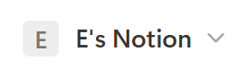
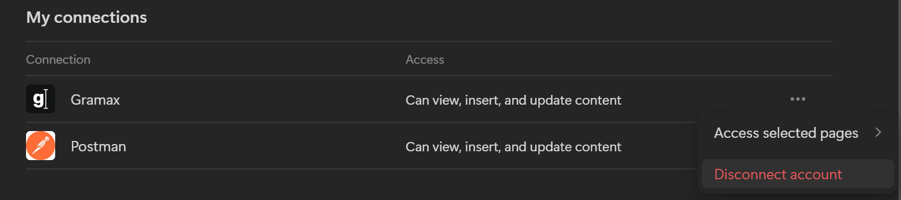

## Анализ

Для добавления аккаунта будет использоваться OAuth 2.0. Пользователю откроется окно Notion, где он сможет выбрать контент, к которому хочет предоставить доступ.

[image:./dobavlenie-akkaunta-vybor-stranic-dlya-perenosa.png::Окно выбора:0,0,100,100:36:]

За один раз можно выбрать только один воркспейс.

После выбора данные аккаунта будут сохраняться по названию воркспейса. В списке сохранённых аккаунтов все добавленные аккаунты из Notion будут отображаться по названию воркспейса(Один юзер может предоставить доступ к нескольким воркспейсам, для каждого воркспейса создаётся свой access_token)

## Критерии

Импорт из Notion будет находиться по пути **Добавить каталог --> Импортировать**

Вид окна добавления нового источника:

[image:./dobavlenie-akkaunta-vybor-stranic-dlya-perenosa-4.png:::0,0,100,100:67:]

По нажатию «Войти в Notion» появляется окно Notion, предлагающее выдать доступ Gramax

[image:./dobavlenie-akkaunta-vybor-stranic-dlya-perenosa-5.png:::0,0,100,100:40:]

Пользователь выбирает Workspace и страницы, к которым хочет предоставить доступ

[image:./dobavlenie-akkaunta-vybor-stranic-dlya-perenosa-6.png:::0,0,100,100:34:square,70.0621,0.655738,27.8969,6.55738,Выбор Workspace,top-left]

После выбора, окно закрывается, пользователю выводиться добавленный [comment:tKtgS]аккаунт[/comment]

[image:./dobavlenie-akkaunta-vybor-stranic-dlya-perenosa-7.png:::0,0,100,100:60:]

После добавления, в списке источников, появляется источник Notion с названием воркспейса

[image:./dobavlenie-akkaunta-vybor-stranic-dlya-perenosa-8.png:::0,0,100,100:62:]

Дополнительных данных указывать не нужно, кнопка «Импортировать» сразу доступна. Будут импортироваться все страницы, к которым дан доступ.

Один пользователь может иметь несколько воркспейсов, которые он может добавлять поочерёдно, как описано выше. Каждый добавленный воркспейс отображается в системе как отдельный источник.

[image:./dobavlenie-akkaunta-vybor-stranic-dlya-perenosa-9.png:::0,0,100,100:53:]

:::tip 

Для обновления списка страниц доступных для Gramax, пользователь может либо заново добавить workspace, либо изменить список доступных страниц в Notion

:::

