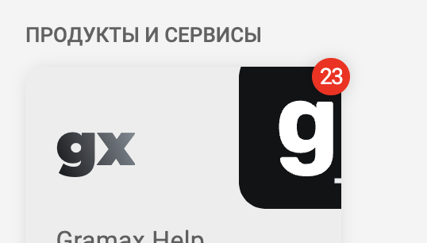

Концепция: *Gramax -- это как мессенджер в котором в каталоги и в статьи приходят новые сообщения и хочется видеть что там есть обновления.*

Badge API: <https://github.com/tauri-apps/tauri/issues/4489>

Сейчас проблема в том, что часто непонятно что было изменено.

-  У приложения счетчик

-  У каталога

-  У статьи

-  [comment:1]А у раздела статьи?  небольшой опасити сделать[/comment]





-  Все каталоги периодически опрашиваются, когда приложение висит в фоне.

   -  если есть интернет


#### Вопросы на подумать

-  [comment:2]Если есть изменения в другой ветке, то считать ли их изменениями?[/comment]

-   

Важно уведомлять об изменениях когда комментарий появился в треде в котором я поучаствовал. (также я должен считаться участником если меня упомянули).

-  Надо ли отключать подписку на уведомления о каталога? [comment:3]Стейт в Gramax Server будет храниться.[/comment]

:::hotfixes:true CSS-Стиль

```
element.style {
    letter-spacing: -0.3px;
    text-overflow: clip;
    background: red;
    color: white;
    border-radius: 100px;
    font-size: 10px;
    font-weight: 400;
    line-height: 1em;
    padding: 3.5px;
}
```

Для плашек каталога дополнительно: `zoom: 1.4`

:::


### На будущее

-  В Enterprise Server можно хранить состояние о прочтении

-  В комментариях можно упоминать других людей и они должны быть уведомлены