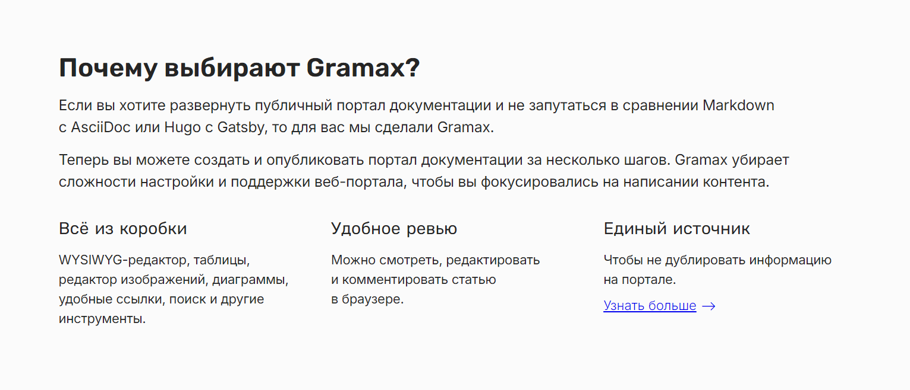
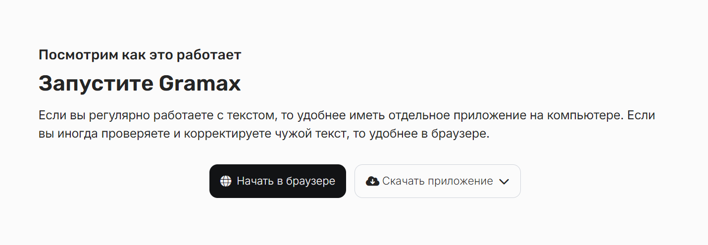
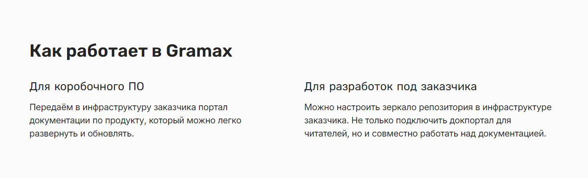
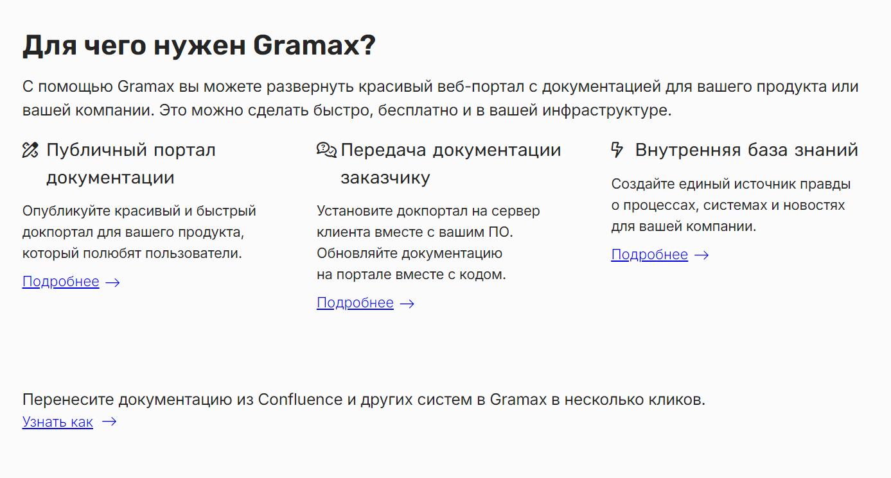
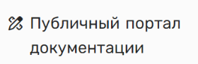
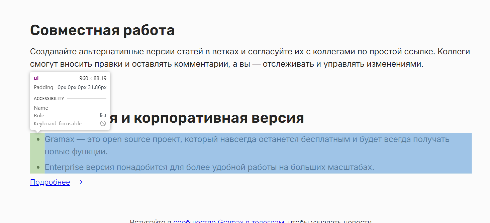
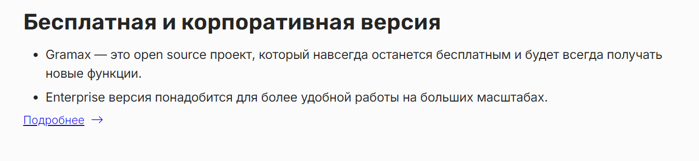
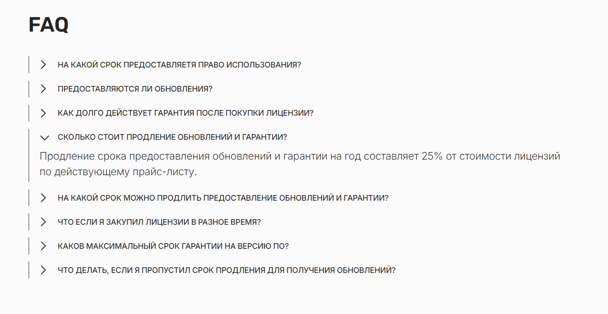
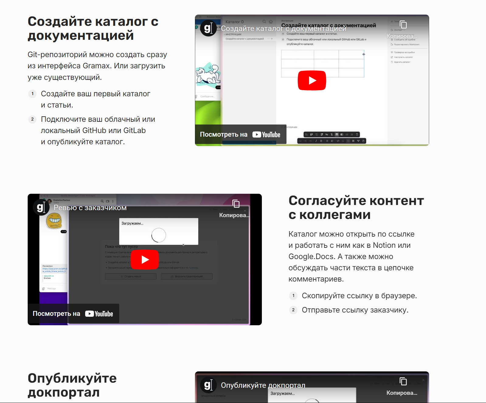

Заменив контент на сайте develop.gram.ax, стало понятно, что нужен редизайн сайта.

Ссылка на контент - <https://dev.gram.ax/gitlab.ics-it.ru/dr/docreader-team/master/-/business-plan/site/v3>

### Референсы:

-  [ics-it.ru](https://ics-it.ru/)

-  [sellout.plus](https://sellout.plus/)

### Что хотелось бы:

-  Обновить каталог с документами:

   -  [https://support.ics-it.ru/issue/GXS-1566;](https://support.ics-it.ru/issue/GXS-1566)

-  Дизайн сайта для мобильной и десктопной версии:

   -  ru:

      -  Элементы в шапке:

         -  Wiki для IT-команд (Ссылка на главную страницу);

         -  Ссылка “Решения“ (по нажатию на которую появляется попап);

         -  Корпоративная версия;

         -  Справка;

         -  Переключение языка.

      -  Элементы попапа в ссылке “Решения“:

         -  Публичная документация;

         -  Отчуждаемая документация;

         -  Внутренняя база знаний:

         -  Документация от поставщиков;

         -  Docs as Code.

      -  Элементы в подвале:

         -  Блог;

         -  Документы;

         -  Контакты;

         -  Технологии;

         -  ООО “Грамакс“.

   -  en:

      -  Элементы в шапке:

         -  Wiki for IT Teams (Ссылка на главную страницу);

         -  Ссылка “Solutions“ (по нажатию на которую появляется попап);

         -  Enterprise;

         -  Docs;

         -  Переключение языка.

      -  Элементы попапа в ссылке “Solutions“:

         -  Public documentation;

         -  Docs delivery with the product;

         -  Knowledge Base;

         -  Docs as Code.

      -  Элементы в подвале:

         -  Documents;

         -  © 2024 Gramax.

### Элементы которые требуют дизайна:

:::note:true Почему выбирают Gramax

Url: <https://develop.gram.ax/solutions/public-documentation>

Блоки снизу без иконок смотрятся инородно, нужно что то придумать.

:::

:::note:true Запустите Gramax

Url: <https://develop.gram.ax/solutions/public-documentation>

Заголовок сверху, вообще не понятная мне вещь, нужно это исправить.

:::

:::note:true Как работает Gramax

url: <https://develop.gram.ax/solutions/public-documentation>

Отступы и размер шрифта не очень смотрятся

:::

:::note:true Для чего нужен Gramax

url: <https://develop.gram.ax/>

Текст про Confluence снизу, это тоже часть этого блока.

Ранее весь текст в этом элементе умещался в одну строку:

Сейчас это не очень смотреться, думаю нужно что то придумать.

:::

:::note:true Списки

Думаю списки нужно привести к одному виду, что бы на сайте и приложении они были одинаковые.

И текущие отступы выглядят не очень:

:::

:::note:true FAQ

url: <https://develop.gram.ax/enterprise>

Когда разворачиваю cut блок - шрифт и отступы выглядят не очень.

:::

:::note:true Подробнее

url: <https://develop.gram.ax/solutions/public-documentation>

Блок был разработан без дизайнера, нужно обсудить внутренние отступы и расположение контента.

:::