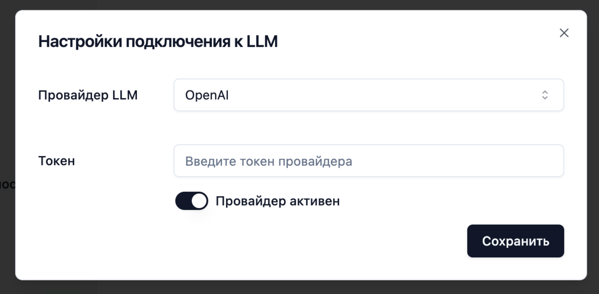
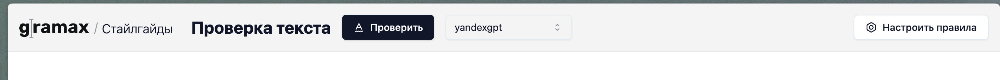
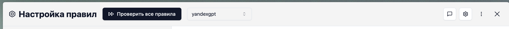

## @AL-->@VS Вопросы на обсуждение

-  Если есть идентификатор предложения, то не обязательно в подменах писать полное предложение в аутпуте, давай по-минимуму, что советует заменить и на что, ну можно 2 слова до и после, для сохранения контекста. Все это важно, чтобы у нас кол-во выходных токенов было минимальным

-  Также предлагаю не группировать промпты по типам блоков (так больше ошибок?)

-  Хотелось бы после прогона получить полный последний отправленный и полученный промпт (или несколько штук). Давай его в троеточие поместим?

## Итерация 6. LanguageTool

-  В список провайдеров добавлен LanguageTool

   -  При его выборе в настройках появляются такие поля настроек:

      -  URL сервера Gramax LanguageTool -- текстовое поле

      -  Аутентификация -- дропдаун со значениями

         -  Без аутентификации -- по умолчанию

         -  По логину и паролю -- появляются инпуты логина и пароля

-  Когда подключение к LanguageTool настроено, то при редактировании текста автоматически осуществляется проверка орфографии, грамматики (русский и английский) и всех стайлгайдов.

-  Ошибки стайлгайдов подсвечиваются синим, орфография красным и грамматика желтым.

-  После окончания ввода и прошествии 500мс (настраивается в конструкторе либы) отправляется запрос на введенные предложения, которых не было в предыдущей проверке.

## Итерация 5. Правки

1. Поменять title окна на “Gramax -- Проверка по стайлгайдам”(сейчас называется Стайлгайд в Gramax)

2. Окно проверки:

   1. Курсор должен быть мигать в начале плейсхолдера. Сейчас мигает после плейсхолдера:

      [image:./zamechaniya-k-interfeys-glavreda-4.png:::0,0,100,100:10:]

   2. Переименовать кнопку “Проверить” в “Проверить текст”. Также сделать иконку [icon:play]

   3. В тултипе info выделить Gramax Check жирным.

3. Настройки подключения:

   1. В диалоговом окне настройки подключения к LLM в дропдауне провайдеров для активных провайдеров добавить галочку, что провайдер подключен

   2. В пункт дропдауна “Настроить…” добавить троеточия

4. Настройка правил

   1. В заголовке в счетчике указывать кол-во пройденных правил, а не общее кол-во тестов и пройденных текстов. Сделать тултип "Правил протестировано”,  “Тестов пройдено”

## Итерация 4. Последние правки перед конференцией

-  Дропдаун моделей

   -  Плейсхолдер: *Модель* (*Выберите модель* слишком длинно)

   -  После списка моделей сгруппированных по провайдерам снизу пункт: “[icon:plug] Настроить подключения…”

      

      -  Заголовок модального окна: [icon:plug] Подключения к LLM

      -  После провайдера LLM сделать горизонтальный сплиттер или пустое место

      -  В поле токена добавить плейсхолдер

      -  Чекбокс подвинуть по левому краю инпутов

-  Верхний тулбар главного экрана

   -  Справа. Кнопку переименовать в “Настройки” (из Настроить), при нажатии на нее она становится черной и мы должны переходить в интерфейс админ-панели. При повторном нажатии возвращаемся назад

   -  Слева от кнопки отображается иконка (i). При нажатии на нее отображается поповер с текстом:

      -  [Gramax Check](https://check.gram.ax/) -- это сервис проверки текстов на соответствие корпоративному стайлгайду. С его помощью можно автоматизировать ревью документации: от проверки пунктуации до смысловых конструкций.

         Подробнее в документации (тут ссылка на [gram.ax/resources/check](http://gram.ax/resources/check)).

-  Меню троеточие сделать таким образом:

   -  Системный промпт

      -  Открывается модальное окно только с промптом

   -  Перепроверка текста

      -  Обычное окно перепроверки текста

   -  История затрат

   -  Параметры проверки

      -  Открывается модально окно только с кол-вом предложений в проверке

   -  Группа Конфигурация

      -  Удалить все правила

      -  Скачать файл настроек

      -  Загрузить файл настроек

## Итерация 3. Обновление интерфейса

### Общие изменения

-  Выставить для shadcn стиль New York (он выглядит немного компактнее и аккуратнее)

-  Дропдаун с моделями

   -  Модели в дропдауне группировать по провайдерам.

   -  Если не так сложно, то в дескрипшне отображать стоимость за 10 000 токенов (сколько примерно токенов за одну проверку снимается в среднем?). Дескрипшн выводить прижатым справа или снизу или в поповере)

   -  Снизу горизонтальный разделитель и кнопка Настроить.

      -  При нажатии открывается окно настройки подключения, которое повторяет окно которое в Gramax.

         -  Снизу на форме отображать тоггл “Отключить”. При нажатии дизейблятся поля

### Основная страница

-  Редактор:

   -  Размер шрифта 16px (сейчас 20px)

-  Верхний тулбар:

   -  При высоком тексте не должен скроллироваться, а должен быть зафиксирован к верху

      -  В идеале, чтобы тень была когда есть скролл как в МДТ (если существенно по трудоемкости, то не так обязательно)

   -  Перенастроить в соответствии со скриншотом:

      

      -  “/” имеет `opacity: 0.4` и вместе с подзаголовком `font-weight: 300`. И обратить внимание на `position: relative`.

   -  Иконка[icon:spell-check] у *Проверить текст*

### Админ-панель

-  Основное окно:

   -  Скроллбар должен быть с самого левого края у основного окна

   -  Проверки

      -  Переименовать заголовок Тесты в Проверки (тесты -- это более программерский и специфичный термин).

      -  Между заголовком Проверки и “Предложения с ошибками” нужно убрать вертикальный отступ

      -  Переименовать секцию “Предложения без ошибок” в “Корректные предложения” (чтобы отличалось явнее)

      -  Между самими проверками горизонтальные линии убрать

      -  В предложениях:

         -  Убрать тип предложения

         -  Кнопку запуска и троеточия поместить в строку с предложением справа друг за другом.

         -  Перед кнопкой запуска добавить индикатор последнего запуска: либо красный крестик, либо красная галка, либо крутилка пока выполняется проверка правила.

            -  При наведении на крестик или галку отображать в поповере технические детали проверки

-  Левая панель:

   -  В заголовке добавить сколько правил из скольки выполнились успешно (так же должно выглядеть как для отдельных правил, но немного покрупнее)

   -  Для 0/0 нужно сделать шрифт серенький, т.к. как будто неактивный элемент, который нельзя запустить.

   -  У заголовков правил кнопки запуска без бекграунда, просто с аутлайном

-  Верхняя панель должна выглядеть так:

   

## Итерация 2. Админ-панель

-  Бекграунд верхнего тулбара в админ-панели и на главной, а также бекграунд левой панели в админ-панели -- #F4F4F4

-  Тулбар

   -  [icon:arrow-left] с аутлайном. Возвращает на главный экран

   -  Заголовок: [icon:bolt] Настройка правил по стайлгайду.

   -  Кнопка: [icon:fast-forward] Протестировать все. Черная.

   -  Иконка троеточие [icon:ellipsis-vertical] с меню:

      -  [icon:coins] История затрат. При нажатии открывается модальное окно с таблицей со столбцами: 1) дата 2) модель 3) Входящих токенов 4) Исходящих токенов. В первой строчке жирным указано “За весь период”. Первый столбец с датой с `rowspan` на весь день.

      -  [icon:repeat] Перепроверка текста. При нажатии открывается модальное окно с чекбоксом и промптом для перепроверки.

-  Левая панель

   -  Заголовок: Правила

      -  Плюсик добавления правила сразу за заголовком (как в тестах).

      -  Справа (там где сейчас плюс) черная кнопка запуска правил в виде иконки: [icon:fast-forward]

   -  Результаты тестов

      -  В результатах если всего 0 тестов (0/0), то выводить серым цветом как задизейблено

      -  Успешный тест: бекграунд .text-green-100, цвет .text-green-700. Для неуспешного red 100/700.

-  Область содержимого (основная правая панель):

   -  Правая панель без вложенного контейнера с закругленной границей (сейчас место отнимает)

   -  Название правила:

      -  С плейсхолдером “Название правила”

      -  При добавлении правила, название правила автоматически переключается в режим редактирования (можно сделать чтобы оно всегда было таким если не заполнено).

   -  Описание правила:

      -  С плейсхолдером: Описание правила понятными для LLM словами.

      -  Включен autogrow, минимальная высота 5 строк.

   -  Тип правила

      -  Нет лейбла для поля. Дропдаун со значениями:

         -  Для всех элементов (выбрано по умолчанию)

         -  Только для обычного текста

         -  Только для подписи к картинке или схеме

         -  Только для блока кода

-  Тесты

   -  У заголовка нет плюса. А кнопка *Запустить все* без заливки аутлайном

   -  Два обязательных подраздела: Предложения без ошибок и Предложения с ошибками. Сбоку от каждого плюсик для добавления сценария

   -  Автогроу и по умолчанию высота только 1 в высоту (сейчас 2)

-  Все пункты *Удалить* -- красные: Удалить тест, Удалить правило.

## Итерация 1. Главная страница

-  favico для сайта стандартный грамаксовый

-  Тулбар

   -  Лого: gramax слева в углу. При нажатии переход на [gram.ax](http://gram.ax)

   -  Заголовок: Проверка текста по стайлгайду

   -  Кнопка \[icon:spell-check-2\] Проверить текст. Черная. При нажатии справа от текста кнопки добавляется крутилка и крутится до тех пор, пока проверяется.

   -  Дальше все прижато к правому краю:

      -  Кнопка: \[icon: bolt\] Настроить стайлгайд. С аутлайном

      -  \[icon:plug\] Подключения. Выпадающее меню

-  Основной текст.

   -  Без боковых, верхних и нижних границ и растянут на полную ширину и полную высоту до верхнего тулбара. Если в редакторе много контента, появляется вертикальный скролл

   -  Основан на tiptap и никаких других инпутов и текстарий нет

   -  Введенный текст сохраняется в localStorage и не теряется

   -  Заполняется при первом открытии  текстом в котором есть разные проблемы и в заголовках и в списках и в обычном тексте, чтобы можно было нажать на кнопку проверить и сразу же увидеть  (пока в простом виде, потом скорректируем текст)

   -  Отправленные предложения сохраняются в текущей сессии окна, при повторных проверках не отправляются.

-  При открытии на узком экране, должны сохраняться все функции и видны все кнопки (если что, можно вынести в следующую итерацию)

### Открытые вопросы

-  Что будем делать с проверками LanguageTool? Т.к. он требует сервера и настройки могут быть для пользователя только одни. И если юзер не имеет прав админа, то он не сможет это сделать.

-  На check.gram.ax не нужна авторизация. Но для управления проверками LanguageTool нужна

-  Есть ли сейчас проблемы с CORS при обращении к API разных LLM?

-  Хотелось бы чтобы пользователь сразу зашел и в простом виде сразу мог запустить проверку по примерному тексту, но так не получится, т.к. ему нужен обязательный токен. Можем им дать за свои деньги для простых текстов, хотя бы на время конференции (можем потратить 10-50 своих долларов)

   Также было бы неплохо найти сервис, с которого при простой аутентификации люди могли бы несколько запросов послать для пробы.

-  Нужно нормально развернуть все в нашей инфраструктуре. Скорее всего лучше на кубере и LanguageTool и