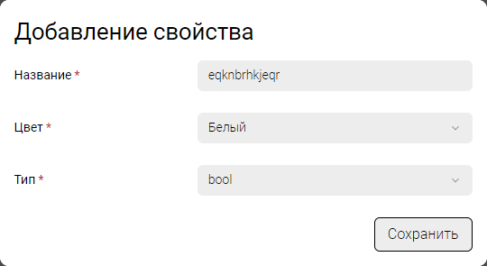
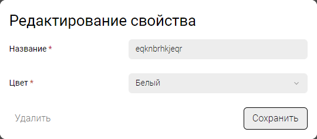
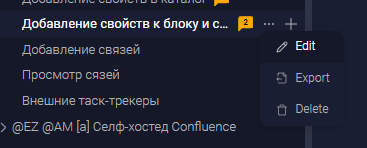

## Концепция

-  [Добавление свойств в каталог](./koncepciya-2/dobavyalem-svoystva-v-katalog)

-  [Добавление свойств к статье](./koncepciya-2/dobavlyaem-svoystva-k-bloku-i-state)

## Критерии

1. В настройках каталога добавлен пункт «Свойства»

2. При открытии панели свойств, будет открываться новое модальное окно, со следующими возможностями:

   1. Добавить новое свойство со следующими параметрами

      1. Наименование

      2. Цвет свойства (выпадающий список, с заранее выбранными цветами)

      3. Тип свойства

         -  enum

         -  bool

         -  counter

         -  counter-link

      

   2. Удалить существующее свойство -- есть только при редактировании

      

      

3. Свойства каталога хранятся в `.doc-root`. Пример:

   ```yaml
   properties:
     - id: OMVgy
       name: Criterias
       color: #808000
       type: counter
     - id: hevqJ
       name: Criterias2
       color: #808000
       type: counter-link
     - id: LksNM
       name: Example2
       color: #6667FF
       type: bool
     - id: aHGjh
       name: Example3
       color: #6667FF
       type: enum
   	values: 
   		- value1
   		- value2
   		- value3
   ```

4. Добавление свойств в статью

   1. Управление свойствами  происходит в настройках статьи.

      

   2. В настройках статьи добавлен пункт «Свойства».

   3. При добавлении свойства указывается значение.

   4. Нельзя добавлять одно и то же свойство несколько раз.

   5. Свойства хранятся в файле статьи. Пример:

      ```yaml
      ---
      order: 1
      title: test
      properties:
        - id: LksNM
      	value: true
        - id: aHGjh
      	value: 2
      ---
      ```


