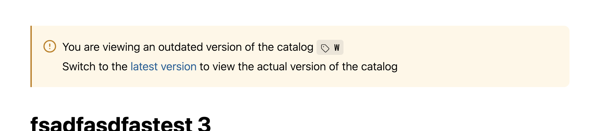

Для первого этапа будет достаточно иметь возможность просматривать весии каталога на докпортале. Редактор будет вручную через git создавать теги (версии), а читатель -- сможет их просматривать

## Критерии

1. В редакторе (веб/десктоп) ничего связанного с версионированием не добавляется. Функционал переключения ревизий работает только в режиме докпортала.

2. Редактор может указывать glob-паттерны версий в `.doc-root.yaml`, на которые пользователь сможет переключаться. Эта конфигурация всегда берётся из основного каталога

   ```yaml
   versions:
   	- 'release/*'
   	- 'v1*'
   ```

   ```typescript
   function test() {
   }
   ```

### Переключение ревизии

1. В правом углу есть [переключатель версии](./_index#вариант-1:-переключение-ревизии), который становится активным только в докпортале и при наличии доступных версий для переключения

2. Пользователь может просматривать каталог на любой из доступных версий, при этом его переключения не влияют на других пользователей

3. В качестве версии используются git-теги, редактор самостоятельно должен их создавать через git

### Хранение активной версии в URL

Активная версия хранится после названия каталога, например: `catalog:version/article`

### Предупреждение пользователя о неактуальной ревизии

Когда пользователь просматривает неактуальную версию каталога, над статьёй появляется предупреждение об этом. В нём показана текущая активная ревизия и присутствует ссылка для перехода на актуальную версию


