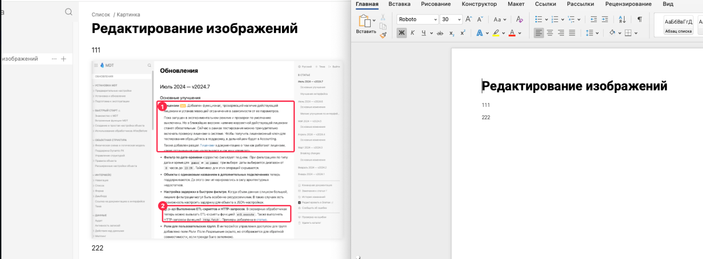

Редактированные картинки не экспортируются в docx. Вообще не экспортируются

## Критерии

-  Редактированная картинка экспортируется соответственно с тем, как она выглядит в редакторе:

   -  Объекты

      -  Квадратная область переносится

      -  Аннотации переносится

      -  Если на картинке только один выделяемый объект, то номера не показываются

      -  Повороты углов объектов тоже учитываются

   -  Crop объекта тоже учитывается

[image:./kv-export-redaktirovannyh-kartinokrev-export-reexport-redaktirovannyh-kartinokaktirovannyh-kartinok.png:::0,0,100,100:100:]

## Открытые вопросы

-  Не понятно, как перенести тултипы

-  Перенести scale тоже нужно будет

## Исходная заявка

-  <https://support.ics-it.ru/issue/GXS-2008>

## Тесты

-  Отсутствуют