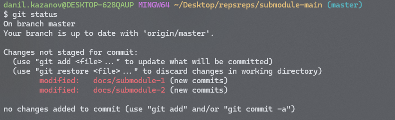

Сейчас каталоги в докпортале пуллятся без подмодулей. Нужно, чтобы пуллились с подмодулями.

## Критерии

-  Все каталоги с полмодулями в докпортале пуллятся с подмодулями.

-  Если в файле `.gitmodules` не указана ветка подмодуля, то пытаться переключаться на ветку `master`, если не получается - пытаться переключаться на ветку `main`. Если не получается - бросать ошибку:

   -  ru: “Не удалось сменить ветку на **master** или  **main** в подмодуле `{{path}}` .”

   -  en: “Failed  to switch the branch to **master** or **main** in the `{{path}}` submodule.”

-  Если после пулла в основном репозитории изменились ветки у подмодулей, то переключаться на эти ветки

## Текущие ограничения

1. Максимальная глубина подмодулей -- 1. Это значит, что подмодули в подмодулях не поддерживаются

2. Если в репозитории не проинициализированы подмодули, то они и не будут инициализироваться при помощи синхронизации

3. В докпортале придется клонировать репозитории вручную, через `git clone {url} --recursive`.

4. Если после пулла изменилось количество подмодулей, то новые подмодули не появятся, а старые не удалятся. Обновятся только те, которые были до пулла и остались после пулла.

5. Если после пулла изменился url подмодуля, то он не обновится в подмодуле, а просто сделает pull.

6. Все махинации с удалением, добавлением, изменением url подмодулей нужно делать вручную в репозитории.

## Design details

В когда подмодуль пуллится, то в основном репозитории это показывается как чендж:



Чтобы это избежать, можно использовать специальное поле в `.gitmodules` -- `ignore = all`

Например:

```
[submodule "docs/submodule-1"]
        path = docs/submodule-1
        url = https://gitlab.ics-it.ru/danil.kazanov/submodule-1
        ignore = all
[submodule "docs/submodule-2"]
        path = docs/submodule-2
        url = https://gitlab.ics-it.ru/danil.kazanov/submodule-2
        ignore = all
```

В таком случае изменение HEAD подмодуля не будет отображаться как чендж.

Однако, это не проблема, т.к. эти изменения не должны конфликтовать между собой при пулле. Других ченджей в докпортале быть не должно.

## Оценка

-  16 часов

## Тесты

-  Добавлен юнит тест для рекурсивного pull в GitStorage

-  Добавлен интеграционный тест для Repository