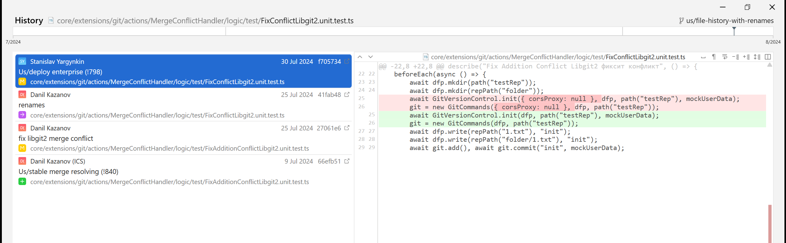
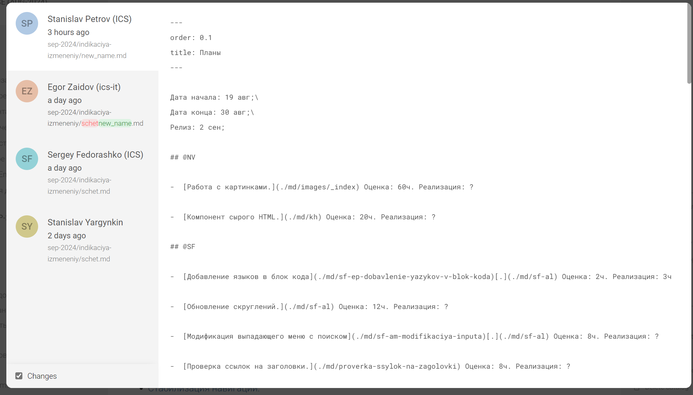

#### Проблема

Сейчас, если файл переносится или меняется название родительского каталога, его история изменений теряется. Нужно ее сохранять. Если меняют названия и структуру не через Gramax, то придерживаемся стандартной логики git.

#### Критерии приемки

1. В истории изменений под датой изменения показывается так-же путь к статье

2. Если в изменении поменялся путь файла, то изменение пути показывается так же, как и в публикации изменений:

   

#### На обсуждение

-  Если меняют через Gramax, то:

   1. В истории изменений файла выводится его урл и изменение урла.

   2. У перенесенного файла в истории изменений содержатся также изменения по старому пути.

-  Изучить как отслеживается перемещения файлов в гите, можно ли сохранять object_id после перемещения?

Референс:

Fork:

Варианты дизайна:

")

