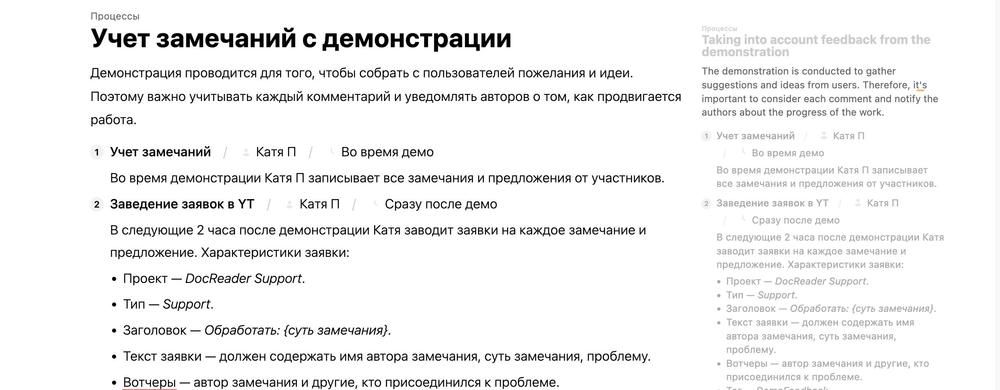

Сейчас переключение языка недоступно в приложении для редактирования, потому что оно фильтрует все статьи, которые не на нужном языке. Хотелось бы сделать так чтобы переключение языка не фильтровало статьи в приложении для редактирования, а только в докпортале

Критерии:

-  [comment:1]\[ \] переключения языка в приложениях для редактирования меняет только язык ui.[/comment] То есть в режиме редактирования будут показываться статьи только на дефолтном языке (defaultLanguage). Все остальные языки не будут показываться

-  \[ \] переключение языка в докпортале будет работать также, как раньше (фильтрует все каталоги/разделы/статьи, которые не на нужном языке)

-  опасити статьи (создаются при клике)

-  переключение языка фильтрует статьи и переключает интефейс.

## На обсуждение

1. Как лучше хранить статьи с разными языками? Нам нужен одинаковый по смыслу контент в статьях или допустим разный?

   1. В отдельный папках `ru/`, `en/`. Контент и свойства статей никx5×6

   2. Хранить переводы на другие языки в одном и том же файле. Таким образом свойства статьи (например, order) будут всегда синхронизированы между языками

      1. Сейчас свойства статьи храняться в заголовке md-файла. Предлагаю провернуть то же самое с языками -- разделить их какими-нибудь маркерами

         ```
         ---
         title: 123
         ---
         
         --- 
         language: ru
         контент на русском
         ---
         
         ---
         language: en
         контент на английском
         ---
         ```

      2. Считаю, что такой механизм -- самый простой из предложенных

      3. Это breaking change для тех, кто переводил статьи ранее (sellout, например)

      4. Нужен ли нам основной язык в этом случае? При создании статьи она будет создаваться на активном языке, при переключении на другой -- будет серой и её надо будет написать

2. Нужно ли нам разделение языка интерфейса и языка статей? Как это будет работать в докпортале и в редакторе? Где хранить поддерживаемые языки каталога (в `.doc-root.yaml`?)?

   **переключался на главной переключает интерфейс, в статье - контент**

   **в докпортале пытаться поставить такой же как и контент, иначе пытаться получить от ос, иначе defaultLanguage**

   **сделать defaultLanguage английским**

   1. В докпортале язык интерфейса = язык статьи, в редакторе разделены

      1. Думаю, что основной язык в целом не очень важен. Если есть дока и она переведена на какие-то языки -- они все должны быть актуальны. А язык на котором читать выбирается пользователем. Не норм это, когда интерфейс, условно, французкий, а основной язык китайский.

         Но в таком случае и в докпортале тоже надо иметь возможность отображать ui на одном языке, а контент на другом

   если язык интерфейса не поддерживается, то мы используем последний язык

   1. Где будет можно выбирать языки в UI, если они разделены?

3. Нужно ли отображать иконки/сокращения языков?

   1. Если пользователь захочет добавить свой язык, ему всё равно надо будет его как-то обозначить

      **не отображать**


### Предложение

-  Если в настройках каталога кликнули на чекбокс “Многоязычность”, то появляется дропдаун “Укажите основной язык для каталога” и в `doc-root.yaml` появляется раздел . В дропдауне с поиском отображается список языков из справочника ISO. Выбираем, например, *Русский* и сохраняем.

   -  Еще вариант - чекбокс не показывать, и если выбран язык по умолчанию, то считаем что уже включена многоязычность.

-  В правой панели сверху рядом с *Тема* появляется дропдаун *Русский* [icon:angle-down]. При нажатии выпадает дропдаун с элементом Русский и галка напротив него, ниже кнопка *\+Добавить язык* с подменю в котором отображается справочник языков. Допустим выбрали там English. Выбранный язык статьи сразу меняется. Статья очищается, а в заголовке статьи виден плейсхолдер на русском языке (потому что он основной). В левой навигации все русские статьи сереют, это значит что у них еще нет английской версии.

-  Когда в статью начинаем писать контент - она в навигации чернеет. И контент сохраняется с постфиксом языка. Для английского будет `_en`. Статьи в основном языке хранятся без постфикса.

-  При смене языка обратно на *Русский* все статьи в левой навигации на русском чернеют. А если была добавлена хотя бы одна статья на английском, то она отображается серым с английским названием.

-  Удалить локализованную статью можно выделив весь текст вместе с заголовком и удалить. Это же поведение можно сделать и для обычного удаления статей -- т.е. выделил все удалил и переключился на другую статью -- та в которой был тупо пропадает из навигации.




## На подумать

-  Переключатель языков можно показывать в виде глобуса и двухбуквенного именования и показывать в левой панели рядом со схлопыванием.

-  Может запретить создавать статьи Нельзя создать статьи на языках, которых нет на дефолтном языке? Как это обрабатывать?

-  Что делать с order? Лучше чтобы был один order на все статьи иначе запутаемся. Поэтому предлагаю order брать всегда из статьи основного языка. А из всех остальных языков его удалять или не обращать внимание на него.

-  Справочник языков и двухбуквенных сообщений наверное лучше сделать через справочник ISO? Или давать пользователям вводить самим. Через справочник как будто бы лучше, и эмодзи не надо будет указывать мы заранее сможем предконфигурить.

   -  Есть языки, которых нет в ISO, например чувашский. Выходит у него и emoji нет и сокращения общепринятого и в справочнике его нет. Может пусть такие языки прописывают в `doc-root.yaml` на низком уровне, добавим расширенную возможность самим задавать любые языки. Например, хотят не *English*, а *English (US)* вот пусть там задают любое название какое пожелают и код.

-  Иконки делать для языка или тупо названия писать (так длиннее)? Если иконки, то можно emoji (флаги цветастые) или двухбуквенные сокращения использовать (как в маке)?


# Способ хранения переводов статей

## Хранить файлы переводов в разных директориях

В Obsidian сделано так: в корневой директории находятся директории `ru/`, `en/`, `fr/`, и т. д. А в них уже содержатся статьи. Статьи на разных языках никак не связаны между собой

В этом случае нам необходимо создавать много файлов. Например, если языков 10, то нужно в 10 раз больше файлов. А у нас и так гиту в браузере достаточно тяжело. Это относится и к ресурсам в том числе

Создаст breaking change для пользователей, которые писали переводы

## Добавлять постфиксы

У нас сейчас для переводов есть постфиксы. В целом, похоже на предыдущий способ, но приходится держать все файлы в одной куче. И ресурсы, тем не менее, придётся дублировать.

В пропозале Андрей хочет, чтобы некоторые свойства статьи наследовались из статьи на основном языке. При такой реализации это сделать будет сложнее (и лично для меня такая система выглядит менее надёжной)

## Хранить все переводы в одном файле .md

Третий вариант - хранить всё в одном файле и фильтровать маркдаун. На данный момент у нас есть похожий механизм - в заголовке статьи есть её свойства, они отделены `---` от контента. Статью можно делить на разные языки похожим методом. Ресурсы тоже можно будет легко шарить между переводами. Пример:

```
---
title: Статья
order: 1
---
Контент на основном языке

---
language: en
title: Article
---
Content in English

---
language: fr
title: Article
---
Сontenu en Аrançais
```

В этом примере есть статья на основном языке всегда идёт первой в списке и может содержать любые доступные свойства. Части статьи на других языках могут переопределять некоторые свойства -- например, `title`.

В “Редактировать Markdown” будет показываться только текущий язык статьи.

Это тоже breaking change для старых переводов.

При использовании такого способа в репозитории количество файлов не будет кратно увеличиваться при переводе на новый язык.