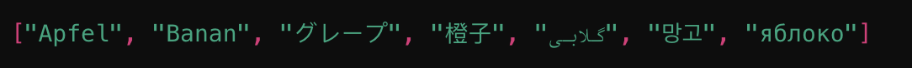
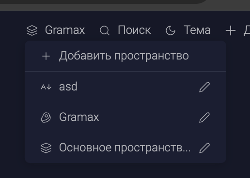

Сейчас на портале каталоги не имеют логичной сортировки, поэтому выводятся в хаотичном порядке. Для удобства восприятия, а также более удобной и понятной работы пользователей нужно сделать сортировку каталогов, находящихся в одном workspace.

## Критерии

-  Каталоги сортируются по следующим правилам:

   -  order указанный в .doc-root.yaml -- первый приоритет

   -  title в алфавитном порядке -- второй приоритет

      -  если заголовки на разных языках, сортировка будет в таком порядке

         

      -  в macOS сортировка зависит от текущего выбранного языка. Текущий выбранный в OS язык ставится в самое начало

-  Воркспейсы сортируются в алфавитном порядке

   

## Тесты

-  Есть юнит тесты, которые  проверяют критерии

## Исходные заявки

-  <https://support.ics-it.ru/issue/GXS-1899>