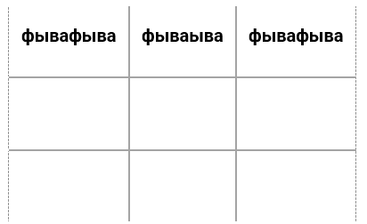
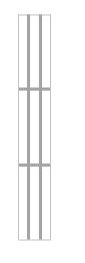
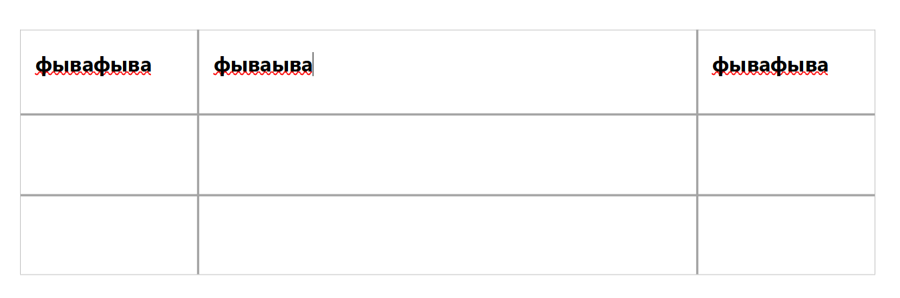
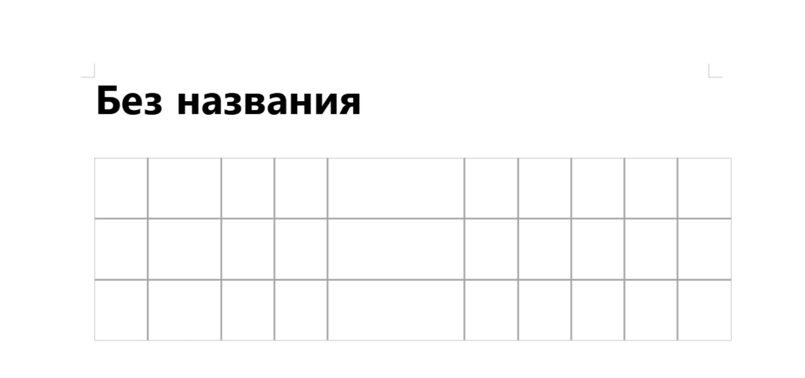
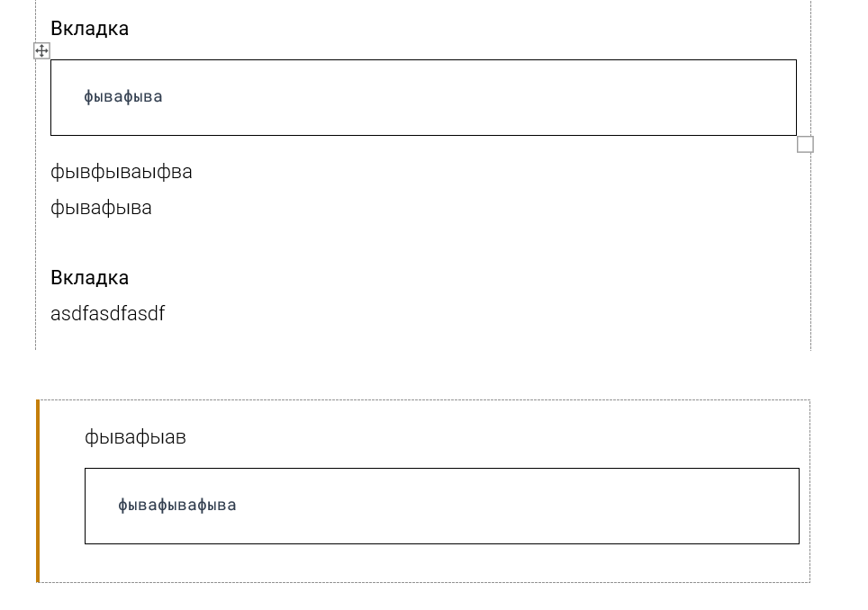
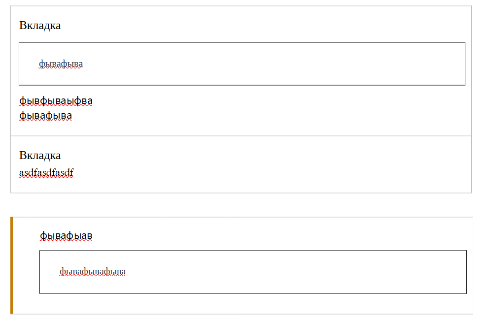
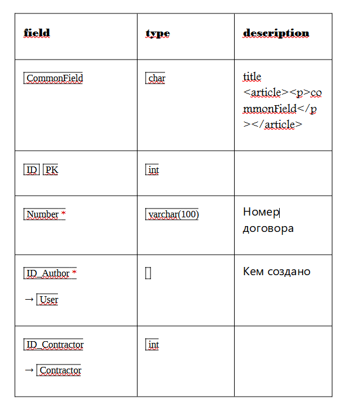
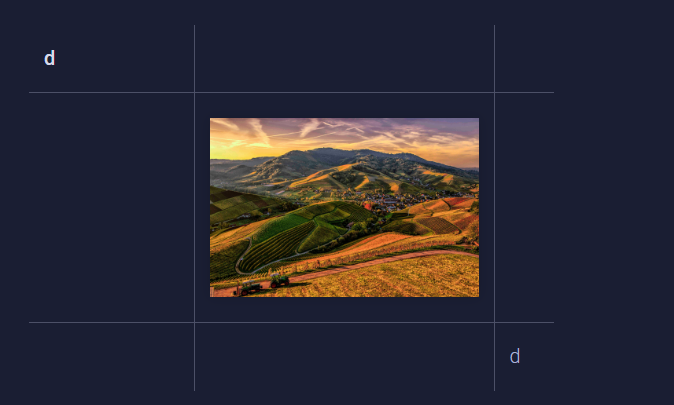
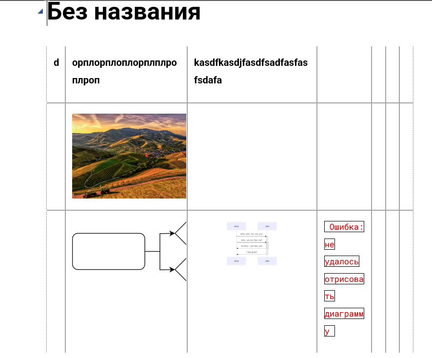
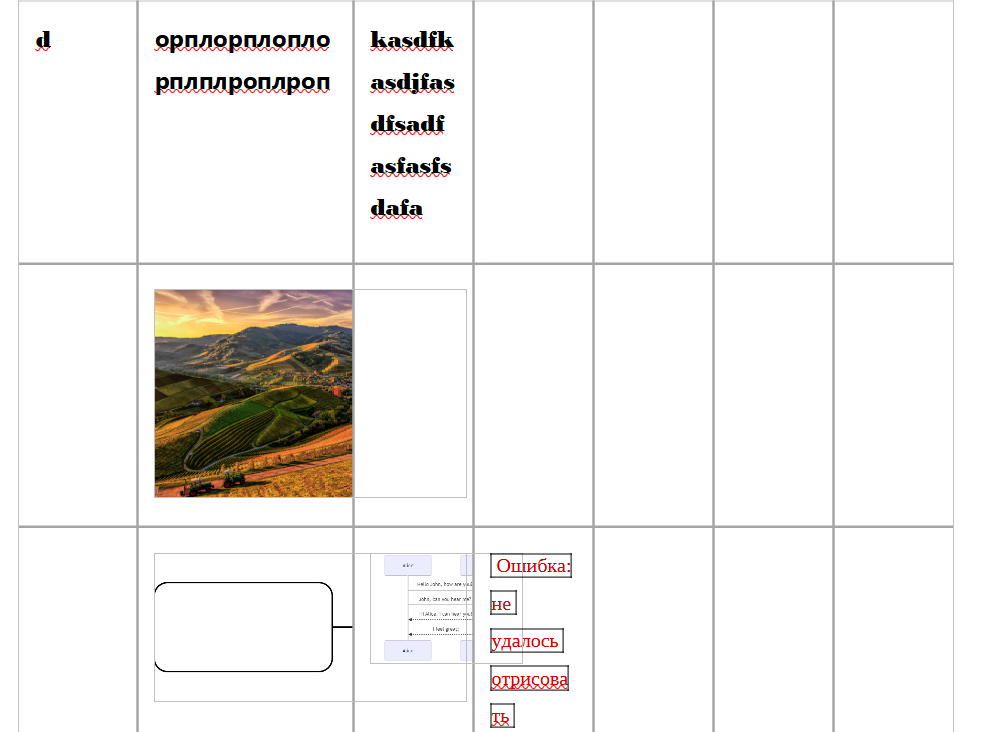

<https://support.ics-it.ru/issue/GXS-1916>

Проблема заключается в том, что во многих других редакторах **отличных от word,** таблицы имеют скукоженный вид



---

*  

   фывафыва

*  

   фываыва

*  

   фывафыва

---

*   

*  

   

*   

---

*   

*  

   

*   



Более подробно проблема описана в [этом](https://github.com/dolanmiu/docx/issues/216) обсуждении.

## Критерии

-  Теперь ширина колонки будет фиксированной ширины - это позволит сделать нормальную таблицу в текстовых редакторах, отличных от word

-  Если пользователь поменял ширину таблицы внутри редактора gramax вручную, сделав ширину **фиксированной**, то и в экспорте таблица будет соответственной ширины

-  Если таблица будет влезать за рамки страницы, то таблица будет ужиматься, по  формуле `ширинаЯчекиНовая = ширинаЯчекиСтарая*коэфициентСужения`, где `коэфициентСужения = ширинаСтраницы / суммаШиринВсехСтолбцов`

-  У заметок и блока кода сделать ширину на всю страницу, если один блок находится внутри другого, то максимальную ширину уменьшить до необходимого

-  Аналогично с вкладками

-  Таблица базы данных

## Ограничения

-  Картинки вне word будут некрасивыми

