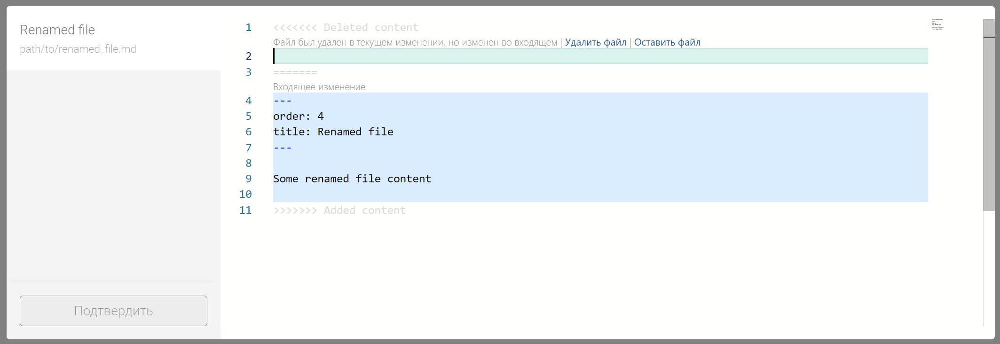

Раньше мы не умели решать некоторые виды конфликтов. Хотелось бы теперь настроить так, чтобы Gramax умел решать все виды конфликтов.


## Критерии

1. Вместо ошибки “Мы пока не умеем решать такие конфликты” показывается стандартное окно ошибки при всех конфликтах ниже.

## Виды конфликтов

Ветки A и B, в которых есть файл `file`. Мы находимся на ветке A.

1. Файл изменен на одной и той же строке на обоих ветках

   

2. Файл удален в ветке A, изменён в ветке B

   

3. Файл удален в ветке A, переименован в ветке B

   

4. Файл добавлен в ветке A, и добавлен в ветке B

   

5. Файл добавлен в ветке A, и переименован в такой же файл в ветке B

   

6. Файл переименован в ветке A и переименован в ветке B:

   1. Контент совпадает:

      1. Переименован в разные файлы:

         

         

      2. Переименован в одинаковые файлы: это не конфликт.

   2. Контент не совпадает

      1. Переименован в разные файлы:

         

         

      2. Переименован в один файл:

         


Таблица:

Ветка `A`(наша, ours), ветка  `B` (их, theirs). Мержим `B` в `A` . Файл - `1.txt`, контент файла:

```
1.txt content
line 2
line 3
```

-  M - изменение контента (modify). В ветке `A` меняем первую строчку на `content A`, в ветке `B` меняем первую строчку на `content B`

-  D - удаление (delete)

-  A - добавление (add)

-  R - переименование (rename)

-  R+M - переименование и изменение контента меньше 50% (rename + modify)

-  lg2 - какой результат конфликта вернул libgit2

По горизонтали - наше действие, по вертикали - их действие



---

*  

   ours -->

   theirs ↓

*  

   M

*  

   D

*  

   A

*  

   R

*  

   R+M

---

*  

   M

*  

   1\.txt

   ```
   <<<<<<< ours
   content A
   =======
   content B
   >>>>>>> theirs
   line 2
   line 3
   ```

   lg2:

   ```
   ours: null,
   theirs: '1.txt',
   ancestor: '1.txt'
   ```

*  

   1\.txt

   ```
   <<<<<<< Deleted content
   
   =======
   content B
   line 2
   line 3
   >>>>>>> Added content
   ```

   lg2:

   ```
   ours: null,
   theirs: '1.txt',
   ancestor: '1.txt'
   ```

*  

   \-

*  

   \-

*  

   1\.txt:

   ```
   <<<<<<< Deleted content
   
   =======
   content B
   line 2
   line 3
   >>>>>>> Added content
   ```

   1_moved_A.txt:

   ```
   content A
   line 2
   line 3
   ```

   lg2:

   ```
   ours: null,
   theirs: '1.txt',
   ancestor: '1.txt'
   ```

   Как будто lg2 посчитал

   переименование как

   удаление и добавление

---

*  

   D

*  

   1\.txt

   ```
   <<<<<<< Deleted content
   
   =======
   content A
   line 2
   line 3
   >>>>>>> Added content
   ```

   lg2o:

   ```
   ours: null,
   theirs: '1.txt',
   ancestor: '1.txt'
   ```

*  

   \-

*  

   \-

*  

   1\.txt - удален

   1_moved_A.txt:

   ```
   <<<<<<< Deleted content
   
   =======
   1.txt content
   line 2
   line 3
   >>>>>>> Added content
   ```

   lg2:

   ```
   ours: null,
   theirs: null,
   ancestor: '1.txt',
   ---
   ours: '1_moved_A.txt',
   theirs: null,
   ancestor: null
   ```

*  

   \-

---

*  

   A

*  

   \-

*  

   \-

*  

   В обоих ветках добавляется

   файл 2.txt:

   1. Контент полностью совпадает:

      Не конфликт

   2. Контент совпадает больше 50%:

      2\.txt:

      ```
      <<<<<<< ours
      content A
      =======
      content B
      >>>>>>> theirs
      line 2
      line 3
      ```

      lg2:

      ```
      ours: '2.txt',
      theirs: '2.txt',
      ancestor: null
      ```

   3. Контент совпадает меньше 50%:

      2\.txt:

      ```
      <<<<<<< ours
      content A
      line 2 A
      line 3 A
      =======
      content B
      line 2 B
      line 3 B
      >>>>>>> theirs
      ```

      lg2:

      ```
      ours: '2.txt',
      theirs: '2.txt',
      ancestor: null
      ```

*  

   В текущей ветке файл переименовывается 1.txt --> 2.txt,

   в их ветке добавляется 2.txt:

   lg2 создаёт конфликт, несмотря на то, что контент совпадает. Так же создает `~ours` и `~theirs` файлы (не нативное поведение).

   1. Контент полностью совпадает:

      1\.txt - удален

      2\.txt\~ours:

      ```
      1.txt content
      line 2
      line 3
      ```

      2\.txt\~theirs:

      ```
      1.txt content
      line 2
      line 3
      ```

      lg2:

      ```
      ours: null,
      theirs: '1.txt',
      ancestor: '1.txt'
      ---
      ours: '2.txt',
      theirs: '2.txt',
      ancestor: null
      ```

   2. Контент совпадает больше 50%:

      1\.txt - удален

      2\.txt\~ours:

      ```
      1.txt content
      line 2
      line 3
      ```

      2\.txt\~theirs:

      ```
      content B
      line 2
      line 3
      ```

      lg2:

      ```
      ours: null,
      theirs: '1.txt',
      ancestor: '1.txt'
      ---
      ours: '2.txt',
      theirs: '2.txt',
      ancestor: null
      ```

   3. Контент совпадает меньше 50%:

      1\.txt - удален

      2\.txt\~ours:

      ```
      1.txt content
      line 2
      line 3
      ```

      2\.txt\~theirs:

      ```
      content B
      line 2
      line 3
      ```

      lg2:

      ```
      ours: null,
      theirs: '1.txt',
      ancestor: '1.txt'
      ---
      ours: '2.txt',
      theirs: '2.txt',
      ancestor: null
      ```

*  

   В текущей ветке файл переименовывается 1.txt --> 2.txt и изменяется первая строчка,

   в их ветке добавляется 2.txt:

   1. Контент полностью совпадает:

      Не конфликт

   2. Контент совпадает больше 50%

      2\.txt:

      ```
      <<<<<<< ours
      content A
      =======
      content B
      >>>>>>> theirs
      line 2
      line 3
      ```

      lg2:

      ```
      ours: '2.txt', 
      theirs: '2.txt',
      ancestor: null
      ```

   3. Контент совпадает меньше 50%:

      2\.txt:

      ```
      <<<<<<< ours
      content A
      line 2
      line 3
      =======
      content B
      line 2 B
      line 3 B
      >>>>>>> theirs
      ```

      lg2:

      ```
      ours: '2.txt', 
      theirs: '2.txt',
      ancestor: null
      ```

---

*  

   R

*  

   \-

*  

   1\.txt - удален

   1_moved_B:

   ```
   <<<<<<< Deleted content
   
   =======
   1.txt content
   line 2
   line 3
   >>>>>>> Added content
   ```

   lg2:

   ```
   ours: null,
   theirs: null,
   ancestor: '1.txt',
   ---
   ours: null,
   theirs: '1_moved.txt',
   ancestor: null
   ```

*  

   В текущей ветке добавляется 2.txt:

   В их ветке файл переименовывается 1.txt --> 2.txt,

   lg2 создаёт конфликт, несмотря на то, что контент совпадает. Так же создает `~ours` и `~theirs` файлы (не нативное поведение).

   1. Контент полностью совпадает:

      1\.txt - удален

      2\.txt\~ours:

      ```
      1.txt content
      line 2
      line 3
      ```

      2\.txt\~theirs:

      ```
      1.txt content
      line 2
      line 3
      ```

      lg2:

      ```
      ours: '1.txt',
      theirs: null,
      ancestor: '1.txt'
      ---
      ours: '2.txt',
      theirs: '2.txt',
      ancestor: null
      ```

   2. Контент совпадает больше 50%:

      1\.txt - удален

      2\.txt\~ours:

      ```
      content A
      line 2
      line 3
      ```

      2\.txt\~theirs:

      ```
      1.txt content
      line 2
      line 3
      ```

      lg2:

      ```
      ours: '1.txt',
      theirs: null,
      ancestor: '1.txt'
      ---
      ours: '2.txt',
      theirs: '2.txt',
      ancestor: null
      ```

   3. Контент совпадает меньше 50%:

      1\.txt - удален

      2\.txt\~ours:

      ```
      content A
      line 2 A
      line 3 A
      ```

      2\.txt\~theirs:

      ```
      1.txt content
      line 2
      line 3
      ```

      lg2:

      ```
      ours: '1.txt',
      theirs: null,
      ancestor: '1.txt'
      ---
      ours: '2.txt',
      theirs: '2.txt',
      ancestor: null
      ```

*  

   1. Переименованы в один и тот же файл:

      Не конфликт

   2. Переименованы в разные файлы:

      2_A.txt:

      ```
      <<<<<< Deleted content
      
      =======
      1.txt content
      line 2
      line 3
      >>>>>>> Added content
      ```

      2_B.txt:

      ```
      <<<<<< Deleted content
      
      =======
      1.txt content
      line 2
      line 3
      >>>>>>> Added content
      ```

      lg2:

      ```
      ours: null,
      theirs: null,
      ancestor: '1.txt'
      ---
      ours: '2_A.txt',
      theirs: null,
      ancestor: null
      ---
      ours: null,
      theirs: '2_B.txt',
      ancestor: null
      ```

*  

   1. Переименованы в один и тот же файл:1.

      1. Контент идентичен:

         Не конфликт

      2. Контент совпадает больше 50%:

         Создает `~ours` и `~theirs` файлы (не нативное поведение).

         2\.txt\~ours:

         ```
         content A
         line 2
         line 3
         ```

         2\.txt\~theirs:

         ```
         1.txt content
         line 2
         line 3
         ```

         lg2:

         ```
         ours: null,
         theirs: null,
         ancestor: '1.txt'
         ---
         ours: '2.txt',
         theirs: '2.txt',
         ancestor: null
         ```

      3. Контент совпадает меньше 50%:

         Создает `~ours` и `~theirs` файлы (не нативное поведение).

         2\.txt\~ours:

         ```
         content A
         line 2 A
         line 3 A
         ```

         2\.txt\~theirs:

         ```
         1.txt content
         line 2
         line 3
         ```

         lg2:

         ```
         ours: null,
         theirs: null,
         ancestor: '1.txt'
         ---
         ours: '2.txt',
         theirs: '2.txt',
         ancestor: null
         ```

   2. Переименованы в разные файлы:

      1. Контент совпадает больше 50:

         2_A.txt:

         ```
         content A
         line 2
         line 3
         ```

         2_B.txt:

         ```
         1.txt content
         line 2
         line 3
         ```

         lg2:

         ```
         ours: null,
         theirs: null,
         ancestor: '1.txt'
         ---
         ours: null,
         theirs: '2_B.txt',
         ancestor: null
         ```

      2. Контент совпадает меньше 50%:

         2_A.txt:

         ```
         content A
         line 2 A
         line 3 A
         ```

         2_B.txt:

         ```
         1.txt content
         line 2
         line 3
         ```

         lg2:

         ```
         ours: null,
         theirs: null,
         ancestor: '1.txt'
         ---
         ours: null,
         theirs: '2_B.txt',
         ancestor: null
         ```

---

*  

   R+M

*  

   1\.txt:

   ```
   <<<<<<< Deleted content
   
   =======
   content A
   line 2
   line 3
   >>>>>>> Added content
   ```

   1_moved_B.txt:

   ```
   content B
   line 2
   line 3
   ```

   lg2:

   ```
   ours: '1.txt',
   theirs: null,
   ancestor: '1.txt'
   ```

   Как будто lg2 посчитал

   переименование как

   удаление и добавление

*  

   \-

*  

   В текущей ветке добавляется 2.txt:

   В их ветке файл переименовывается 1.txt --> 2.txt и изменяется первая строчка,

   1. Контент полностью совпадает:

      Не конфликт

   2. Контент совпадает больше 50%

      2\.txt:

      ```
      <<<<<<< ours
      content A
      =======
      content B
      >>>>>>> theirs
      line 2
      line 3
      ```

      lg2:

      ```
      ours: '2.txt', 
      theirs: '2.txt',
      ancestor: null
      ```

   3. Контент совпадает меньше 50%:

      2\.txt:

      ```
      <<<<<<< ours
      content A
      line 2 A
      line 3 A
      =======
      content B
      line 2
      line 3
      >>>>>>> theirs
      ```

      lg2:

      ```
      ours: '2.txt', 
      theirs: '2.txt',
      ancestor: null
      ```

*  

   1. Переименованы в один и тот же файл:

      1. Контент идентичен:

         Не конфликт

      2. Контент совпадает больше 50%:

         Создает `~ours` и `~theirs` файлы (не нативное поведение).

         2\.txt\~ours:

         ```
         1.txt content
         line 2
         line 3
         ```

         2\.txt\~theirs:

         ```
         content B
         line 2
         line 3
         ```

         lg2:

         ```
         ours: null,
         theirs: null,
         ancestor: '1.txt'
         ---
         ours: '2.txt',
         theirs: '2.txt',
         ancestor: null
         ```

      3. Контент совпадает меньше 50%:

         Создает `~ours` и `~theirs` файлы (не нативное поведение).

         2\.txt\~ours:

         ```
         1.txt content
         line 2
         line 3
         ```

         2\.txt\~theirs:

         ```
         content B
         line 2 B
         line 3 B
         ```

         lg2:

         ```
         ours: null,
         theirs: null,
         ancestor: '1.txt'
         ---
         ours: '2.txt',
         theirs: '2.txt',
         ancestor: null
         ```

   2. Переименованы в разные файлы:

      1. Контент совпадает больше 50:

         2_A.txt:

         ```
         content A
         line 2
         line 3
         ```

         2_B.txt:

         ```
         1.txt content
         line 2
         line 3
         ```

         lg2:

         ```
         ours: null,
         theirs: null,
         ancestor: '1.txt'
         ---
         ours: null,
         theirs: '2_B.txt',
         ancestor: null
         ```

      2. Контент совпадает меньше 50%:

         2_A.txt:

         ```
         content A
         line 2 A
         line 3 A
         ```

         2_B.txt:

         ```
         1.txt content
         line 2
         line 3
         ```

         lg2:

         ```
         ours: null,
         theirs: null,
         ancestor: '1.txt'
         ---
         ours: null,
         theirs: '2_B.txt',
         ancestor: null
         ```

*  

   1. Переименован в один и тот же файл:

      1. Контент идентичен:

         Не конфликт

      2. Контент совпадает больше 50%:

         2\.txt:

         ```
         <<<<<<< ours
         content A
         =======
         content B
         >>>>>>> theirs
         line 2
         line 3
         ```

         lg2:

         ```
         ours: '2.txt',
         theirs: '2.txt',
         ancestor: null
         ```

      3. Контент совпадает меньше 50%:

         2\.txt:

         ```
         <<<<<<< ours
         content A
         line 2 A
         line 3 A
         =======
         content B
         line 2 B
         line 3 B
         >>>>>>> theirs
         ```

         lg2:

         ```
         ours: '2.txt',
         theirs: '2.txt',
         ancestor: null
         ```

   2. Переименованы в разные файлы:

      1. Контент идентичен:

         Не конфликт

      2. Контент совпадает больше 50%:

         Не конфликт

      3. Контент совпадает меньше 50%:

         Не конфликт



#### Design details:

1. Пример unit теста:

   

2. Нужно проверить все варианты конфликтов:

   1. С переменованием

   2. С добавлением двух файлов

   3. Комбинации переименования и добавления

3. Если  файл переименован в ветке A и переименован в ветке B, с разным контентом, но при совпадении больше 50% (гит считает это переименованием), в разные файлы, нативный гит считает это конфликтом, а libgit2 - нет.

## Исходные заявки

-  <https://support.ics-it.ru/issue/GXS-1782> -- Ошибка при конфликте с переименованием