Сейчас мы поддерживаем импорт только основных элементов Confluence. Необходимо расширить список поддерживаемых элементов.

### Сопоставление элементов



---

*  

   В Confluence

*  

   Реализация в Gramax

---

*  

   

*  

   [@Имя Пользователя](./../../../jun-2024/plany/_index)

---

*  

   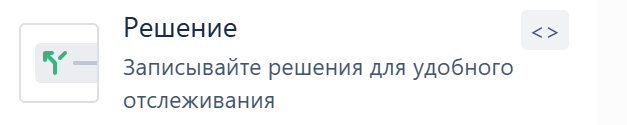

*  

   Маркированный список

---

*  

   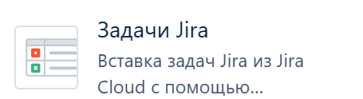

*  

   Выводит список задач с фильтрацией

   Переносим ссылкой на поиск задач в Jire

   Пример: [https://yargynkin.atlassian.net/issues/?jql=ORDER BY created DESC](https://yargynkin.atlassian.net/issues/?jql=ORDER%20BY%20created%20DESC)

---

*  

   

*  

   Аналогично элементу “Задачи Jira”

---

*  

   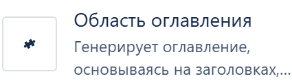

   Генерирует оглавление, основываясь на заголовках в тексте, сам текст размещается внутри элемента

*  

   Переносим содержимое элемента.

---

*  

   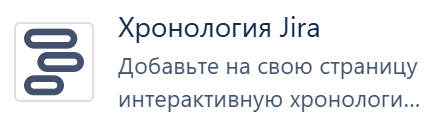

*  

   Переносим ссылкой.

   Пример: [https://yargynkin.atlassian.net/jira/software](https://yargynkin.atlassian.net/jira/software%20%20/projects/KAN/boards/7/timeline)

   [/projects/KAN/boards/7/timeline](https://yargynkin.atlassian.net/jira/software%20%20/projects/KAN/boards/7/timeline)

---

*  

   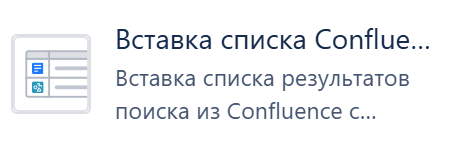

*  

   Выводит список элементов с фильтрацией

   Переносим ссылкой на поиск элементов в конфе

   Пример: <https://yargynkin.atlassian.net/wiki/search?text=pages>

---

*  

   

*  

   Переносим ссылкой на страницу поиска в Confluence.

   Пример: <https://yargynkin.atlassian.net/wiki/search?text=&spaces=OE&type=page>

---

*  

   

*  

   Переносим ссылкой на указанный файл в дропбокс

---

*  

   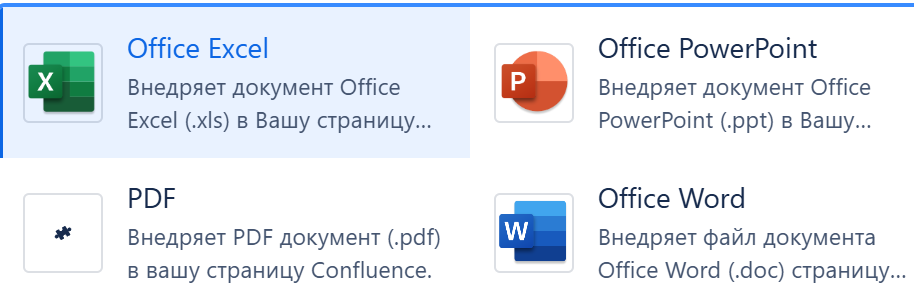

*  

   Возможно перенести файлом

---

*  

   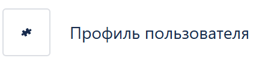

   

*  

   Перенести гипертекст с ссылкой на аккаунт Confluence

---

*  

   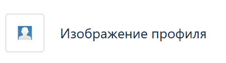

   

*  

   Переносим аналогично “Профиль пользователя”

---

*  

   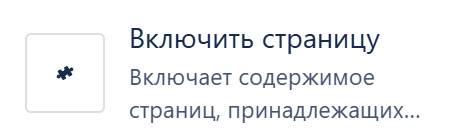

   Отображение всего содержимого другой страницы на текущей.

*  

   Переносим как контент текущей страницы

---

*  

   

*  

   Переносим ссылкой на план

---

*  

   

   Свойства страницы - элемент с каким-то пользовательским содержимым.

*  

   Переносим содержимое как контент

---

*  

   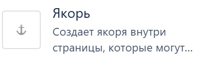

*  

   Не переносим. На месте элемента отобразится контрол со ссылкой на страницу.

---

*  

   

*  

   Не переносим. На месте элемента отобразится контрол со ссылкой на страницу.

---

*  

   

   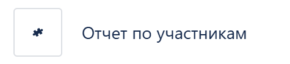

*  

   Не переносим. На месте элемента отобразится контрол со ссылкой на страницу.

---

*  

   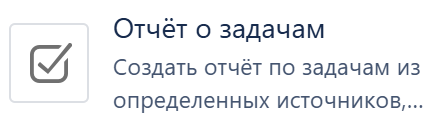

   

*  

   Не переносим. На месте элемента отобразится контрол со ссылкой на страницу.

---

*  

   

*  

   Не переносим. На месте элемента отобразится контрол со ссылкой на страницу.

---

*  

   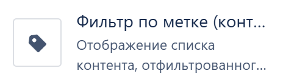

   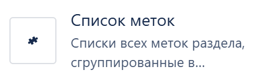

   

   

   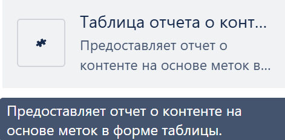

   У нас нет никакого механизма меток.

*  

   Не переносим. На месте элемента отобразится контрол со ссылкой на страницу.

---

*  

   

   Элемент для просмотра прошлых версий данной страницы

*  

   Не переносим. На месте элемента отобразится контрол со ссылкой на страницу.

---

*  

   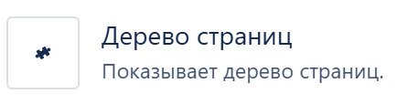

   Строит дерево страниц, начиная с указанной. Строиться динамически

*  

   Не переносим. На месте элемента отобразится контрол со ссылкой на страницу.

---

*  

   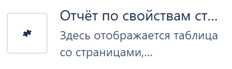

   Отчёт - таблица с выводом содержимого элементов свойства страницы

*  

   Не переносим. На месте элемента отобразится контрол со ссылкой на страницу.

---

*  

   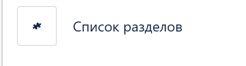

   Список разделов под одним доменом, с возможностью фильтрации

*  

   Не переносим. На месте элемента отобразится контрол со ссылкой на страницу.

---

*  

   

*  

   Не переносим. На месте элемента отобразится контрол со ссылкой на страницу.

---

*  

   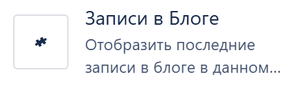

*  

   Не переносим. На месте элемента отобразится контрол со ссылкой на страницу.

---

*  

   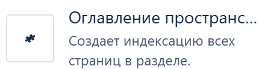

*  

   Не переносим. На месте элемента отобразится контрол со ссылкой на страницу.

---

*  

   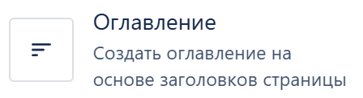

*  

   Не переносим. На месте элемента отобразится контрол со ссылкой на страницу.

---

*  

   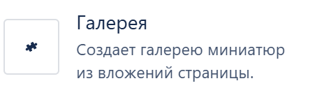

*  

   Не переносим. На месте элемента отобразится контрол со ссылкой на страницу.

---

*  

   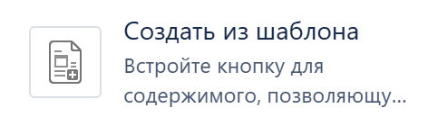

   Создание страницы в Confluence с использованием шаблонов Confleunce

*  

   Не переносим. На месте элемента отобразится контрол со ссылкой на страницу.

---

*  

   

   Диаграммы атласиана

*  

   Не переносим. На месте элемента отобразится контрол со ссылкой на страницу.

---

*  

   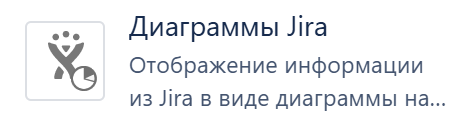

*  

   Не переносим. На месте элемента отобразится контрол со ссылкой на страницу.

---

*  

   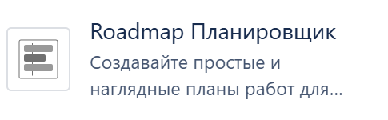

*  

   Не переносим. На месте элемента отобразится контрол со ссылкой на страницу.

---

*  

   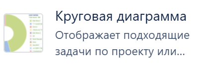

   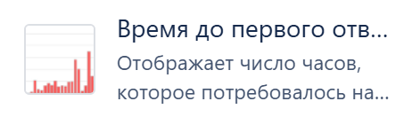

   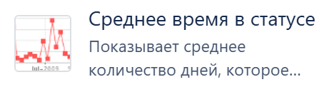

   и все элементы группы “Внешнее содержимое”

   Графики, которые рисуются динамически, ссылок на них нет

*  

   Не переносим. На месте элемента отобразится контрол со ссылкой на страницу.

---

*  

   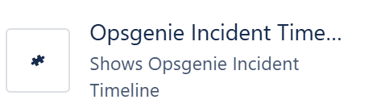

   

   

   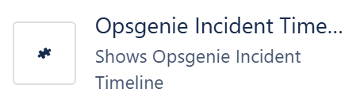

   

   Не могу разместить эти элементы. Ссылки на них тоже не вижу.

*  

   Не переносим. На месте элемента отобразится контрол со ссылкой на страницу.



### Критерии приёмки:

**Переносятся специфичные элементы из конфлюенс. В Грамакс они представлены в следующем виде:**

-  Решение -- Маркированный список

-  Задачи Jira -- Ссылка на указанные задачи

-  Устаревшая версия Jira -- Ссылка на указанные задачи

-  Область оглавления - Свойства страницы -- Весь контент внутри элемента

-  Хронология Jira -- Ссылка на хронологию

-  Вставка списка конфлюенс -- Ссылка на указанные элементы

-  Интерактивный поиск -- Ссылка на страницу поиска в конфлюенс

-  Dropbox -- Ссылка на файл в дропбокс

-  Профиль пользователя - Изображение профиля -- Ссылка на профиль пользователя в виде гипертекста с его именем профиля

-  Упоминание -- Ссылка на профиль пользователя в виде гипертекста @Имя Профиля

-  Включить страницу -- Контент с другой страницы будет перенесён как контент текущей страницы

-  План Jira Премиум -- Ссылка на план

-  Office Excel - Word - PowerPoint - PDF -- Переносим как файл