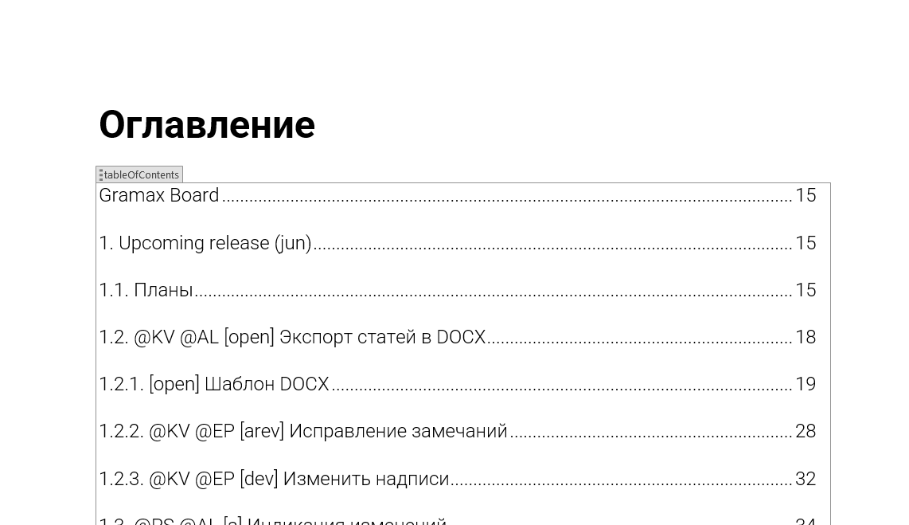
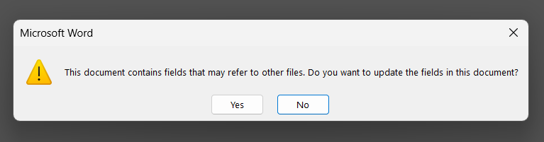
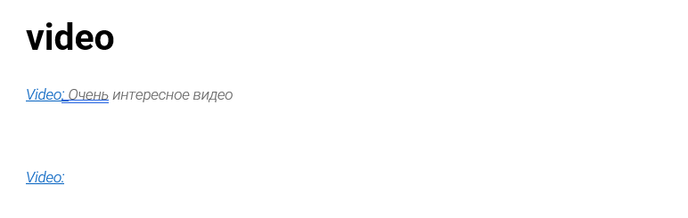
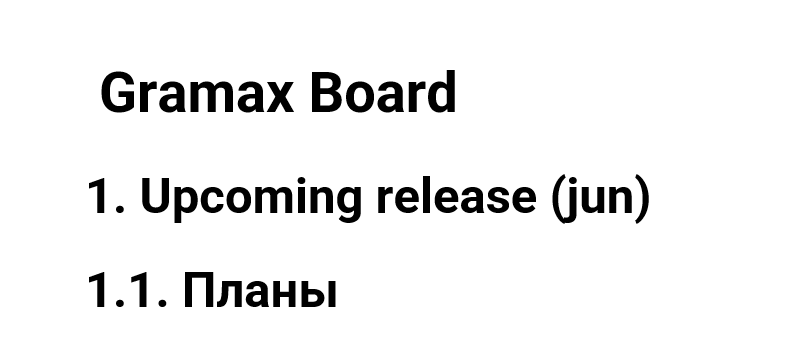
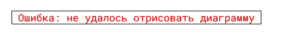

Во время porev экспорта каталога было оставлено несколько замечаний, эта us призвана решить их.

## Критерии

-  Теперь оглавление выглядит так

-  Теперь будет выводиться предупреждение, чтобы word смог сделать оглавление

-  Сделать новый дизайн для видео: раньше подпись экспорт видео экспортировался как `подпись к картинке`, но у видео нет картинки, поэтому было решено выделить для него отдельный стиль, чтобы надпись находилась слева.

-  Другой размер `Title`. `Title - 28пт`; `Heading 1 - 24.5пт`. Раньше было так, что внешне никак было не отличить `Title` от `Heading 1`. Эта проблема решается путем увеличения размера `Title`. `Title - 28пт`; `Heading 1 - 24.5пт`

-  Новый дизайн ошибок: старый дизайн ошибок легко спутать с обычным `danger note`. Новый дизайн списан с `fatal errors`, которые можно изредка встретить в редакторе `gramax`

`Ошибка: не удалось отрисовать диаграмму`,       `Error: Failed to render a diagram`

`Ошибка: не удалось отрисовать картинку`,         `Error: Failed to render a picture`

`Ошибка: не удалось отрисовать таблицу БД`,     `Error: Failed to render a DB table`

`Ошибка: не удалось отрисовать сниппет`,           `Error: Failed to render a snippet`

-  Сделать ссылки: теперь при нажатии на заголовок статьи в оглавлении через `ctrl + лкм`, документ автоматически переходит к этой статье

## 