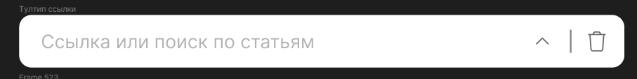
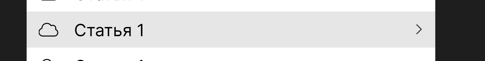
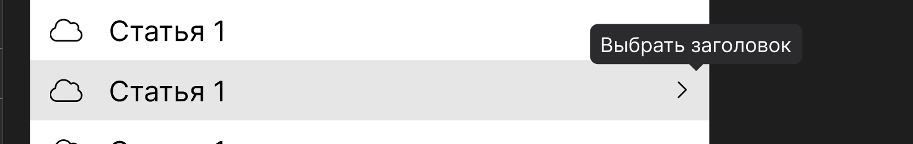
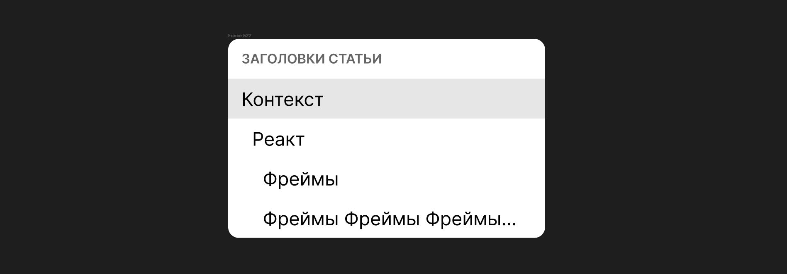

Я, как пользователь приложения, хочу иметь возможность ссылаться не только на статью, но и на конкретный заголовок.

## Критерии

1. Тултип ссылки:

   1. плейсхолдер инпута содержит текст - `Ссылка или поиск по статьям`;

      

   2. для элементов с типом “Статья” при наведении отображается уголок справа;

      

   3. при ховере на уголок он темнеет и появляется тултип;

      

   4. при нажатии на уголок появляется меню с заголовками статьи:

      

2. Меню с заголовками:

   1. отображается список заголовков из статьи;

   2. ссылку на заголовок можно выбрать только нажатием мышью.

   3. перед текстом заголовка, использовать [концепцию ](./../../../../jun-2024/article-export/open-kv-ispravlenie-zamechaniy)отступов из навигации в правом сайдбаре;

   4. если в статье нет заголовков, то в меню отображается сообщение - `(Нет ни одного заголовка)`;

      

3. при переходе по ссылке с заголовком статья открывается на указанном заголовке, если он существует.

Оценка: **9 дней**;