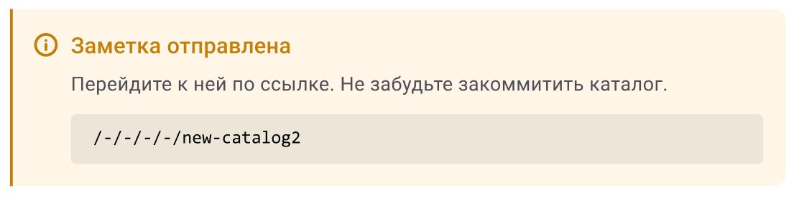
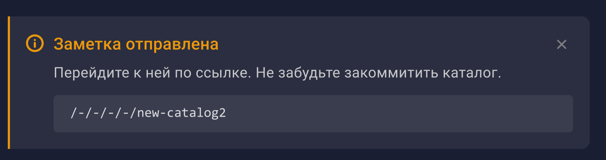
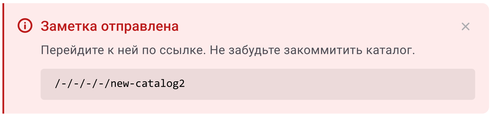
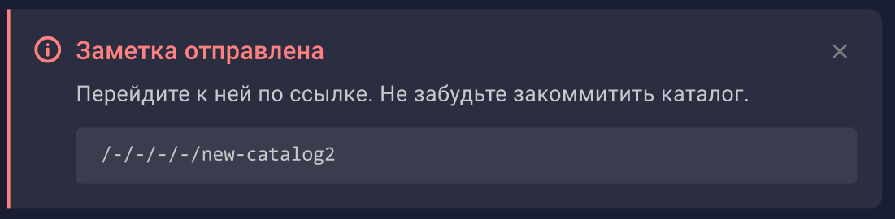

Для сворачиваемого блока в компоненте alert используется заметка, необходимо обновить стили заметки для соответствия стилей в системе.

## Анализ

-  Необходимо обновить цвета заметки и изменить поведение заголовка на поддержку строчных букв.

-  Из-за наличия строчных букв, можно увеличить размер шрифта для заголовка.

-  В макете текст внутри заметки 14px, у нас сейчас 16px

-  Правый край заметки закруглён.

-  Текст в заметке выровнен по началу заголовка

## Что не будет сделано

-  Размер шрифта для контента заметки не изменяется

-  Кнопка крестика, как на макете, не добавляется

## Критерии

-  Заголовок заметки поддерживает строчные буквы

-  Размер шрифта заголовка увеличен до 16px

-  Уменьшено расстояние между иконкой и заголовком( с 16px до 8px)

-  Текст в заметке выравнивается по началу заголовка(в сложенном и разложенном видах)

-  Правые края заметки скруглённые

-  Фон заметки в тёмной теме стал менее прозрачным (Повышена прозрачность всех заметок с 5% до 7%)

-  Изменены цвета заметки (**Предупреждение**) в светлой теме:

   -  Иконка, Заголовок и Граница: #C47E0A

   -  Фон: #FFF6E7

-  Изменены цвета заметки (**Предупреждение**) в тёмной теме:

   -  Иконка, Заголовок и Граница: #EC980C

   -  Фон: #FFFFFF 7%

-  Изменены цвета заметки (**Ошибка**) в светлой теме:

   -  Иконка, Заголовок и Граница: #BC1C1C

   -  Фон: Не изменяется

-  Изменены цвета заметки (**Ошибка**) в тёмной теме:

   -  Иконка, Заголовок и Граница: Не изменяется

   -  Фон: #FFFFFF 7%

