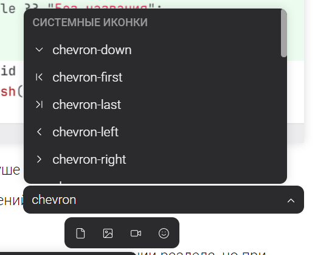
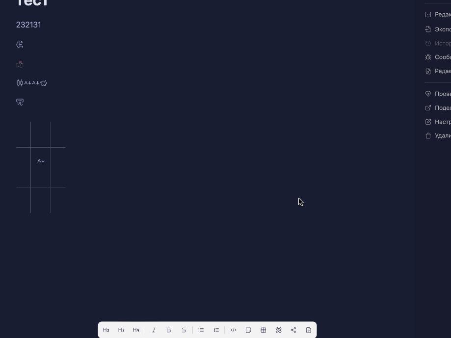

Какие сейчас есть проблемы:

-  Я могу сфокусироваться на заголовок группы с помощью строчки вверх. При нажатии на enter ничего не происходит. Нужно, чтобы нельзя было сфокусироваться на этот текст

-  Поиск по запросу “оо“ выдал неочевидный результат.

   

   Потому что также сработал поиск по категориям: `apple`  есть в категории `food`, а `anvil` и `axe` в `tools`,

-  При выборе иконок по стрелкам вверх и вниз фокус перемещается не по порядку, прыгает через несколько иконок.

   

   Фокус перескакивает на 1 элемент вниз, а потом на элемент, на который наведен указатель мышки, потому что указатель двинулся. Странным кажется, что после нажатия на стрелку сфокусированный элемент оказывается первым в видимом списке

-  При нажатии на кнопку окно с иконками закрывается и не появляется при повторном нажатии по кнопке.

   

-  Инпут с поиск[ом немного уменьши]()ть, не по линии с иконками.

   

-  Поиск не учитывает транслитерацию

## Критерии

-  Нельзя сфокусироваться на заголовок группы. Если при помощи стрелочек попытаться сфокусироваться на него, то фокус будет перескакивать на следующий элемент (как в <https://mui.com/material-ui/react-autocomplete/#virtualization>)

-  При поиске по системным иконкам сначала отображаются иконки, найденные по вхождению подстроки в имя файла иконки. Затем идут иконки, найденные по вхождению подстроки в имя категорий, в которые они входят.

   -  У иконок, найденных по вхождению подстроки в имя категорий, справа от названия иконки показывается первая попавшая под критерии фильтрации категория.

      

-  Фокус переключается как в <https://mui.com/material-ui/react-autocomplete/#virtualization>

-  При нажатии на кнопку иконки/сниппеты, окно не закрывается, а фокус всегда устанавливается в инпут (сейчас он уходит из инпута, если был).

-  Ширина окна списка такая же как и у инпута

-  Добавлена поддержка транслитерации в поиске для списков

## Оценка

-  анализ -- 4ч

-  реализация -- 16ч

## Замечания

-  Скроллбар немного закрывает рамки категории иконок.

