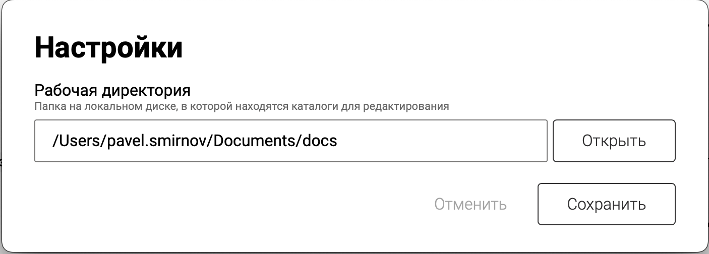

1. Сейчас корневая директория создается автоматически, юзеры не догадываются об этом. Нужно принудительно у них спрашивать.

   Также сейчас окно настроек вынесено за пределы приложения и выглядит не по стандарту.

2. Для энтерпрайз решения необходимо реализовать воркспейсы. Кроме энтерпрайза они также решат первую проблему.




## Критерии

1. Функционал воркспейсов поддерживается в браузерной и десктопной версии приложения, в докпортале -- нет

2. Если у пользователя был задан `ROOT_PATH`, он автоматически превращается в воркспейс “[icon:layers] Основное пространство“

3. На главной странице приложения есть кнопка “[icon:layers] <workspace-name>“ слева от кнопки “[icon:search] Поиск“

4. При нажатии на кнопку “[icon:layers]  <workspace-name>“ открывается выпадающий список воркспейсов

   1. Кнопка “[icon:plus] Добавить пространство“ (“[icon:plus] Add workspace“)

   2. Список воркспейсов в формате “[icon:bird] Название воркспейса [icon:pencil]“, где [icon:bird] -- иконка воркспейса

   3. Переключение воркспейсов происходит нажатием на название

   

   [image:./workspaces.jpeg::Меню воркспейсов, Figma:3.28125,6.60194,90,81.5534:]

5. Если в конфигурационном файле нет ни одного воркспейста или нет самого файла, то на приветственном экране “Пока что тут пусто“ внизу присутствует текст “Рабочая директория: `<path>`. Изменить”

   1. Изменить в виде ссылки, при нажатии открывается directory picker от os, при выборе путь заменяется

   2. Если пользователь указывает путь, в котором уже существуют каталоги, он автоматически выбирается в качестве воркспейса

6. При нажатии на [icon:pencil], открываются модальное окно настроек воркспейса, внешний вид похож на “Настройки каталога“, содержит:

   1. *Поле ввода*\*: “Название” (“Title“)

   2. *Icon Picker*: “Иконка” (“Icon”)

   3. *Поле (readonly)\**: “Рабочая директория” (“Working Directory“), *кнопка (если не readonly)*: “Открыть“ (“Open”)

      *Подсказка*: “Директория на локальном диске, в которой находятся рабочие каталоги”

      Отображается только в десктопном приложении

   4. *Кнопка слева*: “Удалить“ (“Delete“)

      *Конфирм для десктопа*: Удалить пространство? Каталоги останутся на вашем компьютере.

      Конфирм для браузера: Удалить пространство? Все каталоги в нем также удалятся.

   5. *Кнопка справа*: “Сохранить” (“Save”)

7. При добавлении нового воркспейста в десктопном приложении, показывается модальное окно с настройками воркспейса и редактируемым полем “Рабочая директория“ в десктопном приложении

   1. В браузере путь до воркспейса генерируется автоматически в формате `workspace-<count>`, где `count` -- уникальный номер воркспейса. Логика аналогична автоматическому генерации имени статьи/каталога.

   2. После добавления воркспейса, приложение переключается на него

8. Для удаления воркспейса необходимо воспользоваться интерфейсом Gramax

   1. Нельзя удалить последний воркспейс, при открытии его настроек нет кнопки “Удалить“

   2. В браузерной версии вместе с воркспейсом удаляются файлы. В десктопе удаляется только настройки воркспейса (workspace.yaml)

9. Если не удаётся прочитать директорию воркспейса (например, пользователь удалил директорию с воркспейсом самостоятельно или изменил права доступа), то он удаляется, приложение переключается на стандартный воркспейс “[icon:layers] Основное пространство“, если его не существует -- он создаётся

   1. Если не удалось создать стандартный воркспейс, то выдаётся ошибка при загрузке как сейчас при неправильно указаном пути

10. При переключении воркспейса, на главной странице отображаются каталоги воркспейса и применяются его настройки

    1. Приложение не перезагружается, но каталоги предыдущего воркспейса выгружаются из [comment:6]памяти[/comment]

11. Настройки воркспейсов сохраняются в директорию с настройками приложения в формате YAML

    1. `web`: `/mnt/config.yaml`

    2. `macOS`: `~/Library/Application Support/com.ics.gramax`

    3. `Windows`: `%AppData%/com.ics.gramax`

    4. `Linux`: `~/.config/com.ics.gramax`

    5. Пример файла настроек

       `config.yaml`

       ```yaml
       workspaces:
           - "/Users/<user>/Documents/some-workspace-path"
           - "/Users/<user>/Documents/some-workspace-path"
       latest-workspace: "/Users/<user>/Documents/docs"
       ```

       `workspaces.yaml`, содержиться в папке с воркспейсом. В случае, если его нет, используются дефолтные значения

       ```yaml
         name: "Gramax"
         icon: "layers"
         groups: <groups>
       ```

## Оценка

1. Анализ: 1д

2. Реализация: 2-3д