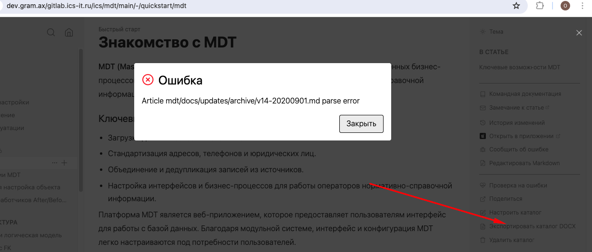
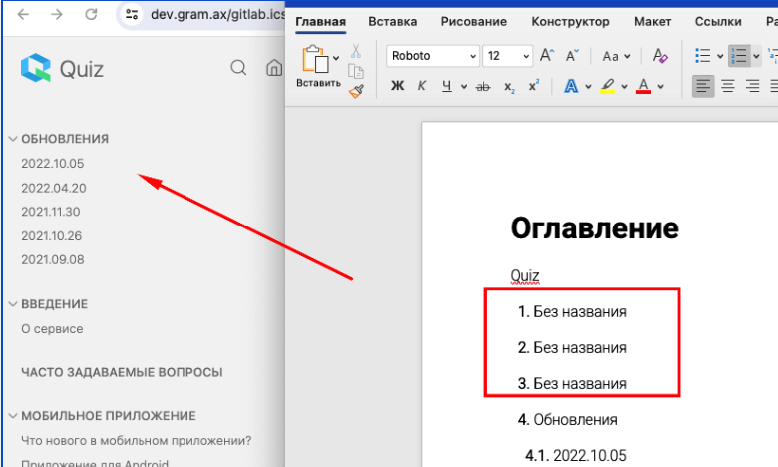
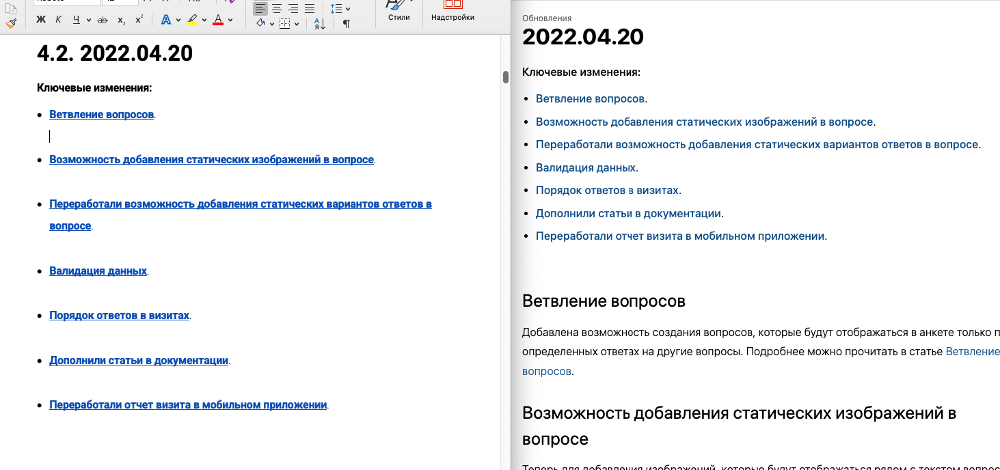
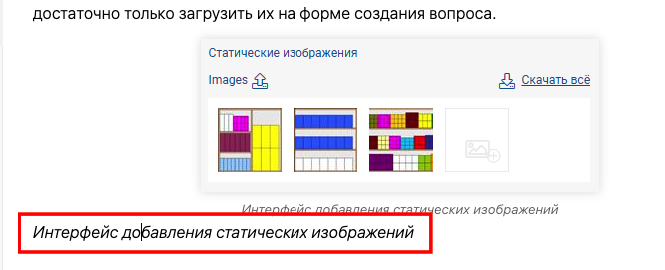

Должна быть возможность экспортировать весь каталог или раздел в формате DOCX.

## Критерии

-  Первая страница -- оглавление с иерархией разделов

-  Дальше идут статьи. Каждая статья с новой страницы.

-  Все стили применяются.

-  Выгружается только контент статей.

-  Название файла = URL каталога/раздела после последнего `/` + расширение.

-  Выгружается каталог в текущем состоянии (если есть неопубликованные изменения -- тоже выгружаются).

-  Кнопка экпорта всего каталога находится ниже кнопки настроек каталога в правой панели. С текстом “[icon:file-text] Экспортировать каталог DOCX"

-  Кнопка экспорта статей и разделов будет в левой панели в троеточие между кнопкой свойства и удаления. С текстом “[icon:file-output] Экспортировать“ при нажатии на эту кнопку появляется еще одно выпадающее меню в котором кнопки:

   -  Для статьи:

      -  [icon:file-text] DOCX

      -  [icon:file-text] PDF

   -  Для раздела:

      -  [icon:file-text] Экспортировать раздел в DOCX

      -  [icon:file-text] Экспортировать статью в DOCX

      -  [icon:file-text] Экспортировать статью в PDF

-  При нажатии на любую кнопку PDF происходит переход в эту статью/раздел и открывается окно print

-  Экспорт раздела

   1. Стиль заголовка статьи основного раздела будет `Title`, а всех дочерних статей - `Heading 1` с стандартной иерархической нумерацией (

      1. 1\.

         1. 1\.1.

            1. 1\.1.1.

         2. 1\.2.

            1. 1\.2.1.

      2. 2\.

         1. 2\.1.

   2. Остальные стили остаются также как и были

   3. Если в разделе есть контент его контент будет во второй странице документа

   4. Если в разделе нет контента (а только ссылки на дочерние) этот раздел экспортится по логике экспорта каталога

-  Экспорт каталога

   1. Стиль всех родительских статей будет `Title`, а всех остальных статей - `Heading 1` с стандартной иерархической нумерацией

   2. Остальные стили остаются также как и были

## Замечания

-  Ошибка при выгрузке всего каталога МДТ <https://dev.gram.ax/gitlab.ics-it.ru/ics/mdt/main/-/updates> Указанный раздел в тексте ошибки - скрытый.

-  В каталоге <https://dev.gram.ax/gitlab.ics-it.ru/ics/quiz/master/->  выгружаются лишние разделы “Без названия“.  Как я поняла, это \[include:../blocks/[shareLink.md](http://shareLink.md)\] , \[include:../blocks/[offline.md](http://offline.md)\] и \[include:../blocks/[removeDraft.md](http://removeDraft.md)\], тут можно посмотреть <https://dev.gram.ax/gitlab.ics-it.ru/ics/quiz/master/-/faq>

   

-  Выгруженный список содержит лишние строки, например тут <https://dev.gram.ax/gitlab.ics-it.ru/ics/quiz/master/-/updates/20220420>

-  Лишняя строчка, тут <https://dev.gram.ax/gitlab.ics-it.ru/ics/quiz/master/-/faq>

-  Где-то курсив не выгружается.

-  Тут <https://dev.gram.ax/gitlab.ics-it.ru/ics/quiz/master/-/mobile/install-android> фотки не выгружаются.