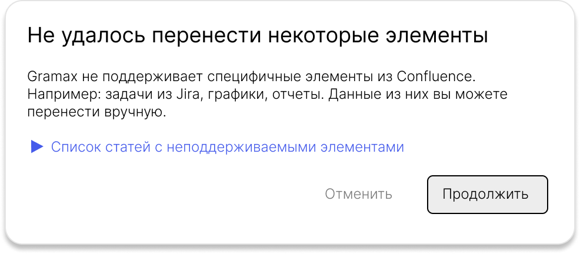
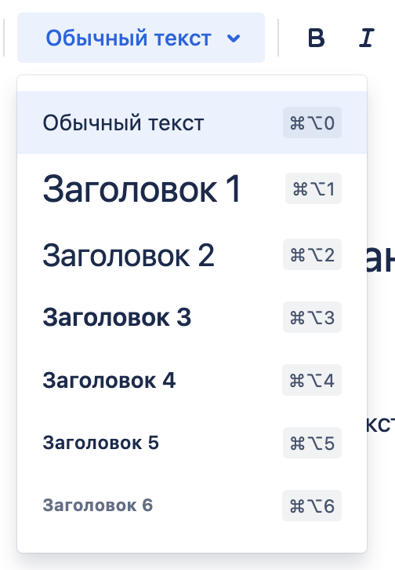
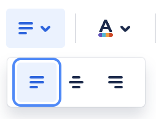
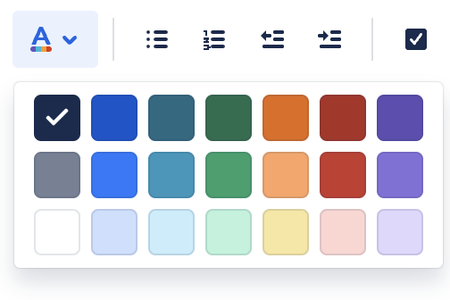
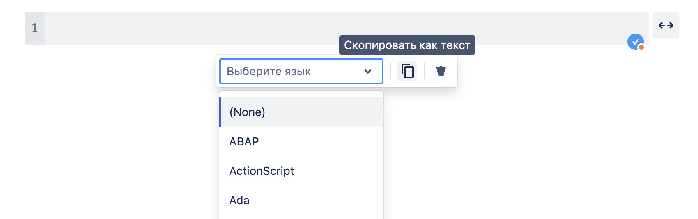
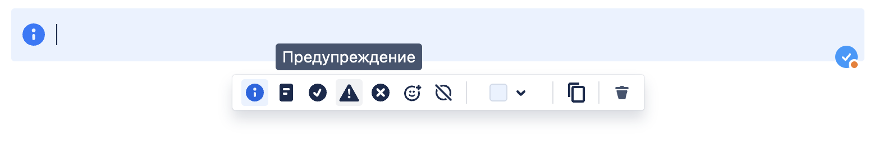

Сейчас пользователи не могут комфортно заменить конфлюенс грамаксом, так как нет удобного механизма перехода. Нужно этот механизм предоставить.

### Критерии приемки

-  В интерфейсе есть возможность перенести данные из конфлюенса. При клике на “Добавить каталог” в меню есть пункт “Импорт”.

-  Желаемый процесс импорта:

   1. Кликаешь «импорт».

   2. Входишь в акк в конфе.

   3. Выбираешь раздел.

   4. Кликаешь «импортировать».

-  Перенести можно только весь раздел целиком.

-  Раздел переносится, учитывая иерархию статей.

-  Контент, который Gramax не способен отобразить, переносится по следующим правилам:

   -  Можно преобразовать в обычный текст/ссылку/файл -- преобразовываем.

   -  Нельзя преобразовать в обычный текст или ссылку -- в статье показывается специальный контрол, который содержит исходный код компонента и сообщение “Тут должен быть “название элемента из статьи (ссылка на статью)”.

-  Для контента, который не перенесется, после импорта отображается информационное окно по всему разделу. Оно содержит:

   -  Название страниц, в которых этот контент.

   -  Кол-во статей с такими элементами.

   -  Ссылки на эти страницы. Отображаются развернутыми в поле со скроллом.

   -  Описание проблемы.

   -  Кнопки действия: одна из них продолжает экспорт, другая -- отменяет.

      

-  Неподдерживаемые элементы (специальные контролы) отображаются в проверке на ошибки.

### Сопоставление терминов



---

*  

   В Gramax

*  

   В Confluence

---

*  

   Каталог

*  

   Раздел

---

*  

   Раздел

*  

   Исходная страница

---

*  

   Подраздел

*  

   Дочерняя страница

---

*  

   Статья

*  

   Страница



### Сопоставление элементов



---

*  

   В Confluence

*  

   В Gramax

---

*  

   Стили текста:

   

*  

   Стили текста:

   -  Обычный текст

   -  Н1 -> Н2

   -  Н2 -> Н3

   -  Н3 -> Н4

   -  Н4 -> жирный текст

   -  Н5 -> жирный текст

   -  Н6 -> жирный текст

---

*  

   Расширенные параметры форматирования:

   

*  

   Стили текста:

   -  Жирный

   -  Курсив

   -  **Подчеркнутый (поддерживаем?)**

   -  **Зачеркнутый (поддерживаем?)**

   -  Строка кода

   -  Обычный текст

   -  Обычный текст

---

*  

   Выравнивание текста:

   

*  

   Обычный текст.

---

*  

   Цвет текста:

   

*  

   Цвет текста.

   *Примечание к переносу:*

   *Применять цвет текста из Markdown. Без редактирования текста в панели.*

   **Confluence даёт нужные данные(hex код)**

---

*  

   Списки и отступы:

   

*  

   Списки и отступы:

   -  Маркированный

   -  Нумерованный

   -  Табы

   *Примечание к переносу:*

   *Вложенные списки переводить в наше оформление.*

   **Иерархия списков аналогичная Gramax**

---

*  

   Задача:

   

*  

   Маркированный список.

---

*  

   Ссылка:

   

*  

   Ссылка.

   *Примечание к переносу:*

   -  *Ссылки на другие страницы в конфлюенсе преобразовывать в относительные ссылки в Gramax.*

   -  *Абсолютные ссылки на другие ресурсы просто переносить.*

---

*  

   Изображения, видео, файлы:

   

*  

   Изображения, видео, файлы.

   *Примечание к переносу:*

   -  *Изображения -- просто переносим.*

   -  *Видео -- не переносим. Добавляем ссылки на статьи с видео в окно с предупреждением.*

   -  *Файлы -- просто переносим.*

   (На все медиа есть ссылки для скачивания. В Confluence видео добавляются только файлом)

---

*  

   Упоминание:

   

*  

   Нет.

   *Примечание к переносу:*

   *Не переносим. Добавляем ссылки на статьи с упоминаниями в окно с предупреждением.*

---

*  

   Эмодзи:

   

*  

   Эмодзи.

   *Примечание к переносу:*

   *Просто переносим, без редактирования в панели.*

---

*  

   Макеты:

   

*  

   Переносим изображениями подряд.

---

*  

   Таблица:

   

*  

   Таблица.

   *Примечание к переносу:*

   -  *Переносим таблицы со всем вложенным контентом.*

---

*  

   Фрагмент кода:

   

*  

   Блок кода.

   *Примечание к переносу:*

   -  *Переносим в тч название языка для подсветки.*

---

*  

   Информационная панель:

   

*  

   Заметка.

   *Примечание к переносу:*

   *Сопоставление стиля заметки в конфе и в грамаксе:*

   -  *Информация -- info*

   -  *Примечание -- tip*

   -  *Готово -- lab*

   -  *Предупреждение -- note*

   -  *Ошибка -- danger*

   *Другие примечания:*

   -  *В конфе у заметки можно заменить иконку на эмодзи и поменять цвет фона. Это игнорируем и не переносим. В предупреждении не показываем.*

---

*  

   Цитировать:

   

*  

   Цитата.

---

*  

   Решение:

   

*  

   Нет.

   *Примечание к переносу:*

   *Не переносим. Показываем в предупреждении.*

   (Если наша цель минимум неподдерживаемых элементов то:

   Маркированный/Нумерованный список)

---

*  

   Разделитель:

   

*  

   Линия.

---

*  

   Разворачивание и раскрыть:

   

   

*  

   Блок скрытого текста.

---

*  

   Выборка и Вставить фрагмент:

   

   

*  

   Выборка - > *Сниппет*(В Confluence сниппет хранится на странице, так что при импорте его тоже оставить)

   Вставить фрагмент - > *место использования сниппета*

---

*  

   Вставки: PowerPoint, Excel, Ms Word, PDF.

   

   

   

   

*  

   *Примечание к переносу:*

   *Прикрепить файлом.*

   ***У меня эти элементы не работают на странице.***

   ***С них можно получить имяфайла.формат, по нему найти файл в массиве всех файлов***

---

*  

   Статус

   

*  

   *Примечание к переносу:*

   *Оформить как инлайновый код.*

---

*  

   Дата из календаря

   

*  

   *Примечание к переносу:*

   *Прописать датой.*

---

*  

   Задача из Jira

   

*  

   Переносим в виде ссылки



---

#### Информация по остальным элементам

-  Информация по остальным элементам будет сгруппирована так, как она представлена в Confluence

-  Будут описаны только те элементы, которые не затрагивались выше

#### Форматирование



---

*  

   Плавающий фрейм

   

*  

   **Вставляем в статью ссылку**

   (Рмка на странице, в которой открывается контент(напр. другой сайт) по переданному url

   Можно получит: URL

   *У элемента так же есть поля Название, Описание. Их можно настроить в редакторе, но они не отображаются на странице Confluence)*

---

*  

   Элементы JSM

   

   

   

*  

   **Не переносим**

   (Не получается воспользоваться продуктом «JSM».

   Нет возможности создать «Incident»

   При добавлении в Confluence появляется пустой элемент.

   Нет возможности получить ссылку.

   *Jira Service Managment не переведён на русский, возможно не используется пользователями?)*

---

*  

   Элементы Opsgenie

   

   

   

*  

   **Не переносим**

   (Функционал и данные аналогичные JSM

   Не являются частью экосистемы Atlassian

   *Дополнительные исследования по **просьбе)***



#### Схемы и изображения



---

*  

   Галерея

   

   *Так же входит в группу «Медиа»*

*  

   **Переносим таблицей с изображениями**

   (Создаёт галерею из всех вложений(фото/гиф) представленных на странице(можно указать доп. страницы и даже разделы)

   В элемент можно добавить какие изображения исключать, т.е. *Он берёт всё, кроме указанных медиа.*

   Нельзя вытащить какие файлы находятся в галереи, только какие файлы исключить

   *Можно импортировать как таблицу с вложениями в ячейках, но из-за логики выбора контента для галереи это проблемно.)*

---

*  

   Roadmap Планировщик

   

*  

   **Не переносим**

   (Невозможно импортировать

   Невозможно получить ссылку)

---

*  

   График

   

*  

   **Не переносим**



#### Навигация



---

*  

   Поиск по дереву страниц

   

*  

   **Не переносим**

   (Элемент который перемещает на страницу поиска в Confluence.

   *Можно перенести как ссылку на эту же страницу)*

---

*  

   Интерактивный поиск

   

*  

   **Не переносим**

   (Поиск происходит прямо на странице с элементом

   *Переносим как ссылку на страницу поиска с сохранением параметров фильтрации)*

---

*  

   Поиск по дереву страниц

   

*  

   **Не переносим**

   (Не смог разобраться.

   Невозможно получить ссылку.)

---

*  

   Оглавление пространства

   

*  

   **Переносим списком из ссылок на статьи**

   (Является ссылками на все страницы в разделе

   Сортируются по алфавиту

   Страницы с кириллицей в заголовке не отображаются

   *Можем этот элемент заменять своим элементом(можно воссоздать))*

---

*  

   Дерево страниц

   

*  

   **Переносим списком из ссылок на статьи**

   *(Элементы списка - ссылки на страницы)*

---

*  

   Область оглавления

   

*  

   **Не переносим**

   (Не заработал, даже после добавления заголовков на страницу)

---

*  

   Якорь

   

*  

   **Переносим со ссылкой на заголовок**

   (Якоря для гиперссылок.

   Можно перенести как заголовок.

   В Confluence якорь невидимый)

---

*  

   Дочерние страницы

   

*  

   **Переносим списком из ссылок на статьи**

   (Элемент для создания маркированного списка гиперссылок на дочерние страницы

   У элемента есть параметры «Максимальное количество уровней» и «Максимальное количество страниц на одном уровне»

   *В идеале сохранить параметры при **воссоздании** элемента.*

   *Если не получится просто список всех дочерних страниц родительской страницы)*



#### Отчёты



---

*  

   Team Calendars

   

*  

   **Переносим ссылкой на календарь**

   (Элемент для расположения существующего календаря

   

   Нет возможности импортировать

   *Можно импортировать в виде ссылки на раздел календари)*

---

*  

   Список пользователей

   

*  

   **Не переносим**

   (Список ролей/групп(админ\_confluence, организатор\_jira)

   В каждой группе все пользователи с данной ролью

   *Не вижу смысла в переносе, пользователи отличаются)*

---

*  

   Популярные метки

   

*  

   **Не переносим**

   (Список наиболее популярных меток

   *Из элемента ничего не вытащить*

   *Возможно воссоздать, если мы планируем импортировать метки(теги страницы)*

---

*  

   Свойства страницы

   

   Отчёт по свойствам страницы

   

*  

   **Не переносим**

   (В элементе свойства страницы можно разместить таблицу со своей информацией

   Элемент взаимосвязан с элементом «Отчёт по свойствам страниц»

   Отчёт по свойствам таблиц: Таблица с заголовками вида (Название страницы, Заголовки таблицы из «Свойства страницы»)

   и информацией из таблицы из «Свойства страницы»

   *Можно перенести таблицу из «Свойства страницы»*

   *Возможно можно воссоздать отчёт)*



#### Разработка



---

*  

   Assets

   

*  

   **Переносим в виде ссылки на джиру**

   (Таблица с объектами из раздела «Активы» в Jira

   С фильтрацией

   *Импорт как ссылка на раздел «Активы» в нужную конфигурацию.*

   *На конкретные объекты сослаться нельзя)*

---

*  

   Диаграмма Jira

   

*  

   **Переносим в виде ссылки на джиру**

   *(Можно получить код задачи из Jira*

   *Получить ссылку на диаграмму не получится*

   *Скопировать функционал не получится)*

---

*  

   Создать задачу Jira

   

*  

   **Переносим в виде ссылки на джиру**

   (Просто создаёт задачу Jira

   *Получаем прямую ссылку на задачу)*

---

*  

   Insert Confluence list

   

*  

   **Не переносим**

   (Таблица с ссылками на контент(Страницы, вложения) Confluence отобранные фильтрацией

   *Можно воссоздать функционал*

   *Проще: Импортируем как ссылку на страницу поиска в Confluence с сохранением параметров поиска)*

---

*  

   Устаревшая версия Jira

   

*  

   **Переносим в виде ссылки на джиру**

   *(Можно воссоздать ссылку на задачи*

   *Импортируем ссылкой)*



#### Внешнее содержимое



---

*  

   Назначенные мне

   

*  

   **Переносим в виде ссылки на джиру**

   *(Импорт как ссылка на раздел «Ваша работа» в Jira)*

---

*  

   Остальные элементы связанные с задачами

   

   

   

*  

   **Переносим в виде ссылки на джиру**

   *(Можно так же переводить на раздел «Ваша работа»*

   *Не отражает реальный функционал элемента*

   *Может лучше не переносить)*

---

*  

   Коннектор виджета

   

*  

   **Переносим в виде ссылки**

   *(Прямая ссылка на содержимое)*

---

*  

   Неподдерживаемые элементы

   

   

   

   Остальные отчёты и диаграммы

*  

   **Не переносим**

   (Все элементы раздела «Внешнее содержимое» рисующие какую-либо инфографику делают это на самой странице.

   Невозможно импортировать в виде ссылки, т.к. элемент существует только в рамках страницы)



#### Содержимое Confluence



---

*  

   Хронология Jira

   

*  

   **Переносим в виде ссылки на джиру**

   *(Прямая ссылка на “хронологию”)*

---

*  

   Изображение профиля

   

*  

   **Переносим изображение**

---

*  

   Недавние обновления

   

*  

   **Не переносим**

   (Маркированный список ссылок на недавно обновленные элементы

   *Не переносимо)*

---

*  

   Элементы связанные с метками

   

   

   

   

   

*  

   **Не переносим**

   *(Зависит от того, будем ли мы делать у себя метки(теги))*

---

*  

   Вложения

   

*  

   **Не переносим**

   (Список вложений принадлежащих текущей странице

   *Маркированный список с гиперссылками на расположения файлов на странице)*

---

*  

   Создать из шаблона

   

*  

   **Не переносим**

   (Кнопка на странице для создания страницы по шаблонам Confluence

   *Не переносимо)*

---

*  

   Профиль пользователя

   

*  

   **Переносим изображение, имя и почту**

   (Элемент состоит из аватарки, имени и почты пользователя

   *Переносим, но оригинальный вид сохранить не получится)*

---

*  

   Включить страницу

   

*  

   **Не переносим**

   (Отображает всё содержимое выбранной страницы

   *Нельзя достать информацию какую страницу отображать)*

---

*  

   Отчёт по участникам

   

*  

   **Не переносим**

   (Статистика по пользователям(публикации, комментарии)

   *Не переносимо)*

---

*  

   Недавно обновленный рабочий стол

   

*  

   **Не переносим**

   (Вообще это возможно, если мы сохраним даты создания/изменения страниц, комментариев, вложений и их авторов

   Можно упростить только до страниц

   Перенести фильтры для выборки невозможно)

---

*  

   Список разделов

   

*  

   **Не переносим**

   (Мы переносим только по одному разделу за раз.

   *Не переносим)*

---

*  

   План из Jira

   

*  

   **Переносим в виде ссылки**

---

*  

   Изменить историю

   

*  

   **Не переносим**

   (Список версий(историй) страниц.

   *Можно импортировать ссылкой на раздел «История страницы»* *в Confluence для конкретной страницы)*

---

*  

   Отчёт о решениях

   

*  

   **Не переносим**

---

*  

   Участники

   

*  

   **Не переносим**

---

*  

   Записи в Блоге

   

*  

   **Переносим в виде ссылки на раздел в Gramax**

   *(Можно перенести в виде маркированного списка*

   *с ссылками на «блоги» в Gramax)*

---

*  

   Отчёт о задачах

   

*  

   **Не переносим**



#### Дополнительно



---

*  

   Дропбокс

   

*  

   **Переносим в виде ссылки на файлы в дропбокс**

---

*  

   Раздел с AI инструментами

   

*  

   **Не переносим**


