Нужно переносить страницы, сохраняя их иерархию.

## Критерии приемки

-  Вся иерархия статей переносится 1:1.

-  Страницы, которые не поддерживаются в Gramax, также переносятся по следующей логике:

   -  Домашняя страница -- в Gramax создается статья “Домашняя страница” в корне. Содержит контент домашней страницы из конфлюенса -- ссылки будут вести на страницы в конфлюенсе.

   -  Блог -- в Gramax создается раздел “Блоги” и все страницы складываются в него.

-  Известное ограничение -- интеллектуальные ссылки выгружаться не будут.

:::hotfixes:true Почему не выгрузить интеллектуальные ссылки

Confluence не выдаёт необходимое разрешение на просмотр интеллектуальных ссылок. Нельзя получить информацию по элементу, из-за этого не получается сохранить иерархию(*страницы под данным элементом не переношу, но их возможно выделить в отдельную группу без иерархии*)

**Confluence:**

В [Confluence API](https://developer.atlassian.com/cloud/confluence/rest/v2/api-group-smart-link/#api-embeds-id-get) для чтения "“Интеллектуальных ссылок“ требуется разрешение:

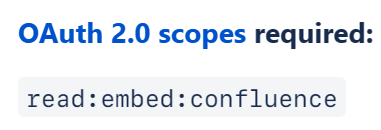

Я выбираю нужное разрешение в консоли разработчика Atlassian, но на форме авторизации оно не отображается.

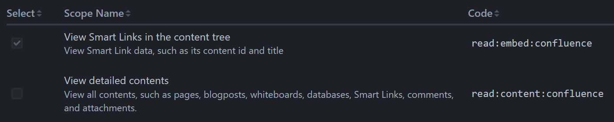

")

")

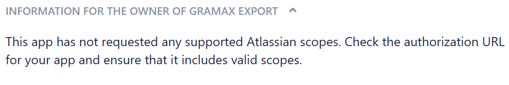

:::

## Исследование

Необходимо рассмотреть иерархию страниц в Confluence

Страницы в Confluence хранятся в следующей иерархии:

-  Домашняя страница(Приветствие и ссылки на другие статьи в разделе)

   -  Исходная страница

      -  Дочерняя страница

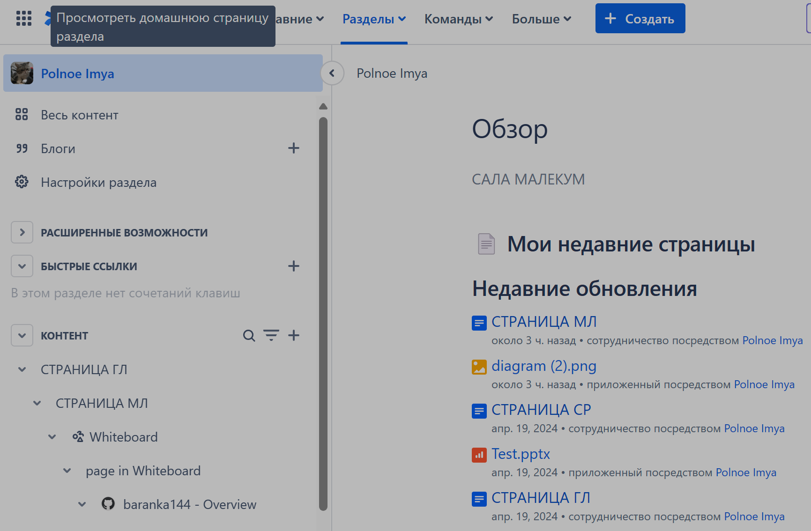

:::danger 

У нас нет элемента Домашняя страница

:::

#### Не импортируемые иерархические элементы

-  Помимо страниц элементами иерархии могут быть элементы “Доска” и “Интеллектуальная ссылка“

-  От этих элементов возможно создать страницы и углубить иерархию.

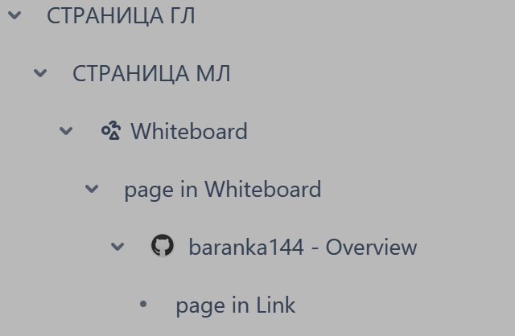

:::danger 

Не импортируемые элементы нарушают иерархическую структуру

:::

#### Импортируемые не иерархические элементы

-  В Confluecne есть элемент «Блог», он представляет собой страницу, которой нет в иерархии

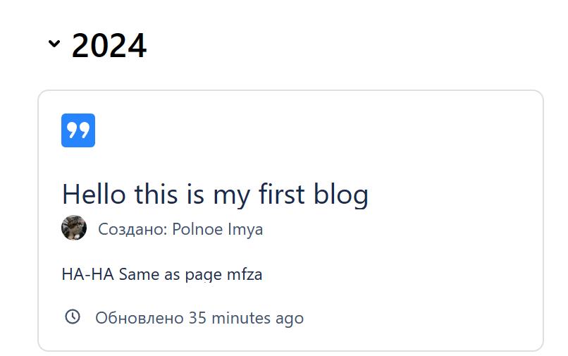

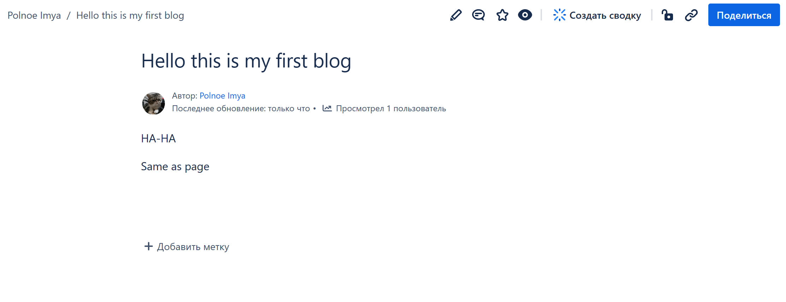

## Замечания

-  \[x\]В десктопе в форме добавления нового источника выбираю конфлюенс и при входе открывается апп веб-версия.

   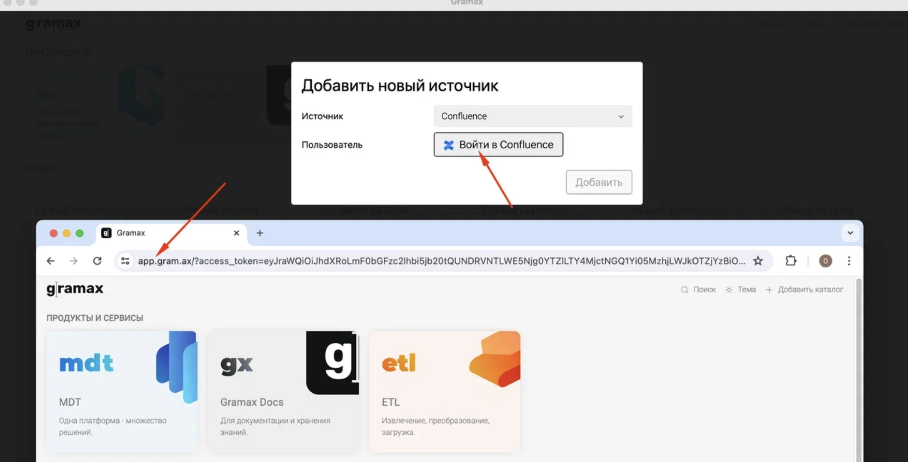

-  \[x\]Не импортируется ничего, появилась ошибка makeSourceApi(...).isRepositoryExists is not a function

   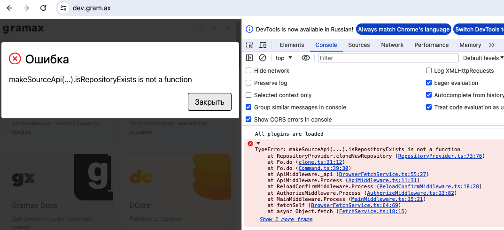

-  [comment:1]Не перенеслись разделы после 5 уровня.[/comment]

   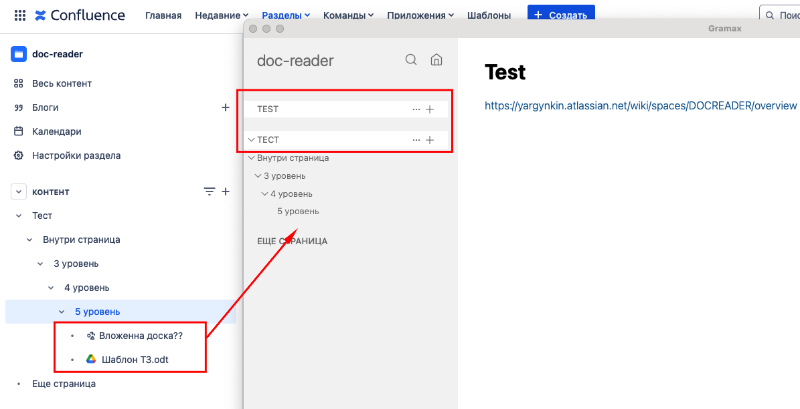

-  [comment:2]Раздел ТЕСТ задублировался.[/comment]

   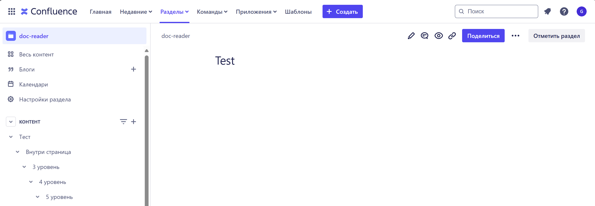

-  [comment:3]В  конфлюенсе нет никакого раздела, а в грамакс добавился раздел “Обзор”.[/comment]

   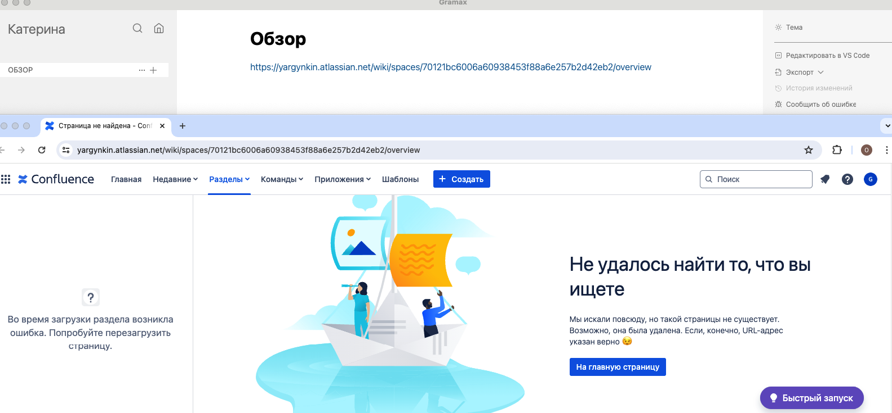
