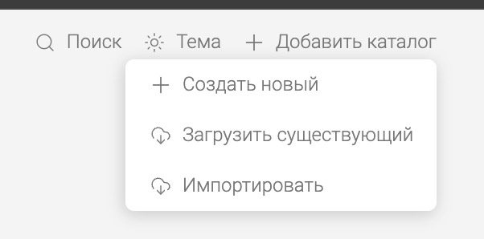
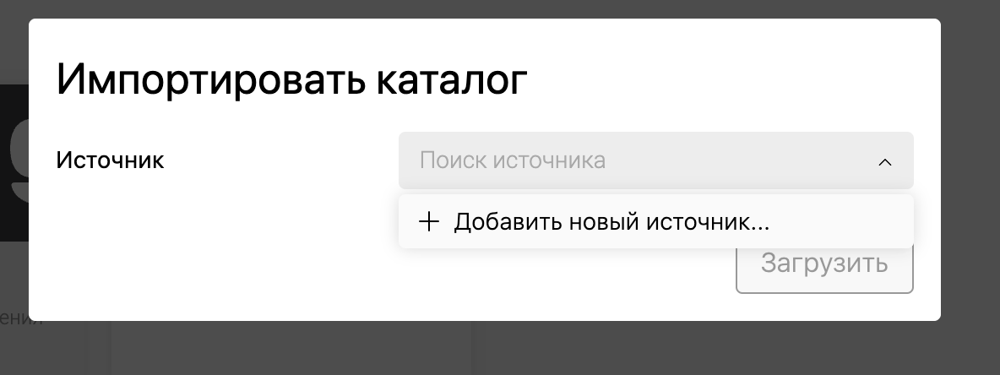
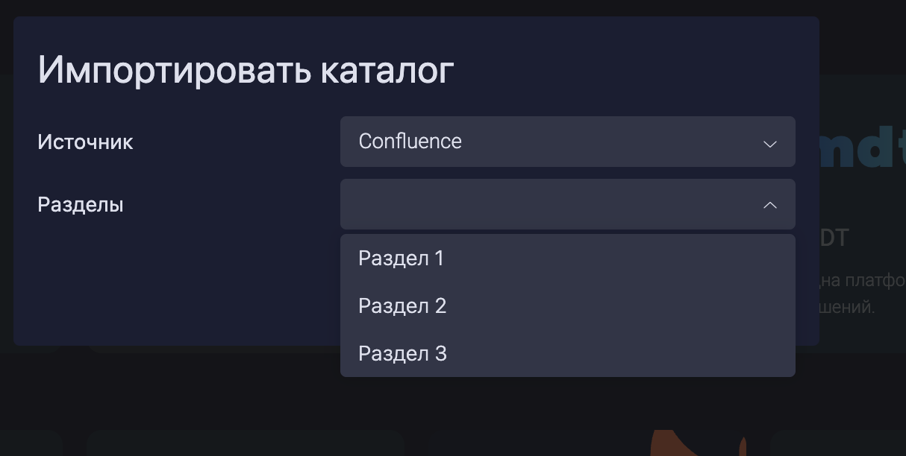
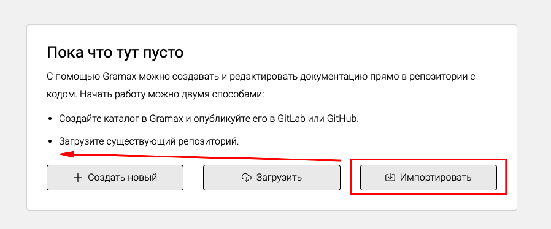
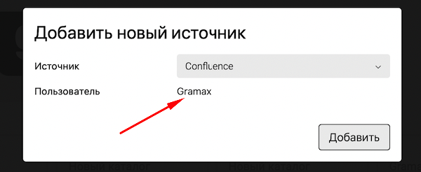

Для импорта каталога нам нужна возможность выбрать конфлюенс в качестве источника.

## Критерии приемки

-  На главной есть кнопка “Импортировать“ с иконкой “import“.

   

   

-  При нажатии на импортировать появляется стандартное окно добавления источника.

   

-  При нажатии на *Добавить новый источник,* появляется один вариант -- конфлюенс.

   

-  При нажатии кнопки *Confluence* снизу появляется кнопка для входа.

   

-  При нажатии на *Войти* открывается дочернее окно, пользователь там заходит в Confluence.

-  После входа кнопка *Добавить* становиться активной. При клике источник добавляется.

   

-  После добавления источника можно выбрать этот источник и выбрать раздел для импорта.

   

-  После выбора раздела кнопка *Импортировать* становится активной. При клике запускается процесс импорта.

   

## Замечания

-  \[x\]Описать третий способ работы грамакса с  помощью импорта.

-  Поле “Пользователь“ отличается от других полей.

   
