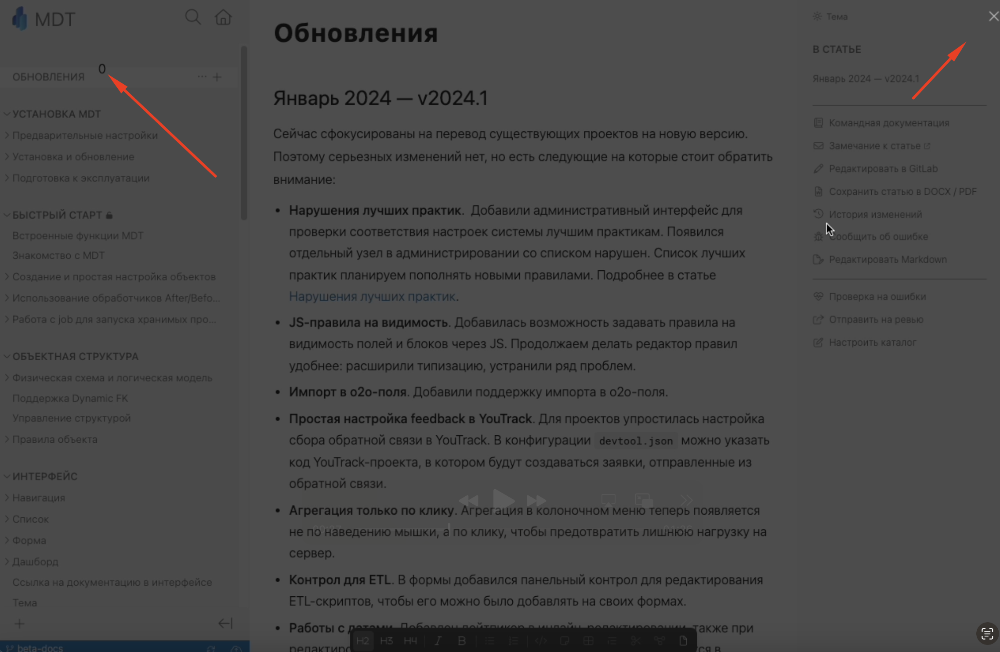
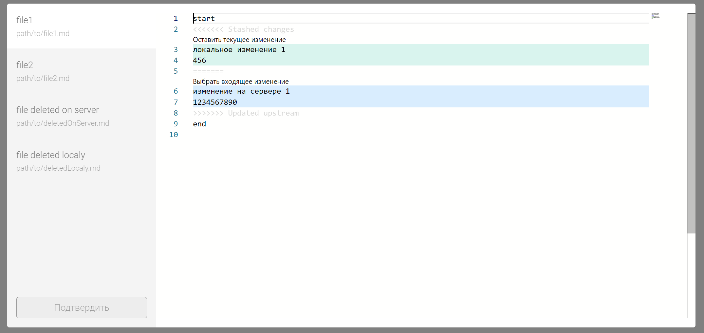
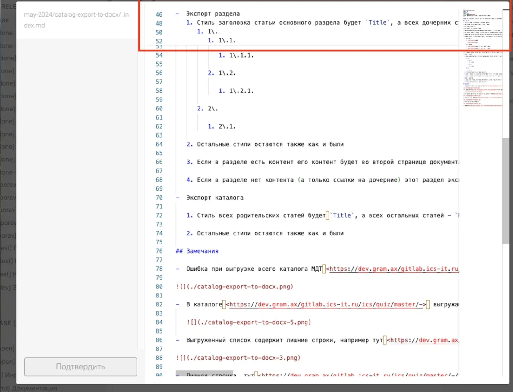

**Проблема**: Сейчас, если Gramax не сможет запарсить контент и найти мерж конфликты в файлах, он выдаёт пустое модальное окно:

## Критерии

1. Если контент не отличается -- значит конфликт связан с метаданными (filemode, либо ещё с чем-то, не знаю что ещё может быть), то выбираем версию, которая пришла с сервера.

2. Если в файлах содержится конфликт контента, показывается стандартное окно с предложением решить конфликт.

   1. Пользователь нажимает “Решить конфликт”.

   2. В правой части показывается редактор Monaco. Такой же как и при нажатии кнопки в правой навигации “Редактировать в Markdown“:

      1. [comment:2]Действия[/comment]:

         1. Оставить текущее изменение

         2. Выбрать входящее изменение

         

   3. Пользователь вручную выбирает нужные изменения, а также может свободно изменять контент файла.

   4. Кнопка “Подтвердить” заблокирована до тех пор, пока пользователь не решит все конфликты во всех файлах.

   5. После нажатия “Подтвердить” весь контент сохраняется в файловую систему.

   6. При закрытии модального окна решения конфликта, остаётся старая логика -- каталог откатывается в то состояние, которое было до синхронизации. Перед самим закрытием показывается confirm:

      1. Текст: Отменить решение конфликта? Каталог вернется в то состояние, в котором был до синхронизации.

   7. При конфликтах с удалением файла отображается старый интерфейс и старое поведение.

## Исходная заявка

-  <https://support.ics-it.ru/issue/GXS-1541>

## Дальшейние шаги:

1. Эскейпить символы `<` `>`, чтобы не считать контент файла конфликтом.

## Замечания

-  [comment:4]В редакторе monaco не совсем плавно проматывается список, происходит прилипание сверху.[/comment]

   
